# MSRU MDX 撰写与排版系统指南

在 MSRU（微服务与多尺度资源利用）平台，我们坚信“文档即代码（Docs as Code）”的工程哲学。对于承载着 MES 制造执行、WMS 智能仓储等核心业务的工业级软件而言，文档的精确度与代码的健壮性同等重要。

本指南全景展示了 MSRU 文档系统中所有可用 UI 组件的深度调用范式、底层渲染逻辑以及最佳实践规范。请所有架构师、前端开发与实施顾问在贡献文档时，**严格、逐字地遵循此规范**。

<Callout type="info" title="设计哲学与 shadcn/ui 视觉规范">
  我们的文档排版深度致敬了 **shadcn/ui** 的设计美学：强调极简的暗黑科技质感（Dark Tech）、绝对清晰的视觉层级对比，以及「所见即所得」的代码对照结构。在撰写任何包含复杂交互或 UI 呈现的指南时，请务必强制采用 `Preview` 与 `Code` 的双栏切换模式。
</Callout>

<Callout type="warn" title="严格模式警告 (Strict Mode)">
  所有的 `.mdx` 文件在提交 PR (Pull Request) 前，将经过 MSRU CI/CD 流水线的严格校验。缺少 Frontmatter、组件闭合错误或乱用非规范组件，将导致流水线构建失败（Build Failed）。
</Callout>

---

## 1. 文档编译拓扑与多尺度渲染生命周期

在掌握具体的排版语法之前，架构师必须建立对文档渲染底层的宏观认知。MSRU 文档站点并非简单的静态 HTML 堆砌，而是基于 Next.js App Router 驱动的动态 React 树。

```mermaid
graph TD
    subgraph Authoring ["撰写层 (Authoring)"]
        A["*.mdx 源文件"] -- "注入" --> B("Frontmatter 解析器")
    end
    
    subgraph Compilation ["编译与构建层 (Build & Transform)"]
        B -- "remark/rehype 插件链" --> C{"AST 抽象语法树"}
        C -- "MDX Provider 映射" --> D["注入 MSRU 自定义 React 组件"]
        D -- "Tailwind CSS 编译" --> E["生成高度优化的 RSC (React Server Components)"]
    end
    
    subgraph Edge_Delivery ["边缘侧分发 (Edge Autonomy)"]
        E --> F["Vercel Edge Network / MSRU 离线节点"]
        F -- "增量静态再生 (ISR)" --> G["最终用户呈现"]
    end
    
    style A fill:#0d9488,stroke:#042f2e
    style E fill:#8b5cf6,stroke:#4c1d95
    style G fill:#09090b,stroke:#2dd4bf,stroke-width:2px
```



如上图所示，当你在文档中写入一个 `<Card>` 标签时，它在 AST 阶段会被精准拦截，并映射为我们在 `mdx-components.tsx` 中定义的、带有 MSRU 科技绿主题的专属 React 组件。

---

## 2. 核心排版模块与语义化卡片矩阵

为了降低用户的认知负载，我们在阐述核心概念（如架构的六大支柱）时，禁止使用枯燥的无序列表，**必须使用网格化的卡片阵列 `<Cards>`**。

您可以通过传入 `icon="IconName"` 直接调用 Lucide 矢量图标，系统会自动完成动态导入与尺寸约束。

<Cards>
  <Card 
    title="基础排版与容器 (Layouts)" 
    description="包含 Callout 提示框、手风琴折叠面板与标签页。用于控制文档的信息密度，折叠次要信息。" 
    icon="LayoutTemplate" 
  />
  <Card 
    title="代码与文件系统 (Code & Files)" 
    description="支持多种语言的语法高亮、差异对比 (Diff) 以及极具工程感的目录树结构展示。" 
    icon="FileCode2" 
  />
  <Card 
    title="高阶业务组件 (Business Components)" 
    description="支持嵌入复杂的数学公式推导（LaTeX 引擎）、动态架构图（Mermaid）或商业定价表。" 
    icon="Cpu" 
  />
  <Card 
    title="边缘自治模块 (Edge Modules)" 
    description="专为 MSRU 离线网关设计的状态指示器与状态机流转展示组件。" 
    icon="Network" 
  />
</Cards>

---

## 3. 交互组件演示 (shadcn/ui 双重视窗)

这是本文档**最重要**的设计模式。对于任何 UI 组件、代码片段或架构配置，必须向用户同时展示**“它看起来是什么样”**以及**“它的底层代码是什么”**。

请使用 `<Tabs>` 组件构建 `Preview`（预览）和相关的代码视图。

<Tabs items={['Preview', 'EdgeStatus.tsx', 'tailwind.config.ts']}>
  <Tab value="Preview">
    <div className="p-6 border border-zinc-800 rounded-xl bg-zinc-950/50 mt-4 shadow-2xl flex flex-col gap-4">
      <div className="flex items-center justify-between pb-4 border-b border-zinc-800">
        <h3 className="text-lg font-bold text-zinc-100 flex items-center gap-2">
          <span className="relative flex h-3 w-3">
            <span className="animate-ping absolute inline-flex h-full w-full rounded-full bg-teal-400 opacity-75"></span>
            <span className="relative inline-flex rounded-full h-3 w-3 bg-teal-500"></span>
          </span>
          MSRU 边缘计算节点 01
        </h3>
        <span className="px-2.5 py-1 text-xs font-medium text-teal-400 bg-teal-400/10 border border-teal-400/20 rounded-full">
          自治模式 (Autonomous)
        </span>
      </div>
      <span className="text-sm text-zinc-400 leading-relaxed">
        检测到核心骨干网 BGP 抖动。该边缘节点已主动切断与中心云的同步，启动本地 SQLite 账本，确保产线 10ms 内的极速工艺判定不受影响。
      </span>
    </div>
  </Tab>
  <Tab value="EdgeStatus.tsx">
    ```tsx showLineNumbers {5-8, 12}
    import { Badge } from "@/components/ui/badge"
    
    export function EdgeStatus() {
      return (
        <div className="p-6 border border-zinc-800 rounded-xl bg-zinc-950/50">
          <div className="flex items-center justify-between pb-4">
            <h3 className="text-lg font-bold text-zinc-100">
              MSRU 边缘计算节点 01
            </h3>
            <Badge variant="outline" className="text-teal-400 border-teal-400/20">
              自治模式 (Autonomous)
            </Badge>
          </div>
          {/* ... */}
        </div>
      )
    }
    ```
  </Tab>
  <Tab value="tailwind.config.ts">
    ```typescript
    import type { Config } from "tailwindcss"

    const config = {
      theme: {
        extend: {
          colors: {
            // MSRU 科技绿主题色
            teal: {
              400: "#2dd4bf",
              500: "#14b8a6",
            }
          }
        },
      },
    } satisfies Config
    ```
  </Tab>
</Tabs>

---

## 4. 标准化 SOP 创建流程

向 MSRU 知识库提交新文档不是随意的 Markdown 涂鸦，而是一项严谨的工程实践。请严格遵守以下 SOP (Standard Operating Procedure)：

<Steps>
  <Step>
    ### GitOps 分支策略与路由分配
    从 `main` 分支切出 `docs/feature-name` 分支。确定文档所属子系统，在 `content/docs/` 对应的嵌套目录下创建 `.mdx` 文件。我们采用与 Next.js App Router 思想一致的基于文件系统的路由机制。
  </Step>
  <Step>
    ### 强制声明 Frontmatter 元数据
    在文件的第 1 至第 5 行，必须使用 YAML 语法块 (`---`) 声明文档的元数据。这是驱动整站全栈搜索、侧边栏层级渲染和 SEO 爬虫索引的核心载体。缺少标题或描述将导致流水线拒绝合并。
  </Step>
  <Step>
    ### 编排、校验与本地热更新
    在终端执行 `pnpm run dev` 启动本地环境。利用本文档提供的交互式组件进行内容填充。仔细检查多尺度排版的视觉一致性，确保在移动端（Mobile）和桌面端（Desktop）均具有极致的阅读体验。
  </Step>
  <Step>
    ### 提交 PR 与 Peer Review
    创建 Pull Request，并指定至少一位架构委员会（CoE）成员进行 Code Review。检查内容是否符合“多尺度”、“零信任”等 MSRU 核心价值观。
  </Step>
</Steps>

---

## 5. 巨型仓库 (Monorepo) 文件树规范

在向开发者解释复杂的项目结构、微服务配置文件路径或证书部署位置时，**严禁使用纯文本缩进拼凑**。必须使用 `<Files>` 及其子组件，以呈现最专业的 IDE 级目录视窗。

以下是 MSRU 平台典型的 Turborepo 巨型仓库代码结构示范：

<Files>
  <Folder name="msru-platform-monorepo" defaultOpen>
    <Folder name="apps" defaultOpen>
      <Folder name="docs" defaultOpen>
        <Folder name="content" defaultOpen>
           <File name="architecture.mdx" />
           <File name="edge-deployment.mdx" />
        </Folder>
        <File name="source.config.ts" />
      </Folder>
      <Folder name="mes-web">
         <File name="next.config.mjs" />
      </Folder>
    </Folder>
    <Folder name="packages">
      <Folder name="ui">
        <File name="tailwind.config.ts" />
      </Folder>
      <Folder name="edge-agent">
        <File name="cargo.toml" />
      </Folder>
    </Folder>
    <File name="pnpm-workspace.yaml" />
  </Folder>
</Files>

---

## 6. 严谨的数学推导与算法可视化

工业级软件的底层是冰冷的数学与物理定律。在阐述多尺度资源调度算法、OEE（设备综合效率）计算模型或高级声学降噪公式时，**绝不允许使用普通文本拼接公式**。

请调用 `<MathEquation>` 组件，它底层集成了强大的 LaTeX 渲染引擎（KaTeX），支持最高级别的学术级公式渲染。

**示例一：OEE 设备综合效率基准公式**
<MathEquation 
  inline={false} 
  formula={String.raw`\text{OEE} = \underbrace{\left( \frac{\text{Operating Time}}{\text{Planned Production Time}} \right)}_{\text{Availability}} \times \underbrace{\left( \frac{\text{Ideal Cycle Time} \times \text{Total Pieces}}{\text{Operating Time}} \right)}_{\text{Performance}} \times \underbrace{\left( \frac{\text{Good Pieces}}{\text{Total Pieces}} \right)}_{\text{Quality}}`} 
/>

**示例二：MSRU 多路径网络延迟感知模型**
在边缘侧发生网络闪断时，调度器会基于网络状态计算动态容错阈值：
<MathEquation 
  inline={false} 
  formula={String.raw`\mathcal{L}_{total} = \min_{p \in Paths} \left( \sum_{i=1}^{n} \mathcal{T}_{compute}(node_i) + \Delta_{network}(t) \right) + \mathcal{O}(\log N) \leq \Tau_{threshold}`} 
/>

---

## 7. Frontmatter 全量元素与 API 属性速查表

每篇文档顶部的元数据属性（Frontmatter）决定了页面的骨架、SEO 表现、社交分发（Open Graph）卡片质量以及编译期的生命周期。

我们通过 `source.config.ts` 中的 Zod Schema 对 Fumadocs 的原生属性进行了深度扩展。在撰写文档时，请严格遵守下方的 TypeScript 接口约束：

<TypeTable
  type={{
    title: { 
      type: 'string', 
      required: true, 
      description: '【核心】文档的主标题。直接映射为 `<h1>` 及 HTML `<title>` 标签，决定全局导航与面包屑的显示名称。' 
    },
    description: { 
      type: 'string', 
      required: true, 
      description: '【核心】对文档核心思想的 150 字以内精炼摘要。用于页面副标题、大模型 RAG 检索权重计算与 SEO 爬虫抓取。' 
    },
    icon: { 
      type: 'string', 
      required: true,
      typeDescription: 'Lucide React 图标类名 (PascalCase)',
      typeDescriptionLink: 'https://lucide.dev/icons',
      description: '【视觉】指定在左侧侧边栏和页面标题旁渲染的专属图标。' 
    },
    image: { 
      type: 'string', 
      required: true,
      description: '【SMO】Open Graph 社交分享大图路径（如 `/images/og/cover.jpg`）。建议尺寸 1200x630，极大提升在飞书、微信分享时的卡片质感。' 
    },
    keywords: { 
      type: 'string[]', 
      required: true,
      description: '【检索】供全局搜索引擎与 MSRU AI 知识库做高权重倒排索引的关键词数组，例如：`["MSRU", "边缘自治"]`。' 
    },
    author: { 
      type: 'string', 
      required: false,
      description: '【溯源】文档的主要责任人或布道师署名（例如 "MSRU Office of CTO"）。' 
    },
    date: { 
      type: 'string | Date', 
      required: false,
      description: '【溯源】文档的首次发布或架构生效时间（标准格式 `YYYY-MM-DD`）。' 
    },
    lastModified: { 
      type: 'string | Date', 
      required: false,
      description: '【溯源】文档的最后一次修订时间。这会在页面底部向开发者传递技术方案的时效性。' 
    },
    full: { 
      type: 'boolean', 
      default: 'false', 
      description: '【布局】是否开启沉浸式全宽模式。设为 `true` 将强制拉伸内容区，通常用于展示横向超大架构图或全屏监控面板。' 
    },
    toc: { 
      type: 'boolean', 
      default: 'true', 
      description: '【布局】是否渲染页面右侧的悬浮锚点目录树 (Table of Contents)。结构极简单的单页 FAQ 可设为 `false` 以节省空间。' 
    },
    index: { 
      type: 'boolean', 
      default: 'false', 
      description: '【路由】是否将此文件作为当前目录的强制索引页。开启后，点击侧边栏的父文件夹会直接跳转至该文件。' 
    },
    draft: { 
      type: 'boolean', 
      default: 'false', 
      description: '【安全】草稿标记。在生产环境（Production）流水线构建时，设为 `true` 的文件将被硬性剔除，绝对杜绝半成品架构方案泄露。' 
    },
    legacyNav: { 
      type: 'boolean', 
      default: 'true', 
      deprecated: true,
      description: '【历史遗留】是否在侧边栏中显示此节点。自 MSRU Docs 2.0 引入 `meta.json` 强控路由后，该字段已废弃，请勿使用。' 
    },
    onEdgeFallback: {
      type: 'function',
      description: '【高阶演示】（仅供动态 MDX 环境的自定义组件注入）定义边缘节点离线时触发的回调钩子。',
      parameters: [
        { name: 'nodeId', type: 'string', description: '断连的边缘设备唯一标识 (如 TPM 芯片指纹)' },
        { name: 'reason', type: 'Error', description: '触发降级回退的网络底层错误栈信息' }
      ],
      returns: 'Promise<void>'
    }
  }}
/>
---

## 8. 深度陷阱与常见问题排查 (FAQ)

对于容易引起开发者疑惑的边缘情况、MDX 编译报错处理等，请集中在页面底部使用 `<Accordions>`（手风琴面板）进行收纳。这符合“渐进式披露”的设计原则，能有效保持页面主体的信息密度。

<Accordions>
  <Accordion title="致命错误：Hydration Mismatch（水合不匹配）是怎么产生的？">
    **原因**：这通常是因为您在 `.mdx` 文件中，将块级元素（如 `<div>` 或 `<Card>`）错误地嵌套在了段落 `<p>` 标签内部。Markdown 解析器会自动为普通文本包裹 `<p>`。
    **解决**：确保在调用大块 UI 组件时，组件标签的前后都保留**一个完整的空行**。
  </Accordion>
  <Accordion title="为什么我传入的 icon 字符串渲染为了空白或报错？">
    **原因**：MSRU 的动态图标映射依赖于 `lucide-react`。您传入的字符串必须**完全符合大驼峰命名规范 (PascalCase)**，且该图标确实存在于依赖库中。
    **解决**：请使用 `icon="MessageCircle"` 而不是 `icon="message-circle"` 或 `icon="messageCircle"`。您可以通过查阅 Lucide 官网获取准确名称。
  </Accordion>
  <Accordion title="如何在代码块或文本中显示被 MDX 劫持的特殊符号 { 和 < ？">
    **原因**：在 MDX 环境下，`{}` 被视为 JavaScript 表达式执行域，而 `<` 被视为 React 组件的开标签。
    **解决**：
    1. 在普通文本中：使用反斜杠转义，如 `\{` 或 `\}`。
    2. 在行内代码中包裹它：`` `{变量名}` ``。
    3. 如果是大段包含特殊符号的内容，请坚决使用标准的 Markdown 代码块（三个反引号）。
  </Accordion>
</Accordions>

---

## 9. 商业级组件嵌入演示 (SaaS 拓展)

MDX 的终极能力在于打破了静态文档与动态 Web 应用的物理边界。在 MSRU 平台中，您可以像搭积木一样，直接在文档内挂载复杂的、带有交互逻辑的商业级数据展示组件。

例如，当我们向客户展示 MSRU 私有化部署与公有云托管方案的对比时，只需插入一个 `<PricingTable />` 标签，即可渲染出实时同步的订阅矩阵：

<PricingTable />