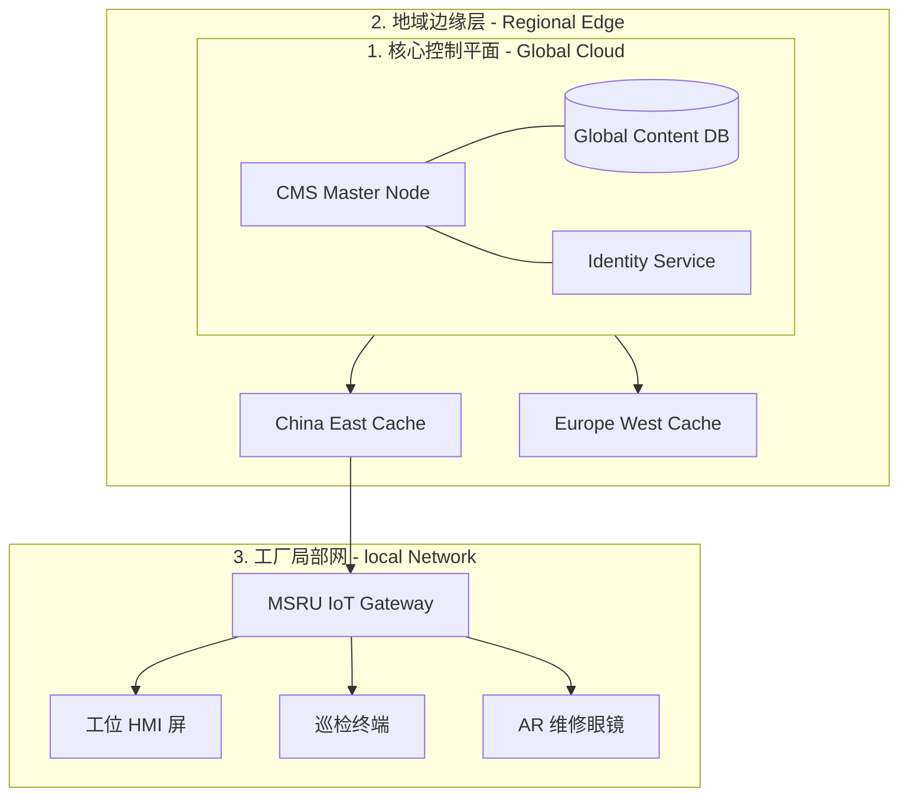

# 部署指南

在工业 4.0 的背景下，内容分发的可靠性直接关系到生产线的连续性。**MSRU | CMS** 提供了极具弹性的平台部署方案，旨在满足从单体工厂到全球分布式集团的多样化需求。

我们将部署架构划分为三个核心层级：**控制平面 (Cloud/Master)**、**分发节点 (Edge/CDN)** 以及 **接入终端 (Devices)**。

<Callout type="warning" title="环境预检">
  在开始部署前，请确保您的服务器环境满足 **[系统要求](../../configuration/settings)**，特别是针对 PostgreSQL 15+ 和 Redis 7+ 的性能调优。
</Callout>

---

## 1. 部署模式对比 (Deployment Models)

根据数据主权与架构灵活性的不同，您可以选择以下模式之一：

<div className="grid grid-cols-1 md:grid-cols-2 gap-4">
  <div className="border rounded-xl p-6 bg-blue-50/30 dark:bg-blue-900/10">
    <div className="font-bold text-blue-600 dark:text-blue-400 mb-2">混合云部署 (Standard)</div>
    <div className="text-sm text-zinc-500 mb-4">内容管理在云端，分发缓存在边缘。</div>
    <ul className="text-xs space-y-2">
      <li>✅ 极速上手，免运维控制台</li>
      <li>✅ 自动享受全球 CDN 加速</li>
      <li>✅ 跨国同步延迟低</li>
      <li>⚠️ 依赖稳定的公网连接进行创作</li>
    </ul>
  </div>
  
  <div className="border rounded-xl p-6 bg-emerald-50/30 dark:bg-emerald-900/10">
    <div className="font-bold text-emerald-600 dark:text-emerald-400 mb-2">全私有化部署 (Isolated)</div>
    <div className="text-sm text-zinc-500 mb-4">所有组件运行在企业私有虚拟网络 (VPC) 中。</div>
    <ul className="text-xs space-y-2">
      <li>✅ 物理隔离，最高级别数据主权</li>
      <li>✅ 适配完全断网的保密车间</li>
      <li>✅ 深度自定义存储后端</li>
      <li>⚠️ 需要专业的运维团队支持升级</li>
    </ul>
  </div>
</div>

---

## 2. 拓扑架构：三级分发体系

为了应对工业现场复杂的网络环境，我们推荐采用以下三级拓扑：



---

## 3. 部署步骤 (Step-by-Step)

### A. 环境初始化
使用 Docker Compose 快速拉取 CMS 核心镜像：

```yaml
version: '3.8'
services:
  msru-cms:
    image: msru/cms-core:v4.2
    ports:
      - "1337:1337"
    environment:
      - DATABASE_CLIENT=postgres
      - DATABASE_HOST=db.msru.local
      - REDIS_URL=redis://cache.msru.local:6379
    volumes:
      - ./uploads:/opt/app/public/uploads
```

### B. 数据库与存储设置
我们强烈建议在生产环境使用托管数据库服务。
<MathEquation 
  inline={false} 
  formula={String.raw`QPS_{limit} = \frac{\text{CPU\_Cores} \times 1000}{Latency_{avg\_ms}} \cdot \text{Parallelism\_Rate}`} 
/>
若您的并发访问量超过 500 次/秒，请务必开启 Redis 读写分离。

---

## 4. 边缘缓存优化策略

在工业场景下，`Availability > Consistency`。
当工厂网关与中心云失联时，CMS 会自动进入 **“存量分发模式”**。

- **预取逻辑 (Prefetching)**：系统会根据生产排程，预先将未来 24 小时内涉及的所有 SOP 资源推送到工厂网关。
- **差异同步 (Delta Sync)**：网络恢复后，仅同步变更的字节，极大节省工业 4G/5G 流量。

---

## 5. 运维监控告警 (Observability)

部署完成后，建议集成 Prometheus 监控以下关键指标：

| 指标名称 | 阈值标准 | 响应动作 |
| :--- | :--- | :--- |
| **API Latency (P99)** | < 150ms | 自动扩展 CDN 节点 |
| **DB Connection Pool** | > 85% | 触发连接清理脚本 |
| **Sync Failure Rate** | > 1% | 启动重试队列并钉钉报警 |

---

## 6. 常见部署 FAQ

<Accordions>
  <Accordion title="是否支持多租户独立部署？">
    **支持**。MSRU | CMS 原生支持 **Multi-Tenancy**。您可以在一套物理集群上为不同的事业部开辟独立的 Space，每个 Space 拥有独立的存储桶与域名，但在底层共享核心组件以节省成本。
  </Accordion>
  <Accordion title="部署在边缘网关对硬件有什么要求？">
    **建议**：至少双核 CPU、4GB 可用内存。若涉及大量高清视频 SOP 的缓存，建议配置 128GB 以上的工业级 SSD。
  </Accordion>
</Accordions>

---

## 7. 总结

成功的部署是内容治理的基石。通过 **“云端管理、边缘分发”** 的架构，MSRU | CMS 能够同时兼顾全球化管理的便利性与工业现场的极致响应。

---

> [!TIP]
> 完成部署后，下一步请配置 [系统设置](./settings) 以激活您的安全加固策略。
