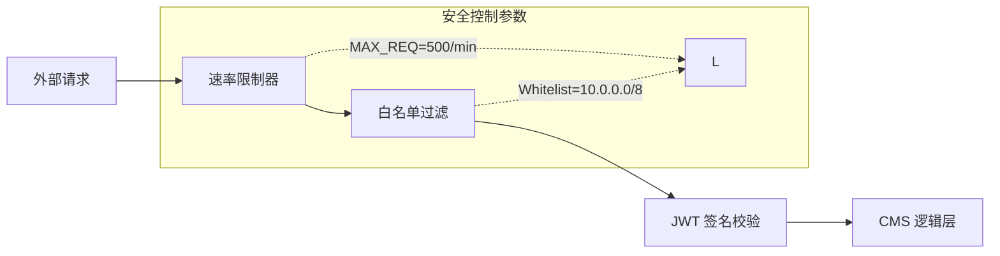

# 系统设置 (Configuration)

部署完成后，对 **MSRU | CMS** 进行精细化配置是确保其在高并发、多工位环境下稳定运行的关键。本篇将详细介绍如何通过配置文件与管理界面微调系统性能与安全性。

<Callout type="info" title="配置优先级">
  系统遵循以下优先级顺序加载配置：**环境变量 (Environment Variables) > 数据库持久化设置 (Admin UI Settings) > 默认值**。
</Callout>

---

## 1. 核心运行参数 (Core Runtime)

这些参数决定了 CMS 核心服务的吞吐量与资源占用。

### A. 数据库连接池
对于拥有数千个 HMI 接入点的工厂，数据库连接池的配置至关重要：
```bash
# .env 配置文件
DATABASE_POOL_MIN=5
DATABASE_POOL_MAX=100
DATABASE_IDLE_TIMEOUT=30000
```
<MathEquation 
  inline={false} 
  formula={String.raw`Max\_Connections = \sum (\text{App\_Nodes}) \times \text{DATABASE\_POOL\_MAX} + \text{Reserve}`} 
/>

### B. 会话与 Token 有效期
工业平板电脑通常需要更长的离线保持能力：
- **Access Token**: 默认 1 小时。
- **Refresh Token**: 建议 30 天，配合 **[SSO 认证](../../platform/index)**。

---

## 2. 媒体处理引擎 (Media Processing)

MSRU | CMS 内置了专为工业 SOP 优化的图片与视频处理引擎，旨在降低带宽消耗并提升弱网环境下的加载速度。

<Tabs items={['图片压缩', '响应式转换', '存储后端']}>
<Tab value="图片压缩">
系统会自动将上传的原始图纸（PNG/JPG）转换为下一代 WebP 或 Avif 格式。
- **质量阈值**: 建议设置为 `75` (兼顾清晰度与体积)。
- **WebP 降级**: 在不支持新格式的旧款工业触摸屏上，系统提供透明回退逻辑。
</Tab>
<Tab value="响应式转换">
配置后，系统会为同一张图自动生成多种尺寸：
- `thumbnail`: 200px (列表详情)
- `small`: 600px (移动端手机)
- `large`: 1920px (产线看板)
</Tab>
<Tab value="存储后端">
支持以下多种存储驱动：
1. **Local**: 本地私有化存储。
2. **AWS S3 / 阿里云 OSS**: 云端海量存储。
3. **MSRU Edge Drive**: 基于工厂网关的本地冗余存储。
</Tab>
</Tabs>

---

## 3. 多租户 Space 隔离设置

对于大型集团客户，您可以通过 **Spaces (空间)** 实现组织级的硬隔离。

| 设置项 | 说明 | 建议配置 |
| :--- | :--- | :--- |
| **Space ID** | 唯一的租户标识符 | 使用工厂代码（如 `FAC_SH_01`） |
| **Data Residency** | 数据驻留政策 | 勾选“强制本地存储”以同步至分中心 |
| **API Token Scope** | 令牌权限范围 | 严格仅限 `Read-Only` 给产线终端 |
| **Audit Retention** | 审计保留时长 | 符合行业规范 (如 1825 天) |

---

## 4. 安全加固配置 (Security Hardening)

为了防止恶意抓取或接口滥用，建议开启以下策略：



### 生产环境 Check-list
- [x] 修改默认的管理员路径 `/admin` 为混淆路径。
- [x] 禁用所有未使用 Content Type 的外部访问。
- [x] 开启 **CORS** (跨域资源共享)，仅允许特定的产线内域访问。

---

## 5. 常见配置 FAQ

<Accordions>
  <Accordion title="如何调整最大上传文件大小限制？">
    **方案**：这通常涉及两层配置。一层是 CMS 内部的 `MEDIA_MAX_SIZE=50MB`，另一层是您前端 Nginx/Ingress 控制器的 `client_max_body_size` 设置。请确保两端步调一致。
  </Accordion>
  <Accordion title="我在管理后台更新了 Logo，为什么所有终端还没变？">
    **原因**：这通常是因为 **CDN 强一致性缓存** 未清除。您可以在设置中手动触发“一键清除缓存”，或者为静态资源设置更短的 `Cache-Control: s-maxage` 指令。
  </Accordion>
</Accordions>

---

## 6. 总结

精细的设置能够让 MSRU | CMS 像经过调优的精密夹具一样高效运行。在常规情况下，使用默认值即可复盖 80% 的场景；但在扩容至全球规模时，以上参数的微调将为您节省大量的架构冗余成本。

---

> [!TIP]
> 基础设置完成后，您可以开始探索 [AI 辅助创作插件](../integrations/ai) 以进一步提升生产力。