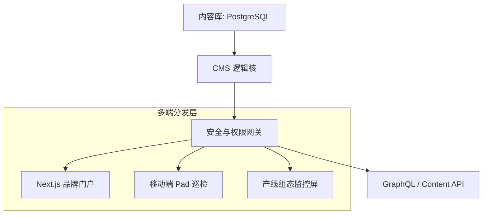

# CMS：数字化工厂的信息中枢

在复杂的工业生态中，信息不仅是文字，更是**核心资产**。**MSRU | CMS (Content Management System)** 正是为此而生——它不仅是一个内容管理工具，更是企业知识沉淀、合规记录分发以及全渠道营销的数字化底座。

通过 **Headless (无头)** 架构，MSRU | CMS 能够将经过审计的权威信息实时同步至产线看板、移动端 App、VR 培训终端以及全球品牌门户。

*图 1：MSRU | CMS——驱动全球工业信息的自由流动与高效治理*

---

## 1. 核心价值主张 (Value Proposition)

MSRU | CMS 重新定义了工业语境下的“内容”：

<Cards>
  <Card 
    title="全渠道分发 (Omnichannel)" 
    description="一次编写，随处发布。利用 REST API 与 GraphQL，将技术文档与 SOP 无缝下发至全球任何终端。" 
    icon="Send" 
  />
  <Card 
    title="工业级合规 (Compliance)" 
    description="内置严苛的角色权限控制（RBAC）与不可篡改的操作审计日志，满足 GxP 与 ISO 审计要求。" 
    icon="ShieldCheck" 
  />
  <Card 
    title="AI 创作辅助" 
    description="深度集成大语言模型，自动生成多语言翻译、SEO 优化策略及技术摘要，提升内容生产效率 5x 以上。" 
    icon="Sparkles" 
  />
</Cards>

---

## 2. 深度架构：为什么选择 Headless？

传统的 CMS 往往将“内容”与“显示”耦合在一起。MSRU 采用 **无头架构**，解耦了这两者：

<Tabs items={['内容建模', '分发逻辑', '缓存与全球加速']}>
<Tab value="内容建模">
### 结构化数据定义
通过高度灵活的字段配置，您可以定义任何内容类型（Content Type）：
- **技术规范 (Specs)**：包含版本号、附件、关联设备。
- **动态新闻 (News)**：全球品牌动态与投资者关系。
- **标准作业程序 (SOP)**：视频、图文与步骤条的结构化组合。
</Tab>
<Tab value="分发逻辑">

</Tab>
<Tab value="缓存与全球加速">
对于跨国企业，MSRU | CMS 支持全球多点冗余：
<MathEquation 
  inline={false} 
  formula={String.raw`Latency_{access} = \frac{Distance}{Speed_{light}} + T_{processing} \implies \text{Goal: } < 100ms \text{ Global}`} 
/>
通过内置的 Edge CDN 缓存策略，确保身处德国的工程师与身处中国的操作员能同时获取最新的技术文档。
</Tab>
</Tabs>

---

## 3. 业务全景：企业如何受益？ (Internal Assets)

了解 CMS 模块在 MSRU 体系中的文件组织逻辑。

<Files>
  <Folder name="cms-content-store" defaultOpen>
    <Folder name="schemas" defaultOpen>
       <File name="sop-template.json (SOP 标准模板)" />
       <File name="news-room.yaml (新闻发布流)" />
    </Folder>
    <Folder name="media">
       <File name="factory-cad.dwg (3D 嵌入组件)" />
       <File name="safety-video.mp4 (安全教育)" />
    </Folder>
  </Folder>
</Files>

---

## 4. 常见问题 (FAQ)

<Accordions>
  <Accordion title="CMS 如何支持多语言（i18n）环境？">
    **方案**：本地化是 CMS 的原生能力。系统支持“主从语言绑定”，当主语言内容更新时，会自动触发翻译工作流（AI 或人工），并保持各语言版本间的修订版本号对齐。
  </Accordion>
  <Accordion title="在高并发访问下，如何保证合规文档的强一致性？">
    **核心机制**：我们采用了 **分级一致性协议**。对于静态营销内容使用最终一致性（CDN 缓存），而对于 SOP 等生产关键文档，强制经过边缘认证节点进行实时权限校验，确保操作员看到的永远是最新且被授权的版本。
  </Accordion>
</Accordions>

---

## 5. 总结

**MSRU | CMS** 并非简单的文字堆砌，它是企业数字化的“记忆体”。

通过将原本零散在各处的 Word、PDF 和纸质文件转化为结构化、可版本化、可程序化调用的数字资产，我们为您建立了一个**高韧性的知识防线**。

---

> [!TIP]
> 准备好创建您的第一篇分发文档了吗？请参考 [快速上手指南](./introduction/quick-start)。
