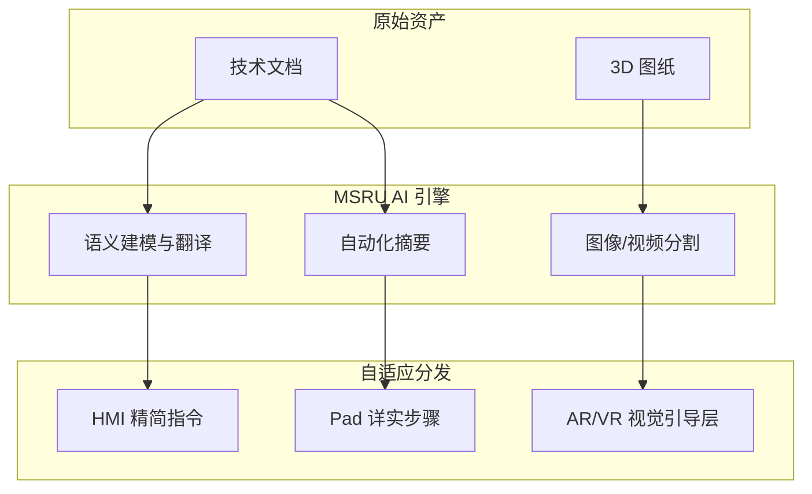

# AI 集成：驱动智能内容治理

在传统的工业内容管理中，文档的编写、翻译与合规性检查占据了技术工程师 **40% 以上** 的精力。**MSRU | CMS** 通过深度集成工业级大语言模型，将这些繁琐的线性工作转化为“人机协同”的非线性增长。

我们不仅仅是接入一个 Chatbot，而是将 AI 逻辑嵌入到了内容建模、创作流与分发审计的每一个原子环节中。

<Callout type="info" title="模型兼容性">
  MSRU | CMS 默认集成了 **[MSRU | AI 工业大语言模型](../../products/ai)**，同时也支持通过标准 API 接入 GPT-4, Claude 以及本地部署的 Llama 3。
</Callout>

---

## 1. AI 创作辅助 (Copilot for Content)

让 AI 成为您的“第二大脑”，告别空白页。

  

    

      
<Sparkles className="size-5" />

      <h3 className="font-bold">结构化规格书提取</h3>
    

    

      只需上传一张设备铭牌照片或一份原始 PDF 规格书，AI 即可根据您的“内容模型”自动提取参数（如电压、转速、序列号）并填充到 CMS 字段中。
    

  

  
  

    

      
<Globe className="size-5" />

      <h3 className="font-bold">工业语境翻译</h3>
    

    

      区别于通用翻译，MSRU AI 具备词汇术语库（Glossary）对齐功能，确保“PLC”或“末端执行器”在所有语言中保持绝对的工程准确性。
    

  

---

## 2. 自动化合规审计 (AI Compliance Guard)

在受监管行业（如医药、航空），内容的合规性重于一切。

<Steps>
  <Step>
    ### 敏感项自动检测
    当编辑提交内容时，AI 会根据内置的 GxP 或 ISO 标准对文本进行扫描，自动标记包含“违禁词”、“模糊指令”或“不安全参数”的段落。
  </Step>
  <Step>
    ### 指令收敛算法
    AI 会评估 SOP 步骤的清晰度：
    <MathEquation 
      inline={false} 
      formula={String.raw`Ambiguity\_Score = \frac{\sum (\text{Vague\_Verbs})}{\text{Total\_Steps}}`} 
    />
    若 `Ambiguity_Score > 0.2`，系统将自动拒绝发布，并建议更具体的描述（例如：将“关掉开关”修改为“顺时针旋转主电源开关至 0 位”）。
  </Step>
</Steps>

---

## 3. 技术路线：多模态分发

AI 不仅处理文字，还负责内容的“再分发”。

---

## 4. 实时语义搜索 (AI Search & Retrieval)

传统的搜索依赖于关键字匹配，而 MSRU | CMS 提供了 **向量化语义搜索**。

- **问题描述**：“为什么二号机床的压力泵在报警？”
- **AI 响应**：系统会跳过所有包含“压力”和“机床”的无关文档，直接检索出 **[EAM 设备管理](../../eam/index)** 中关联的“压力波动故障排查 SOP”的第 4 章节，并实时引用。

---

## 5. 常见集成 FAQ

<Accordions>
  <Accordion title="AI 生成的内容如果出错了，谁来负责？">
    **核心机制**：我们遵循 **“AI 建议，人类签发 (AI Propose, Human Sign-off)”** 的原则。AI 生成的内容在 CMS 中被标记为 `Pre-Draft` 状态，必须经过具备数字证书的专家进行“双人复核”并签名（Digital Signature）后方可发布。
  </Accordion>
  <Accordion title="我的工业数据会被用于大模型的公共训练吗？">
    **隐私政策**：**绝对不会**。MSRU 采用“私有化网关隔离”或“本地私有化模型”模式。所有训练数据或 Prompt 仅在您的租户空间内生效，遵循最高级别的工业数据安全标准（SOC 2/3）。
  </Accordion>
</Accordions>

---

## 6. 总结

AI 与 CMS 的融合，标志着工业内容从“静态档案”向“动态智能体”的进化。

在 **MSRU | CMS** 的加持下，您的企业知识将不再是沉睡在文件柜里的纸张，而是能够实时根据生产现场反馈、自动进化、并能够精准指导每一次操作的智慧源泉。

---

> [!TIP]
> 想要在程序中调用这些 AI 能力？请参考 [API 接入指南](./api)。
