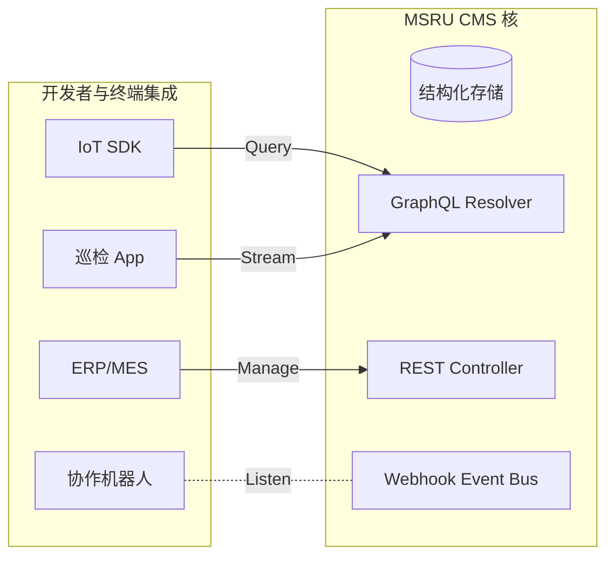

# API 参考：开放的内容集成中心

作为一款 **Headless (无头)** 内容管理系统，**MSRU | CMS** 的核心生命力源于其强大的可编程能力。通过将内容资产解耦为可结构化调用的接口，我们确保了信息能够以毫秒级的速度被任何工业终端、巡检 App 或企业 ERP 系统所消费。

我们将 API 体系划分为三个维度：用于消费内容的 **GraphQL**、用于工程化管理的 **REST**，以及用于事件驱动的 **Webhooks**。

<Callout type="info" title="认证要求">
  所有 API 请求必须在 Header 中携带 `Authorization: Bearer <Your_API_Token>`。您可以在 **[系统设置](../configuration/settings)** 中生成不同权限范围（Scope）的令牌。
</Callout>

---

## 1. 内容消费：GraphQL API (Content Delivery)

GraphQL 是 MSRU | CMS 推荐的内容读取方式，它允许客户端精准请求所需的字段，减少工业网络（如 4G/NB-IoT）下的数据载入成本。

### 核心优势
- **减少冗余**：只请求 `title` 和 `video_url`，而不下载整个 MDX 正文。
- **关系穿透**：一次查询即可拉取 SOP 及其关联的“设备状态”和“上级审批人”。

### 示例查询：获取特定设备的 SOP
```graphql
query GetSopByAsset($deviceId: String!) {
  sop_documents(filters: { asset: { device_id: { eq: $deviceId } } }) {
    title
    steps {
      instruction
      warning_level
    }
    attachments {
      url
      mime
    }
  }
}
```

---

## 2. 自动化管理：REST API (Content Management)

如果您需要进行批量数据迁移、集成外部自动化工作流或大型脚本操作，REST API 是更佳的选择。

### 常用端点概览

| 方法 | 端点 | 描述 |
| :--- | :--- | :--- |
| `GET` | `/api/cms/content-types` | 获取当前 Space 定义的所有内容模型架构 |
| `POST` | `/api/cms/entries` | 创建新的内容条目（如 AI 自动生成的初步报告） |
| `PUT` | `/api/cms/entries/:id/publish` | 将指定 ID 的内容发布到全球边缘节点 |
| `POST` | `/api/cms/media/upload` | 上传工业原件（CAD, MP4, PDF）到媒体中心 |

### 建模效率公式
在集成自动化系统中，API 的吞吐量直接影响了数字化迭代速度：
<MathEquation 
  inline={false} 
  formula={String.raw`Throughput_{batch} = \frac{Batch\_Size}{Latency_{base} + \text{Validation\_Time}} \cdot \text{Parallelism}`} 
/>

---

## 3. 事件驱动：Webhooks (Real-time Pushing)

Webhook 是实现“信息即时同步”的关键。当 CMS 中的内容发生状态变更时，系统会向您预设的 URL 发送 POST 报文。

### 典型应用场景
- **即时通知**：当安全公告发布时，自动触发推送通知到所有员工的 **[移动端 App](../../iot/index)**。
- **构建钩子**：当官方博客更新时，自动触发静态站点（SSG）的增量重新构建。
- **外部合规同步**：将签发的 eBR (电子批记录) 自动同步备份到集团的冷存储中心。

---

## 4. 接入架构演示 (Integration Toplogy)



---

## 5. 安全与流控 (Rate Limiting)

为了保护生产环境的稳定性，API 接入遵循以下流控规则：
- **Professional 版**：每分钟限制 5,000 次请求。
- **Global Enterprise**：支持独占的二级缓存节点，提供 **无上限** 的查询吞吐。

> [!WARNING]
> 请勿在前端代码（如 HTML/JS）中硬编码具有写入权限的 API Key，这会导致重大的工业知识产权泄露。建议始终通过后端代理或使用 `Read-Only` 作用域的 Key。

---

## 6. 常见集成 FAQ

<Accordions>
  <Accordion title="API 是否支持过滤敏感字段（如薪资或保密参数）？">
    **方案**：支持。您可以在 GraphQL 的权限层定义权限策略（Permission Policy），针对不同的 API Key 屏蔽特定的字段。即使查询语句中包含该字段，返回的 JSON 结果也会将其置空或报错。
  </Accordion>
  <Accordion title="如何调试我的 API 请求？">
    **工具**：MSRU 提供内置的 **API Playground**（位于后台菜单的“开发者中心”）。您可以在沙箱中直接编写 GraphQL 语句，实时查看响应结构与执行耗时。
  </Accordion>
</Accordions>

---

## 7. 总结

MSRU | CMS 的 API 体系将内容从枯燥的“文字”变成了具备活性的“数字基因”。

通过这套开放的接口协议，您可以将企业的知识资产无缝注入到现有的业务流程中，真正实现 **“数据定义工业，代码驱动内容”**。

---

> [!TIP]
> 觉得接口文档太复杂？请参考 [SDK 使用指南](./sdk)，通过我们预封装的高级函数库快速开始开发。
