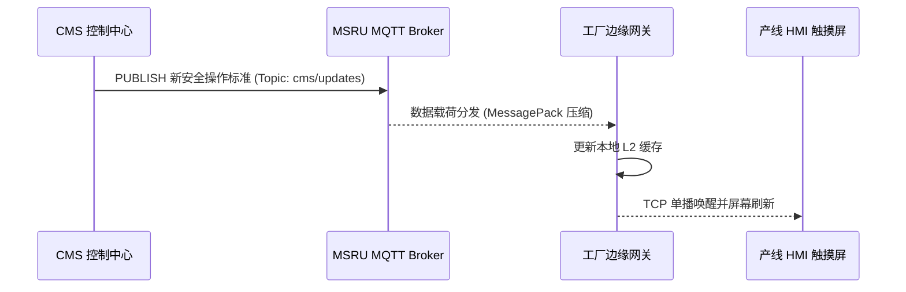
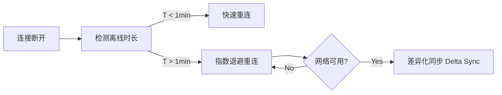

# 内容分发协议集

在工业现场，网络环境往往是极其脆弱的——无论是通过屏蔽严重的偏远车间，还是依赖窄带 NB-IoT 连接的户外资产，传统基于浏览器请求的 HTTP/REST 模式往往难以保证高达 99.99% 的内容可达率。

**MSRU | CMS** 引入了一套混合式通讯协议集，旨在确保指令级内容能够像 PLC 信号一样精准地抵达每一个工业末梢。

<Callout type="info" title="协议优先级">
  系统会根据终端心跳包自动检测网络带宽。当 RTT (往返时延) > 500ms 时，CMS 会自动从 HTTP 模式降级为二进制压缩传输（MessagePack）。
</Callout>

---

## 1. 针对实时性的 MQTT 内容广播 (Push-to-Edge)

对于需要“瞬间同步”的场景（如紧急安全通告、正在变化的安灯状态），CMS 并不等待终端请求，而是通过 **MQTT 协议** 主动向各边缘节点广播变更通知。

### 协议优势
- **轻量级**：头部开销仅为字节级，远低于 HTTP。
- **发布/订阅模型**：终端只需订阅 `msru/cms/fac01/updates` 主题即可实时接收。
- **QoS 保证**：支持 QoS 1/2，确保关键内容至少被送达一次。

---

## 2. 针对弱网的二进制压缩传输 (MessagePack)

对于包含大量文本的 SOP 或审计日志，MSRU 弃用了冗长的 JSON，由于其具备较高的冗余度。

<MathEquation 
  inline={false} 
  formula={String.raw`Bandwidth_{savings} = 1 - \frac{Size_{Binary}}{Size_{JSON}} \approx 30\% \sim 60\%`} 
/>

通过将字符串、数值与结构化模型映射为二进制流，我们显著提升了在工业 4G 网段下的下载速度。

### 协议支持列表
- **HTTP/3 (QUIC)**：利用 UDP 传输，在丢包率高的 Wi-Fi 车间环境提供更强的鲁棒性。
- **WebSockets**：用于管理后台与编辑器的实时协同创作。

---

## 3. 混合式路径：云边端协同分发 (CDN Toplogy)

不同类型的内容资产采用不同的传输路径。

| 内容类型 | 协议 | 建议路径 |
| :--- | :--- | :--- |
| **结构化指令 (JSON/JSONB)** | GraphQL / MQTT | 云端 -> 边缘网关 -> 终端 |
| **富媒体资产 (Video/CAD)** | HTTP/3 (CDN) | 对象存储 -> 地域边缘节点 (Local Cache) |
| **审计心跳 (Audit Logs)** | gRPC | 终端 -> 边缘聚合 -> 云端 |

---

## 4. 自动化重连与离线同步机制

工业现场的通讯断联是常态。MSRU | CMS 的通讯组件内置了 **指数退避重连算法**。

### Delta Sync 逻辑
系统并不下载整个大模型，而是通过 MD5 校验，仅下载自上次离线时间点以来的**变更内容块**，极大节省了电力与流量。

---

## 5. 常见通讯 FAQ

<Accordions>
  <Accordion title="是否支持通过内部局域网(LAN)进行内容同步？">
    **支持**。您可以配置 **[私有化边缘节点](../configuration/deployment)**，将所有内容资源限制在内网分发，完全物理隔离外部互联网。此时系统采用标准的内部 TCP 协议进行高速同步。
  </Accordion>
  <Accordion title="如果我使用的是老旧的 RS485/Modbus 屏，能接收内容吗？">
    **方案**：旧式屏通过 **[MSRU IoT 网关](../../iot/index)** 接入。网关负责将 CMS 的二进制内容报文转换为 Modbus 寄存器地址或特定的串口协议，从而实现“让老设备具备现代内容底座”的效果。
  </Accordion>
</Accordions>

---

## 6. 总结

优质的内容需要通畅的管道。MSRU | CMS 的通讯协议层确保了即便是在最严酷的物理环境下，企业的数字化基因（内容）也能精准无误地完成传递。

---

> [!TIP]
> 想要在您的硬件驱动中直接接入这些协议？请参考 [SDK 接入指南](./sdk)。
