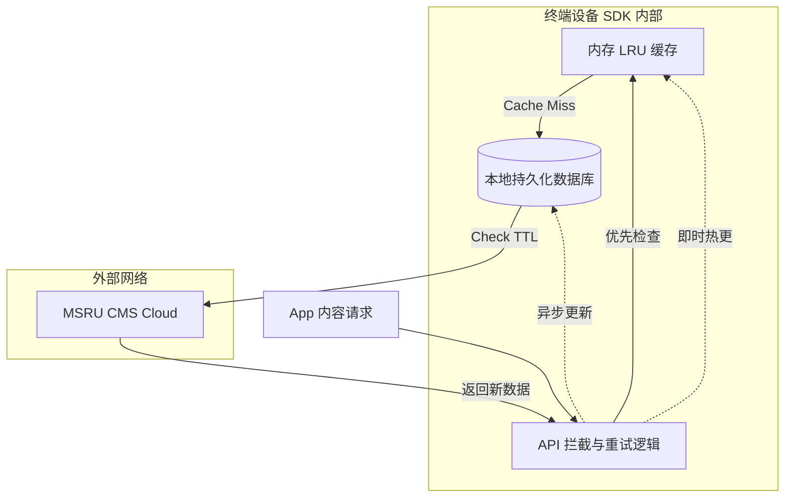

# SDK 使用指南

为了简化开发者对 **[开放 API](./api)** 的调用，我们提供了一套涵盖主流工业开发语言的 **MSRU | CMS SDK**。

该 SDK 不仅封装了繁琐的鉴权与网络重试逻辑，更重要的是，它内置了针对工业场景优化的 **“边缘缓存优先 (Edge-Cache First)”** 算法。这意味着即便在网络瞬时断开的情况下，您的 HMI 或 Pad 应用依然能通过 SDK 获取到本地缓存的 SOP 资料。

<Callout type="info" title="多语言支持">
  目前官方提供 **TypeScript/React**, **Go**, **Python** 以及针对嵌入式终端的 **C++** SDK。
</Callout>

---

## 1. 核心设计哲学：声明式拉取

SDK 建立在“内容即组件”的基础上。开发者无需关心底层的传输协议（无论是 MQTT 还是 HTTPS），只需描述需要什么内容，SDK 会负责剩下的工作。

### 开发效率提升
<MathEquation 
  inline={false} 
  formula={String.raw`Dev\_Effort_{SDK} = \frac{1}{10} \cdot Dev\_Effort_{Raw\_API}`} 
/>

---

## 2. 前端集成：TypeScript & React (UI Layer)

对于基于 Electron 或现代浏览器的工业看板，SDK 提供了响应式 Hooks。

### 安装
```bash
npm install @msru/cms-react
```

### 示例：实现一个实时的安灯公告屏
```tsx
import { useCmsContent } from '@msru/cms-react';

export function BulletinBoard() {
  // 订阅特定的安全通告，开启实时同步模式
  const { data, loading, error } = useCmsContent({
    type: 'safety_notice',
    filters: { status: 'published' },
    live: true // 开启 WebSocket 实时推送
  });

  if (loading) return <Spinner />;

  return (
    <div className="p-4 bg-red-900/10 border-l-4 border-red-500">
      <h2 className="text-2xl font-bold">{data.title}</h2>
      <div dangerouslySetInnerHTML={{ __html: data.content_html }} />
      <span className="text-xs">发布时间: {new Date(data.updatedAt).toLocaleTimeString()}</span>
    </div>
  );
}
```

---

## 3. 边缘计算集成：Golang & Python (Data Layer)

在边缘网关或数据处理层，SDK 通常用于自动化文档生成与系统间同步。

<Tabs items={['Golang (高性能网关)', 'Python (AI/脚本)']}>
<Tab value="Golang (高性能网关)">
```go
package main

import "github.com/msru/cms-go-sdk"

func main() {
    client := cms.NewClient("https://cms.msru.local", "YOUR_API_KEY")
    
    // 获取设备关联的 SOP 指令，结果会自动解包 MessagePack 压缩
    sop, err := client.GetEntryByAsset("ROBOT_ARM_001")
    if err != nil {
        log.Fatal(err)
    }
    
    println("当前指令:", sop.Fields["instruction"])
}
```
</Tab>
<Tab value="Python (AI/脚本)">
```python
from msru_cms import CMSClient

# 初始化并开启本地存储持久化
client = CMSClient(api_key="...", persistence=True)

# 搜索特定语境下的文档
results = client.search(
    query="压力容器操作规范",
    lang="zh-CN",
    semantic=True # 开启 AI 语义搜索
)

for doc in results:
    print(f"匹配度: {doc.score} | 标题: {doc.title}")
```
</Tab>
</Tabs>

---

## 4. 离线缓存与同步拓扑 (Sync Logic)

SDK 内部维护了一个高性能的 Key-Value 数据库（如 SQLite 或 LevelDB），用于在断网时提供“生存能力”。



---

## 5. 常见集成 FAQ

<Accordions>
  <Accordion title="SDK 如何处理图像的大规模并发加载？">
    **方案**：SDK 内置了 **Image Prefetching** 功能。您可以配置 SDK 在空闲时自动下载并预热即将使用的图像资源到本地存储轴，避免在页面跳转时出现白块或延迟。
  </Accordion>
  <Accordion title="在低功耗 MCU 上能跑这个 SDK 吗？">
    **回答**：标准的 TS/Go SDK 不支持。我们专门为 MCU 设计了 **MSRU | CMS Lite (C++版)**，它剔除了复杂的对象模型映射，改为直接处理二进制流，内存开销可控制在 50KB 以内。
  </Accordion>
</Accordions>

---

## 6. 总结

SDK 的存在是为了让开发者能够**“忘记 API”**，转而关注**“业务逻辑”**。

通过整合鉴权、压缩传输、离线缓存与实时推送，MSRU | CMS SDK 为您的数字化工厂应用提供了一套坚固且高效的通讯骨架，确保了内容在任何极端环境下都能稳定加载。

---

> [!TIP]
> 准备好编写您的第一个组件了吗？请参考 [React 组件最佳实践](./usage/modules) 或通过命令行工具 `msru-cli` 生成样板代码。
