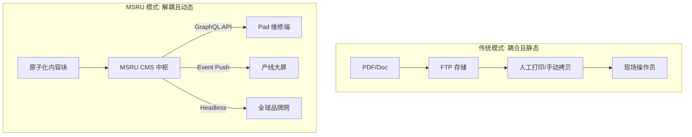

# 行业对比

在选择内容治理方案时，制造企业往往会纠结于：是继续沿用传统的 PDF/FTP 体系，还是采用通用的营销级 CMS（如 WordPress），亦或是引入 **MSRU | CMS** 这种专为工业设计的“无头”架构？

本页将从技术底座、合规深度与分发效率三个核心维度进行深度解码。

<Callout type="info" title="核心设计差异：原子化 vs 模块化">
  传统系统将内容视为“文件”或“页面”，而 MSRU 将内容视为**“具备语义的原子数据”**。这一本质差异决定了信息能否被 AI 理解并被产线 HMI 秒级调用。
</Callout>

---

## 1. 深度对比矩阵 (The Matrix)

<Tabs items={['工业级分发', '通用 CMS', '传统文档系统']}>
<Tab value="工业级分发">
### MSRU | CMS (Headless 架构)
- **核心定位**：全球工业数字化内容的“单一事实来源”。
- **分发能力**：原生支持 API 推送至 PLC 屏、AR 眼镜及品牌官网。
- **合规性**：支持电子签名、版本强一致性控制及长达 30 年的审计追溯。
- **AI 整合**：深度集成 LLM 进行技术文档的自动化摘要与多语言翻译。
</Tab>
<Tab value="通用 CMS">
### 通用 CMS (如 WordPress, Strapi)
- **核心定位**：以营销和博客为中心的网页发布工具。
- **分发能力**：主要复盖 Web 端，难以适配低带宽或封闭网段的工业通讯协议。
- **合规性**：缺乏严苛的工业级工作流审计，版本回滚逻辑较为松散。
- **局限性**：难以处理海量的高频技术资产关联。
</Tab>
<Tab value="传统文档系统">
### 传统 FTP / 共享文件夹 / 纸质
- **核心定位**：原始的文件存储与检索。
- **分发能力**：依赖人工拷贝，存在严重的“版本偏差”风险。
- **合规性**：几乎无法审计“谁读过”以及“读取时是否为最新版”。
- **风险**：信息孤岛严重，数据无法被程序化提取。
</Tab>
</Tabs>

---

## 2. 性能评估指标 (Key Performance Indicators)

通过以下公式，我们可以量化内容治理的效能：

<MathEquation 
  inline={false} 
  formula={String.raw`Efficiency = \frac{\text{Correct Actions}}{\text{Info Retrieval Time} + \text{Verification Time}}`} 
/>

在传统模式下，由于检索时间长且需反复人工确认版本，`Efficiency` 极低。MSRU | CMS 通过 **“即插即用型 SOP”**，将检索时间缩短至毫秒级，从而极大提升了现场处置的准确率。

---

## 3. 选型深度扫描 (Radar Chart)

```mermaid
radar
    title 方案能力深度对标
    "合规审计深度" : 98
    "多端适配灵活性" : 95
    "AI 自动化能力" : 90
    "OT 层通讯友好度" : 92
    "TCO (5年总成本)" : 85
```

> [!IMPORTANT]
> **结论**：如果您是需要管理跨国产线、遵循 GxP 规范、且有大规模分发需求的制造巨头，**Headless 架构的 MSRU | CMS** 是目前市面上唯一的“工业级方案”。

---

## 4. 架构拓扑对比 (Evolution)

理解从“文件中心”到“内容中枢”的演进：



---

## 5. 常见集成 FAQ

<Accordions>
  <Accordion title="既然 Headless 这么好，入门门槛是不是很高？">
    **回答**：确实需要一定的工程能力。但 MSRU 提供了 **[快速上手指南](./quick-start)** 与完善的插件体系。即使您的 IT 团队不熟悉 GraphQL，也可以通过我们预设的模板快速搭建起第一套全自动内容分发台。
  </Accordion>
  <Accordion title="对于存量的数万份旧 PDF 文件，如何平滑迁移？">
    **方案**：我们提供 **“AI 批量导入引擎”**。它可以自动解析 PDF 的标题、内容与关键参数，并根据预定义的 Schema 将其结构化地导入 CMS。平均转换准确率可达 92% 以上。
  </Accordion>
</Accordions>

---

## 6. 总结

对比的目的不是否定过去，而是预见未来。

**MSRU | CMS** 通过将“内容”从“载体”中解放出来，赋予了工业信息前所未有的流动性与确定性。在追求极致效率的工业 4.0 时代，这套领先的 Headless 体系将是您构建“智慧工厂知识产权”的关键。

---

> [!TIP]
> 已经决定拥抱 Headless 了吗？接下来请参考 [快速上手指南](./quick-start) 开启您的首个内容模型。
