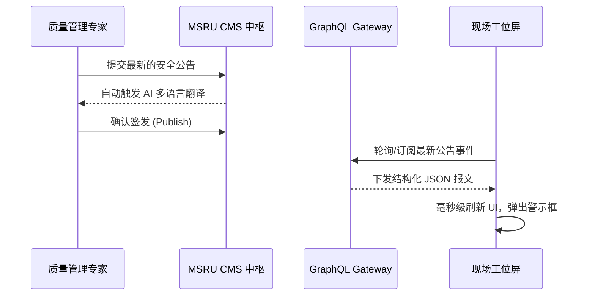

# 快速上手指南

欢迎使用 **MSRU | CMS**。本教程将带领您在 5 分钟内构建一个简单的“标准作业程序 (SOP)”内容管理流，并将其分发至产线看板。

通过本实践，您将深刻理解所谓“无头 (Headless)”架构如何将业务逻辑与展示层完美解耦。

<Callout type="info" title="准备工作">
  您需要拥有 MSRU 平台的管理员权限。若您是开发人员，请确保本地已安装好最新的 **[IoT SDK](../../iot/integrations/sdk)** 以便测试数据调用。
</Callout>

---

## 1. 第一步：定义内容模型 (Modeling)

在 CMS 中，一切皆为“模型”。我们需要为 SOP 创建一个结构化定义。

<Steps>
  <Step>
    ### 创建内容类型 (Content Type)
    进入“内容建模”中心，新建一个名为 `Industrial_SOP` 的模型。
  </Step>
  <Step>
    ### 配置字段属性
    为该模型添加以下字段：
    - **Title (Text)**: 标题。
    - **Step_Content (Rich Text)**: 核心操作步骤。
    - **Safety_Level (Select)**: 安全等级（从高到低）。
    - **Asset_Link (Relation)**: 关联的设备资产 (Link to IoT Module)。
  </Step>
</Steps>

---

## 2. 第二步：录入与签发 (Content Authoring)

现在我们有了“容器”，让我们往里填入真实的技术资料。

<Tabs items={['手动录入', 'AI 辅助生成', '工作流审核']}>
<Tab value="手动录入">
1. 点击“内容列表” -> “新建 Industrial_SOP”。
2. 输入标题：“二号产线机器人末端执行器更换指南”。
3. 关联设备 ID：`ROBOT_ARM_05`。
4. 点击“保存为草稿”。
</Tab>
<Tab value="AI 辅助生成">
利用右侧的 **AI 侧边栏**：
> "基于我的设备规格书，生成一份针对新手操作员的 3 步更换流程，并翻译成英文和德文。"
  
AI 将自动填充字段，您只需进行最后的“专家校对”。
</Tab>
<Tab value="工作流审核">
点击“提交审核”。系统会自动通知质量主管进行数字签名。审核通过后，该内容的状态将变更为 **Published (已发布)**，并同步至 Edge 节点。
</Tab>
</Tabs>

---

## 3. 第三步：API 调用与渲染 (Delivery)

这是 Headless 的魅力所在。您的前端应用可以通过 GraphQL 立即获取数据。

```graphql
# 在您的看板 App 或 Pad 端执行查询
query GetLatestSOP($assetId: String!) {
  industrial_SOPs(where: { Asset_Link: { id: $assetId } }) {
    title
    step_content
    safety_level
    updatedAt
  }
}
```

---

## 4. 实时效果验证 (Validation)

您可以利用内置的**预览沙箱**查看不同终端的渲染效果。



---

## 5. 常见快速上手问题 (FAQ)

<Accordions>
  <Accordion title="为什么我修改了内容，API 查出来的还是旧的？">
    **排查建议**：请检查您的分发策略。MSRU | CMS 默认开启了 **CDN 缓存**。如果您需要即时生效，可以调用 `purge_cache` 接口，或者检查该内容的“生效版本（Active Version）”是否指向了旧版本。
  </Accordion>
  <Accordion title="我可以导出我录入的所有模型定义吗？">
    **操作方式**：可以。在“设置”中选择“架构导出”。系统将生成一个标准的 `.json` 文件，您可以将其导入到生产环境或其他地域的 MSRU 实例中，实现模型的一致性平移。
  </Accordion>
</Accordions>

---

## 6. 开启您的内容治理之旅

恭喜！您已经完成了从“定义”到“分发”的所有核心环节。

MSRU | CMS 的强大之处在于其无限的扩展性。接下来，您可以尝试集成 **[AI 智能审查插件](../integrations/ai)**，或者通过 **[SDK](../integrations/sdk)** 编写自动化的同步脚本。

---

> [!TIP]
> 想要了解更复杂的部署架构？请查看 [部署指南](../configuration/deployment)。
