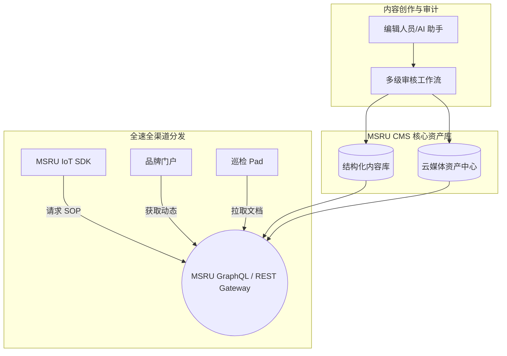

# 什么是 MSRU | CMS？

在数字化转型的深水区，工业企业逐渐发现，真正的瓶颈往往不是“没有数据”，而是**“信息无法在正确的时刻，以正确的格式，触达正确的人”**。

**MSRU | CMS (Content Management System)** 正是为了解决这一痛点而设计的工业级内容治理基座。它超越了传统的“网页排版”或“文档存储”范畴，通过 **Headless (无头)** 技术与 **AI 语义引擎**，将琐碎的、异构的企业信息转化为可版本化、可程序化调用的数字化资产。

<Callout type="info" title="从 Collaborative 到 Content">
  虽然 MSRU 历史版本中曾将 CMS 定义为“协作中心 (Collaborative Center)”，但在最新的全栈架构中，我们已将其升华为**“内容管理系统 (Content Management System)”**。这一转变标志着系统从“处理流程”进化到“治理资产”的战略级跨越。
</Callout>

---

## 1. 工业内容的三个生命阶段

理解 MSRU | CMS 如何管理信息的完整生命周期：

<Steps>
  <Step>
    ### 结构化采集与注入 (Ingestion)
    内容不再是死板的 PDF。通过 CMS 的建模引擎，您可以定义具备特定属性（如：设备关联 ID、安全等级、翻译状态）的“内容对象”。支持从 CAD 图纸、ERP 文档或 AI 生成的摘要中自动注入数据。
  </Step>
  <Step>
    ### 自动化治理与合规 (Governance)
    这是工业场景的刚需。每一笔内容变更都必须经过工作流审计。
    - **多级审批流**：确保 SOP 指令在发布前经过安全主管的数字签名。
    - **版本强一致性**：杜绝“旧版图纸引导生产”的重大事故风险。
  </Step>
  <Step>
    ### 全场景分发 (Orchestration)
    基于 API 优先的原则，内容被分发至：
    - **产线 HMI**：实时展示当前订单的操作指引。
    - **移动端 Pad**：下发维护任务与安全通告。
    - **全球门户**：同步企业年报、质量承诺及品牌动态。
  </Step>
</Steps>

---

## 2. 核心技术架构：Headless CMS 的优势

传统的工业管理软件往往是封闭的黑盒，而 MSRU | CMS 采用开放的 **Headless** 架构：

| 维度 | 传统耦合式 CMS | MSRU 无头 CMS |
| :--- | :--- | :--- |
| **呈现形式** | 仅限于网页或特定客户端 | **全平台** (Web, App, AR, IoT Screen) |
| **开发灵活性** | 被模板语言限制 | **自由化** (使用 React, Vue 或 原生 HMI 代码调用) |
| **数据一致性** | 存在多份拷贝，维护难 | **单一事实来源 (SSoT)**，全球实时同步 |
| **AI 亲和力** | AI 难以解析 HTML 模板 | **数据原子化**，AI 能够精准提取语义并生成翻译 |

---

## 3. 数学模型：内容权重与推送精度

为了实现“信息找人”，我们引入了内容相关性推荐算法：

<MathEquation 
  inline={false} 
  formula={String.raw`Score_{(user, content)} = \alpha \cdot \text{Match}(Role, Tag) + \beta \cdot \text{Proximity}(Asset\_ID) + \gamma \cdot \text{Urgency}(Flag)`} 
/>

这意味着：如果一名二号车间的技术员正在检修某台 PLC，系统会通过 CMS 的算法自动将其匹配的 PDF 手册、故障排除视频以及该设备的历史维修日志优先推送到其移动端首页。

---

## 4. 业务落地架构 (Architecture Map)

---

## 5. 常见挑战与 FAQ

<Accordions>
  <Accordion title="既然我有共享文件夹和 PDF 系统，为什么还需要 CMS？">
    **核心差异**：
    1. **结构化**：PDF 是非结构化的，机器无法搜索其中的字段或通过 API 局部调用。
    2. **安全性**：共享文件夹无法满足工业审计对“谁在什么时候读了哪一页”的细颗粒度记录。
    3. **自适应**：CMS 的内容会根据显示终端自动调整排版，而 PDF 在 7 寸工业小屏上几乎无法阅读。
  </Accordion>
  <Accordion title="CMS 是否支持断网访问？">
    **方案**：支持。我们的 **[边缘网关](../../iot/configuration/deployment)** 会自动缓存本地产线所需的关键内容（如应急预案）。在物理断网时，边缘节点可以继续提供内容分发服务，待网络恢复后同步审计痕迹。
  </Accordion>
</Accordions>

---

## 6. 总结：信息即生产力

MSRU | CMS 不仅是一个软件，它是企业的**“数字免疫系统”**。

通过消除信息的滞后、偏误和隔离，它确保了企业的管理指令能够如同血液一般，精准、快速且合规地流向工厂的每一个末梢神经。

---

> [!TIP]
> 准备好重构您的企业知识库了吗？请查阅 [快速上手指南](./quick-start) 开始创建您的第一个内容模型。
