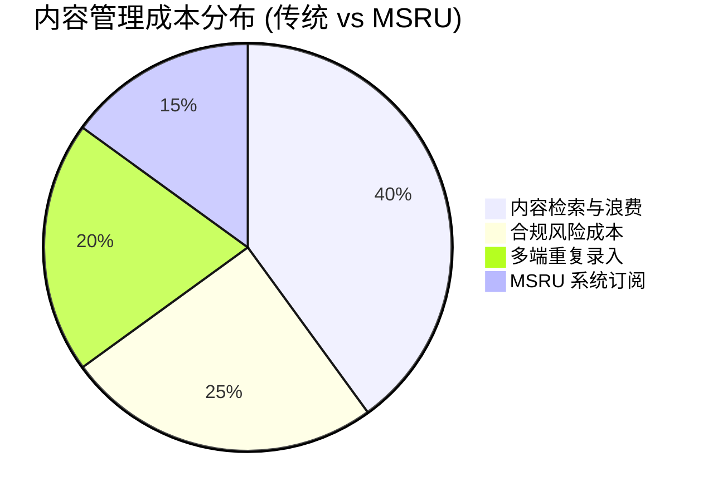

# 价格与订阅

作为全球数字化的赋能者，**MSRU | CMS** 采用了以**“价值产出”**为核心的商业定价模式。我们深知，从初创型数字车间到世界级的跨国集团，其对内容治理的复杂性要求大相径庭。

因此，我们的定价体系被划分为三个核心层级，并支持基于实际资源消耗的弹性扩展。

<Callout type="info" title="计费透明性">
  CMS 的费用通常作为 MSRU 平台整体订阅的一部分。若您已购买 **[Enterprise 旗舰计划](../../(msru)/index)**，则通常已包含 CMS 的高级分发额度。
</Callout>

---

## 1. 订阅版本矩形 (Subscription Tiers)

  

    
Team 版

    
免费 / $0

    
适用于单体工厂的数字化内容起步。

    <ul className="text-xs space-y-2 mb-8">
      <li>✅ 1,000 条内容条目</li>
      <li>✅ 10GB 媒体存储 (S3)</li>
      <li>✅ 基础 REST API 接入</li>
      <li>❌ AI 内容脱敏</li>
      <li>❌ 全球多节点内容冗余</li>
    </ul>
  

  
  

    
推荐

    
Professional 版

    
$499 /月

    
适用于拥有跨部门协作需求的成长型制造企业。

    <ul className="text-xs space-y-2 mb-8">
      <li>✅ 50,000 条内容条目</li>
      <li>✅ 200GB 高性能存储</li>
      <li>✅ 完整的 GraphQL & Webhook</li>
      <li>✅ AI 辅助翻译 (10万字/月)</li>
      <li>✅ 角色权限权限编排 (RBAC)</li>
    </ul>
  

  
  

    
Global Enterprise

    
定制议价

    
面向全球化治理、合规审计严密的跨国集团。

    <ul className="text-xs space-y-2 mb-8">
      <li>✅ 无限内容条目</li>
      <li>✅ Tb 级专用分布式存储</li>
      <li>✅ 独占的 Edge CDN 节点</li>
      <li>✅ 深度 AI 内容审查引擎</li>
      <li>✅ SSO & 本地私有化部署支持</li>
    </ul>
  

---

## 2. 核心计费维度说明 (Value Metrics)

除基础订阅外，以下三个维度决定了您的实际总体拥有成本 (TCO)：

<Tabs items={['内容条目与分发', 'AI 增强套件', '合规与审计中心']}>
<Tab value="内容条目与分发">
### 流量与存储
我们不限制 API 请求的总次数，但对月度分发带宽进行计费。
<MathEquation 
  inline={false} 
  formula={String.raw`Cost_{delivery} = \text{Bandwidth}_{GB} \times \text{Regional\_Weight} + \text{Base\_Fee}`} 
/>
- **内部通道**：流向内部产线 HMI 的数据流量**完全免费**。
- **外部通道**：流向官方品牌门户或第三方移动端的流量按量计算。
</Tab>
<Tab value="AI 增强套件">
### 智能化赋能
- **AI 摘要与创作**：按处理的 Token 数量计费。
- **视觉标签自动识别**：每 1000 张图核算 1 个“计算点数”。
- **多语言同步**：支持按语言对（Language Pairs）订阅包购买。
</Tab>
<Tab value="合规与审计中心">
### 记录保留策略
- **标准记录**：默认保存 1 年的操作日志。
- **长期合规档 (GxP)**：支持 5-30 年的不可篡改数据归档订阅。这是医药、核电等行业的必选项。
</Tab>
</Tabs>

---

## 3. TCO 投资回报分析 (ROI Analysis)

为什么企业应该投资 MSRU | CMS？

通过引入 CMS，企业平均可以：
- **降低 65% 的内容维护工时**：通过无头分发消除重复录入。
- **规避 100% 的生产文件一致性风险**：通过强版本控制确保产线永远看到的是最新签发版本。
- **提升 40% 的品牌分发效率**：通过 AI 自动化完成多国分中心的本地化适配。

---

## 4. 常见商务 FAQ

<Accordions>
  <Accordion title="我可以只订阅 CMS 而不购买全套 MSRU 吗？">
    **支持**。我们提供 **“Stand-alone CMS”** 方案。这特别适用于希望利用我们的工业级合规架构，但尚未准备好全量切换 MES/WMS 的企业。该模式下，CMS 可作为独立的 Headless 数据源接入您现有的系统。
  </Accordion>
  <Accordion title="由于数据安全原因，我们必须保持数据驻留，这会影响价格吗？">
    **方案**：MSRU 提供 **[私有化部署 (On-Premise)](../configuration/deployment)** 选项。这通常涉及一次性的 License 授权费与年度维护费 (MA)，而非按流量计费。
  </Accordion>
</Accordions>

---

## 5. 总结

MSRU | CMS 的定价初衷是：**让每一分投入都转化为可见的信息确定性。**

无论您是只需要管理几百篇 SOP 的小型车间，还是需要管理全球复杂品牌与合规体系的集团公司，我们都有灵活的财务模型支持您的数字化增长。

---

> [!TIP]
> 准备好获取精准报价了吗？欢迎使用我们的 [TCO 计算器](https://msru.global/pricing/calculator) 或联系您的客户经理。
