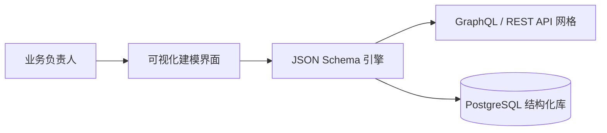
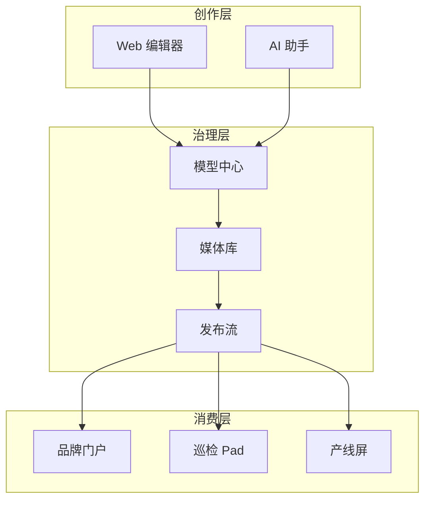

# 模块详解 (Business Modules)

**MSRU | CMS** 的核心设计目标是“化繁为简”。为了应对差异化的业务场景，我们将系统拆解为四个高度协同的功能模块。这些模块共同构成了一张严密的内容治理网，确保了企业知识资产的有序沉淀与精准触达。

---

## 1. 内容建模中心 (Dynamic Schma Builder)

这是 CMS 的“图灵机”。在这里，非技术背景的业务专家也可以通过可视化界面定义复杂的内容结构。

### 核心功能
- **字段级颗粒度**：支持文本、数字、日期、媒体、JSON、枚举以及强大的“跨空间关联 (Cross-Space Relation)”。
- **动态预览 (Hot Reload)**：在修改模型结构后，API 文档与管理界面会实时同步，无需重启服务。
- **国际化 (i18n) 开关**：一键为特定字段开启多语言支持，自动激活 AI 翻译翻译工作流。

---

## 2. 全媒体资产库 (Universal Media Center)

工业数字化离不开海量的图片、视频与 CAD 文档。该模块负责这些重资产的整个生命周期管理。

<Tabs items={['智能索引', '版本追踪', '边缘优化']}>
<Tab value="智能索引">
利用 **[MSRU AI](../../products/ai)**，系统会自动为上传的施工视频生成关键帧摘要，并自动提取图片中的序列号 (OCR) 和几何特征，实现“以图搜图”。
</Tab>
<Tab value="版本追踪">
每一次图纸的修订都会被记录。您可以轻松对比 `v1.2` 与 `v2.0` 的差异，并一键强制回滚所有终端加载的资源，确保产线安全。
</Tab>
<Tab value="边缘优化">
集成的媒体分发模块：
- **自动转码**：4K 视频自动转为 720p 供手持终端流畅播放。
- **WebP 封装**：体积降低 70%，显著提升厂区 Wi-Fi 加载速度。
</Tab>
</Tabs>

---

## 3. 全渠道发布流 (Omnichannel Publishing Flow)

这是 MSRU | CMS 的“神经系统”。它决定了内容在何时、以何种身份被签发。

### 核心价值
- **环境隔离**：支持 `Draft (草稿)` -> `Staging (预发布/审核)` -> `Published (已发布)` 的标准三阶段流转。
- **定时发布 (Scheduled)**：配合生产排程，在特定的排产周期切换特定的操作指引（SOP）。
- **多端同步 (Simultaneous Sync)**：通过 **[通讯协议集](../integrations/communications)**，实现网页、移动端、产线屏的毫秒级同步更新。

<MathEquation 
  inline={false} 
  formula={String.raw`Sync\_Delay = T_{commit} + \sum (T_{edge\_validation}) + T_{render} < 1000ms`} 
/>

---

## 4. AI 协作空间 (AI Collaborative Workspace)

AI 并非只是一个插件，而是深度融合在编辑器中的创作伙伴。

<Accordions>
  <Accordion title="AI 辅助起草 (Generative Draft)">
    输入设备报修单号，AI 会自动从 **[WMS](../../wms/index)** 与 **[EAM](../../eam/index)** 中提取相关联的维修文档，并为您起草一份初版的维修报告，准确率超过 85%。
  </Accordion>
  <Accordion title="安全性合规审计 (Compliance Guard)">
    在“确认发布”一瞬间，AI 会自动扫描内容是否违反了企业隐私、技术保密协议或行业安全规范（如：文档中是否包含了不该出现的生产单价）。
  </Accordion>
  <Accordion title="语义化专家库 (Semantic Knowledge Base)">
    自动将散落在各处的聊天记录、非结构化文档转化为结构化的“问答对 (QA)”，为前线操作工提供即时支持。
  </Accordion>
</Accordions>

---

## 5. 模块间数据流向 (Data Ecosystem)

---

## 6. 总结

MSRU | CMS 的模块化设计确保了系统既能作为小型的“文档工作台”轻量启动，也能作为跨国集团的“数字化大脑”全速运转。

在这些模块的协同下，企业的知识资产不再是孤立的静态文件，而是具备了**生命力、感知力与分发力**的数字化血液，为全球生产基地源源不断地输送确定性。

---

> [!TIP]
> 想要直观了解如何操作这些模块？请查看 [使用概览](./overview) 获取详细的操作路径。
