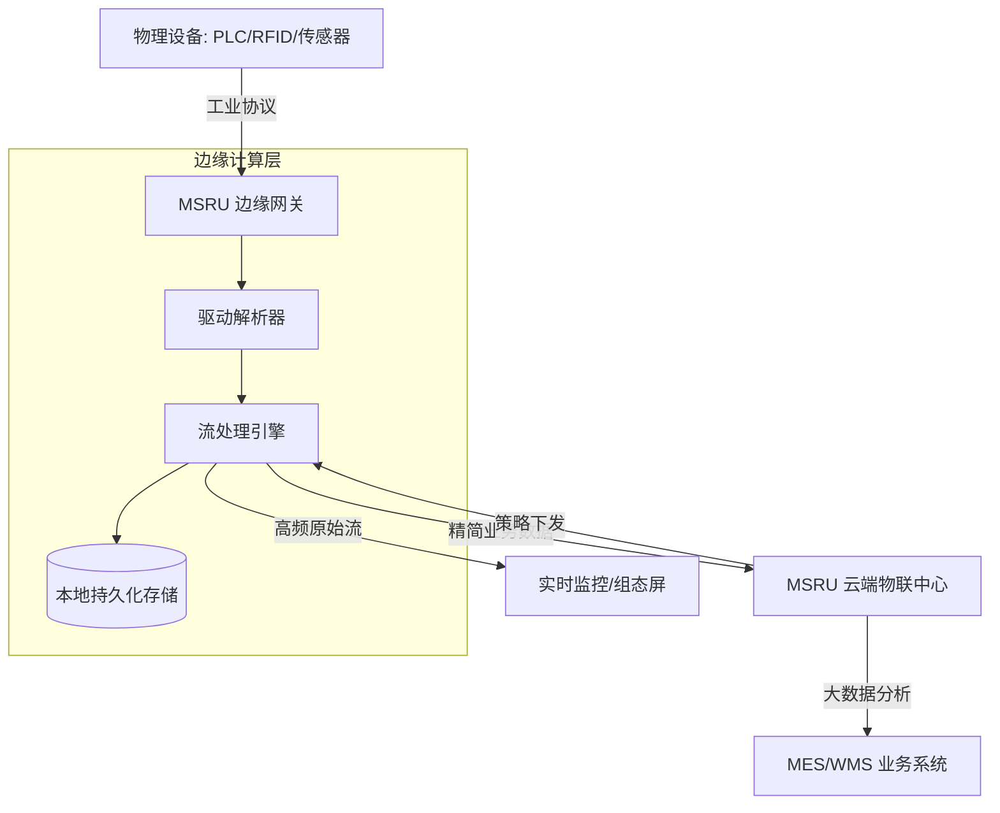

# IoT 万物互联概览

在 MSRU 平台的生态位中，**IoT (Internet of Things)** 模块被定义为整个数字化工厂的“感知神经元”。

它不仅仅是一套协议转换工具，更是一个深度融合了边缘计算（Edge Computing）与数字孪生（Digital Twin）的高性能资产管理框架。它负责将散落在工厂车间各个角落的物理设备——从拥有百年历史的机械冲床到最尖端的协作机器人——无感地接入统一的数字大脑。

<Callout type="info" title="设计愿景：从“设备接入”到“语义连接”">
  传统的 IoT 仅解决“数据能不能传上来”的问题。MSRU | IoT 致力于解决“数据意味着什么”的问题。通过内置的物模型系统，任何协议下的原始位（Bit）和字节（Byte）都会自动转化为具备业务语义的质量参数、运行状态或能效指标。
</Callout>

---

## 1. MSRU IoT 的核心价值支柱 (Core Pillars)

我们从三个尺度重新定义了工业连接的标准：

<Cards>
  <Card 
    title="全协议万能接入" 
    description="内置 150+ 工业协议驱动。无论是 Modbus, OPC-UA 等公开标准，还是复杂的 SECS/GEM, 三菱/西门子私有协议，均可实现‘即插即用’。" 
    icon="Unplug" 
  />
  <Card 
    title="边缘流式预处理" 
    description="在数据离开车间网关前完成清洗、聚合与告警判定。毫秒级响应能力确保了控制反馈的实时性，同时减少 80% 云端带宽消耗。" 
    icon="Zap" 
  />
  <Card 
    title="高保真数字孪生" 
    description="不仅仅是 Dashboard 面板。我们通过映射物理世界的拓扑关系，在软件内部构建了一比一的数字影子，支持状态回溯与趋势仿真。" 
    icon="Boxes" 
  />
</Cards>

---

## 2. 什么是“数智化”连接闭环？

IoT 模块通过标准的四层架构，实现了从信号触发到决策反馈的闭环：

<Tabs items={['采集层 (Acquisition)', '边缘处理层 (Processing)', '应用模型 (Modeling)']}>
<Tab value="采集层 (Acquisition)">
### 多模态数据捕获
支持同步轮询与异步订阅机制。利用 **mTLS 证书** 保证从传感器到边缘节点的通讯链路全加密，满足等保三级安全规范。
</Tab>
<Tab value="边缘处理层 (Processing)">
### 实时流式计算
利用边缘端的计算资源进行高频信号处理：
- **去抖过滤**：消除电气噪声带来的伪信号。
- **动态阈值**：基于历史基准自动调整预警线。
- **断网续传**：本地账本技术（DB Ledger）确保在极低带宽或临时断网下数据零丢失。
</Tab>
<Tab value="应用模型 (Modeling)">
### 统一物模型 (Thing Model)
将不同厂牌、不同协议的设备抽象为标准的“资产对象（Assets）”。
```json
{
  "asset_id": "CNC-SH-05",
  "properties": {
    "spindle_speed": { "unit": "rpm", "value": 12000 },
    "load_percentage": { "unit": "%", "value": 85.5 }
  }
}
```
</Tab>
</Tabs>

---

## 3. IoT 技术深度：边缘计算公式

在 MSRU 体系中，边缘计算的价值由“本地性优先级”决定。

<MathEquation 
  inline={false} 
  formula={String.raw`Latency_{total} = \underbrace{T_{collect} + T_{edge\_calc}}_{\text{Determinism}} + \underbrace{T_{network\_jitter}}_{\text{Stochastic}}`} 
/>

通过将 90% 的业务逻辑（如质量异常判定、安全联锁控制）从云端下沉至边缘侧（`$T_{edge\_calc}$`），MSRU | IoT 消除了网络抖动（`$T_{network\_jitter}$`）带来的不确定性，实现了工业级的 **判定确定性**。

---

## 4. 业务落地架构 (Architecture Map)

展现物理世界与数字世界的无缝映射流程。



---

## 5. IoT 操作资产目录 (Internal Assets)

对于系统架构师，了解 IoT 的底层资源结构至关重要。

<Files>
  <Folder name="iot-core-definitions" defaultOpen>
    <Folder name="driver-lib" defaultOpen>
       <File name="modbus-tcp.so (高性能驱动)" />
       <File name="opc-ua-client.msru (安全映射)" />
    </Folder>
    <Folder name="thing-models">
       <File name="universal-lathe.json (通用车床物模型)" />
       <File name="agv-fleet.yaml (移动机器人集群定义)" />
    </Folder>
  </Folder>
</Files>

---

## 6. 常见问题排查 (FAQ)

<Accordions>
  <Accordion title="系统如何处理非标协议的接入？">
    **方案**：MSRU 提供 **IoT SDK (Go/C++)**。开发者只需遵循我们的 `DriverInterface` 编写特定的解析插件，即可将私有协议设备虚拟化为标准的物模型对象。
  </Accordion>
  <Accordion title="关于大规模设备接入的并发限制是多少？">
    **性能指标**：单个标准边缘节点支持 5,000+ 测点流量的并发（100ms 采集周期）。通过集群化部署边缘网关，采集规模可线性扩展至百万级。
  </Accordion>
</Accordions>

---

## 7. 下一步计划

准备好连接您的第一台数字化设备了吗？

---

> [!TIP]
> 想要快速拉起测试环境？请前往 [快速上手指南](./introduction/quick-start)。
