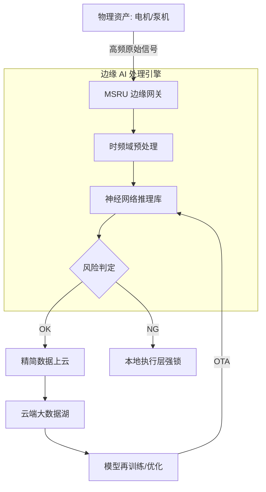

# AI 集成指南

在工业物联网的发展历程中，数据采集只是手段，而 **“从数据中获取洞察”** 才是核心。

**MSRU | IoT** 平台深度集成了 AI 模块，支持将训练好的机器学习（ML）与深度学习（DL）模型无缝分发至边缘网关（Edge Gateway）。这使得您的连接网格不仅能“采集”信号，更能实时“解析”信号背后的物理意义。

<Callout type="info" title="AI 的使命：替代经验主义">
  传统的阈值报警只能处理简单的逻辑。AI 模块通过分析信号的频谱特征、时域关联及非线性波动，能够识别出肉眼或普通公式无法发现的设备隐患。
</Callout>

---

## 1. 核心 AI 感知能力矩阵 (AI Capabilities)

我们在 IoT 的感知环节注入了三个层级的 AI 能力：

<Cards>
  <Card 
    title="高频信号频谱分析" 
    description="针对电机、主轴震动信号。利用 FFT（快速傅里叶变换）+ 卷积神经网络（CNN）实时监测轴承磨损与失衡。" 
    icon="Pulse" 
  />
  <Card 
    title="预测性维护模型 (PdM)" 
    description="结合设备剩余寿命（RUL）预测模型。分析历史工况与能耗波动，在故障发生前一周发出维护建议。" 
    icon="BarChart4" 
  />
  <Card 
    title="异常工况智能判定" 
    description="利用无监督学习（如 Isolation Forest）识别生产过程中的离群点。自动捕获断刀、卡料或传感器失效等瞬时异常。" 
    icon="ShieldAlert" 
  />
</Cards>

---

## 2. AI 边缘推理工作流 (Edge Inference Flow)

MSRU 实现了 **“全生命周期模型治理”**。

<Tabs items={['模型训练与下发', '边缘推理逻辑', '长短期记忆 (LSTM)']}>
<Tab value="模型训练与下发">
### 云端训练，全球下发
1. **数据脱敏**：将边缘采集的原始高频数据同步至云端样本库。
2. **Auto-ML 训练**：利用 MSRU 云端的算力集群自动完成特征工程与模型轻量化（量化压缩）。
3. **Over-The-Air (OTA)**：通过安全隧道将 `.onnx` 或 `.tflite` 模型一键推送至全球各节点的镜像层。
</Tab>
<Tab value="边缘推理逻辑">
### 毫秒级在线判定
边缘网关在接收到 PLC 的高频模拟量（Analog Stream）时，直接调用本地的 TensorRT 或 OpenVINO 推理引擎。
- **采集频率**：可以支持 1kHz 的极高频数据流实时通过模型审查。
- **控制反馈**：一旦模型判定当前处于“高风险”状态，直接下发 PLC 写指令实现主动停机。
</Tab>
<Tab value="长短期记忆 (LSTM)">
### 时间序列预测
通过引入 LSTM 网络，IoT 系统能够记忆设备过去 168 小时的运行惯性。
<MathEquation 
  inline={false} 
  formula={String.raw`h_t = \sigma(W_h \cdot [h_{t-1}, x_t] + b_h) \quad \text{Predict } Y_{t+k} \text{ based on } \{x_{t-n}, \dots, x_t\}`} 
/>
这种预测能力能提前感知识度、压力的缓慢趋势漂移，而非仅在报错时响应。
</Tab>
</Tabs>

---

## 3. 业务落地架构图 (AI-Enabled IoT)

---

## 4. AI 资产目录 (Model Management)

对于 AI 工程师，了解 IoT 边缘测的模型资产分布：

<Files>
  <Folder name="iot-ai-models" defaultOpen>
    <Folder name="vibration-diagnostics" defaultOpen>
       <File name="bearing-fault.onnx (轴承缺陷分析)" />
       <File name="preprocessing-fft.py (数据预处理脚本)" />
    </Folder>
    <Folder name="energy-consumption">
       <File name="power-load-forecast.pkl (负荷预测)" />
    </Folder>
  </Folder>
</Files>

---

## 5. 常见集成挑战 (FAQ)

<Accordions>
  <Accordion title="我的边缘物理网关算力非常低，能跑 AI 吗？">
    **方案**：支持 **“逻辑裁剪”** 与 **“模型蒸馏”**。针对低算力节点，MSRU 建议采用传统的决策树（Random Forest）或 SVM 模型。若必须使用深度学习模型，系统会自动进行 8-bit 量化，确保其在轻量级 CPU 上的运行稳定性。
  </Accordion>
  <Accordion title="如何降低 AI 的“误检”率（False Positives）？">
    **方案**：引入 **“人在回路（Human-in-the-loop）”** 机制。当 AI 判定异常时，会截取一段原始波形图推送至维修技师的手机移动端。技师的确认（赞同/反对）将作为带标签的样本，自动参与云端模型的下一次增量训练。
  </Accordion>
</Accordions>

---

## 6. 总结

智能化的本质是让系统具备“预见性”。

通过 **MSRU | IoT** 的 AI 集成，您的工厂不再是单向度地进行“坏了修”的被动维护，而是拥有一种能够自愈、自进化的感知能力，从而实现生产价值的最大化。

---

> [!TIP]
> 已经准备好训练您的首个预测性维护模型了吗？请查看 [SDK 使用指南](../integrations/sdk) 获取 Python 训练脚本示例。
