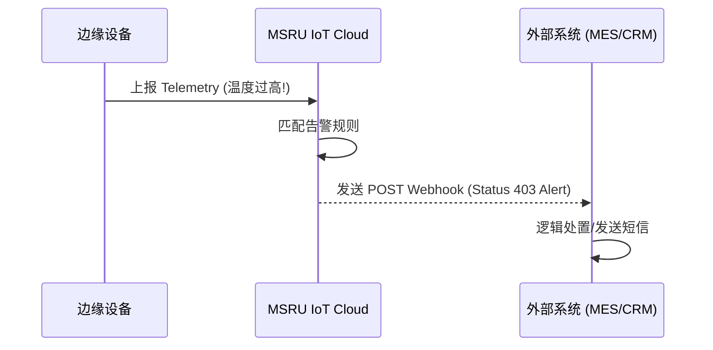

# API 接口参考

**MSRU | IoT** 被设计为一个透明的、可编程的工业管道。通过功能完备的 RESTful API，第三方应用可以实时访问物理资产的属性、下发复杂的控制指令，或者检索大规模的历史时序数据。

本参考文档面向需要将 IoT 数据集成到 MES、ERP 或自定义 3D 组态前端的开发人员。

<Callout type="info" title="设计规范：状态一致性">
  我们的 API 核心围绕着【设备影子 (Device Shadow)】展开。这意味着您可以向云端写入期望的状态，系统将负责处理与边缘节点通信的复杂性。
</Callout>

---

## 1. 认证与频率限制 (Auth & Limits)

为了保护工业基础设施的安全，所有 API 请求必须遵循 MSRU 的统一安全网关标准。

<Tabs items={['认证授权', '访问限制 (Rate Limit)']}>
<Tab value="认证授权">
- **模式**：基于 OIDC 的 OAuth 2.0。
- **Header**：`Authorization: Bearer <MSRU_API_TOKEN>`。
- **作用域 (Scope)**：建议根据最小权限原则申请，如 `iot:read` 或 `iot:command`。
</Tab>
<Tab value="访问限制 (Rate Limit)">
| API 类型 | 速率限制 | 说明 |
| :--- | :--- | :--- |
| **设备元数据查询** | 300 req/min | 针对资产台账的静态查询。 |
| **实时影子更新** | 100 req/s | 针对高性能反向控制指令。 |
| **数据流读取** | 1,000 pts/s | 针对高频时序采集数据的订阅。 |
</Tab>
</Tabs>

---

## 2. 核心资源端点 (Core Resources)

### A. 资产与属性管理 (Assets & Properties)

用于获取设备的实时状态。

<TypeTable
  type={{
    "GET /v1/assets/{id}/shadow": { 
      type: 'Function', 
      description: '获取设备影子的完整快照，包含期望状态（Desired）与报告状态（Reported）。' 
    },
    "PATCH /v1/assets/{id}/properties": { 
      type: 'Function', 
      description: '修改设备的属性。用于设定温控目标、调整机器转速等。' 
    }
  }}
/>

### B. 历史时序查询 (Time-series Query)

支持大规模数据的快速检索，内置了聚合函数。

<MathEquation 
  inline={false} 
  formula={String.raw`E_{query} = \{ \text{Asset\_ID}, \text{Metric}, t_{start}, t_{end}, \text{Interval} \}`} 
/>

---

## 3. 指令下发与异步响应 (Control Plane)

针对长耗时的控制操作，API 采用异步回执模式。

<Files>
  <Folder name="api-payload-examples" defaultOpen>
    <File name="command-request.json">
      ```json
      {
        "command": "RESET_PLC",
        "params": { "force": true },
        "timeout": 5000,
        "callback_url": "https://mes.internal/webhook"
      }
      ```
    </File>
    <File name="command-response.json" />
  </Folder>
</Files>

---

## 4. 实时 Webhook 通知 (Event Bus)

当设备发生状态跳变或告警时，IoT 平台会主动推送事件。



---

## 5. 常见问题排查 (FAQ)

<Accordions>
  <Accordion title="API 返回的 reported 时间点是以谁为准？">
    **原则**：默认以 **边缘网关采集到的时间点** 为准。这是为了消除网络延迟导致的数据点排布错乱。如果您需要云端接收时间，请参考响应体中的 `received_at` 字段。
  </Accordion>
  <Accordion title="如何拉取超过 100,000 点的大规模原始数据？">
    **方案**：不建议使用 REST 接口频繁分页拉取。请使用我们的 **Data Stream (WebSocket)** 服务或配置 **Data Export (到 S3/MinIO)** 定时任务。
  </Accordion>
</Accordions>

---

## 6. 开发者工具

您可以访问 [MSRU API Debugger](https://msru.cn/dev/iot-sandbox) 进行实时接口测试。在这里，您可以查看完整的 Request/Response 堆栈，并生成针对不同语言（Python/Go/JS）的代码片段。

---

> [!TIP]
> 觉得接口对接太繁琐？尝试使用 [IoT SDK](../integrations/sdk) 实现一键式集成。
