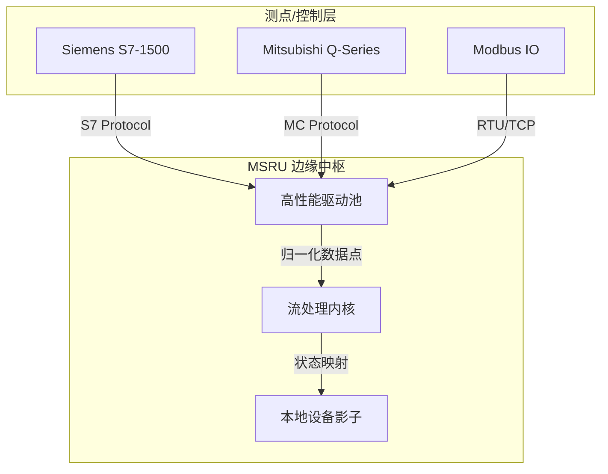

# 工业通讯与协议集成

在制造现场，OT（操作技术）层与 IT（信息技术）层之间往往隔着一道“协议厚墙”。**MSRU | IoT** 的核心价值之一就是作为一名**“万能集成者”**，将复杂的、异构的工业信号转化为标准化的数字资产。

本指南将深入探讨如何利用 MSRU 的边缘驱动引擎实现高性能的硬件连接。

<Callout type="info" title="通讯标准：边缘直连优先">
  为了保证数据的绝对确定性（Determinism），MSRU | IoT 坚持驱动程序在边缘侧运行，而非通过中心云端漫长的链路去握手 PLC。
</Callout>

---

## 1. 深度驱动矩阵 (Protocol Matrix)

MSRU 平台内置了 100+ 工业协议驱动程序，并针对高并发场景进行了 C++/Rust 级的代码优化。

<Cards>
  <Card 
    title="标准工业协议" 
    description="支持 OPC-UA (Security Policy 256), Modbus-TCP/RTU, SNMP 以及工业级 MQTT 5.0。" 
    icon="Unplug" 
  />
  <Card 
    title="原生 PLC 驱动" 
    description="内置西门子 S7 通讯、三菱 MC 协议、欧姆龙 FINS 以及基恩士高性能以太网通讯。" 
    icon="CircuitBoard" 
  />
  <Card 
    title="行业专有方案" 
    description="支持半导体领域的 SECS/GEM, 电力领域的 DL/T 645 以及医疗仪器的 ASTM/HL7 适配。" 
    icon="Wrench" 
  />
</Cards>

---

## 2. 边缘通讯架构 (Edge Connectivity)

理解 MSRU 是如何处理从物理字节流到语义对象的转换。

<Tabs items={['通讯拓扑', '驱动生命周期', '延迟模型']}>
<Tab value="通讯拓扑">

</Tab>
<Tab value="驱动生命周期">
1. **初始化 (Init)**：建立 TCP/串口链路，执行身份握手（TLS/Password）。
2. **扫描轮询 (Polling)**：基于优先级队列定时读取寄存器堆。
3. **变化推送 (COV)**：仅在数值发生跳变时触发上层逻辑。
4. **异常重连 (Keep-alive)**：自动处理链路闪断。
</Tab>
<Tab value="延迟模型">
系统会自动计算每个驱动节点的 **“通讯确定性系数”**：
<MathEquation 
  inline={false} 
  formula={String.raw`E_{determinism} = 1 - \frac{\text{StdDev}(T_{latency})}{T_{avg}} \implies \text{Goal: } > 0.95`} 
/>
若低于阈值，系统会自动启动“双重采样”模式以规避网络异常带来的数据毛刺。
</Tab>
</Tabs>

---

## 3. 核心配置示例 (Configuration)

开发者可以通过 JSON 或 YAML 定义复杂的设备通讯参数。

<Files>
  <Folder name="iot-driver-configs" defaultOpen>
    <File name="siemens-s7.yaml">
      ```yaml
      # 西门子 PLC 通讯配置
      protocol: s7-comm
      transport: tcp-ip
      params:
        ip: 192.168.1.50
        rack: 0
        slot: 1
        pdu_size: 480
      optimizations:
        block_read_limit: 100 # 自动进行读请求合并
      ```
    </File>
    <File name="opc-ua-client.json" />
  </Folder>
</Files>

---

## 4. 传输可靠性与安全 (Security)

工业连接的安全是企业的生命线：
- **物理隔离支持**：支持双网关架构，确保 OT 网与 IT 网完全物理隔离。
- **证书鉴权**：在 OPC-UA 或 MQTT 链路中强制启用 x509 证书。
- **采集防篡改**：每一个原始数据点都会在边缘侧打上“物理时间戳”，防止中途被非法修改。

---

## 5. 常见集成 FAQ

<Accordions>
  <Accordion title="系统支持多大规模的并发采集？">
    **能力基准**：在标准 i5 工业 PC 算力下，单个 Edge Agent 支持同时连接 50 台 PLC，总计 20,000+ Tag 分布在 100ms 级的采集周期内，且保持 CPU 占用率控制在 15% 以内。
  </Accordion>
  <Accordion title="老旧设备没有以太网口，只有串口怎么办？">
    **方案**：支持利用 **边缘串口网关 (Serial to TCP)** 进行透明转发，或直接在边缘工控机上安装 MSRU 的串口驱动插件进行本地解析。
  </Accordion>
</Accordions>

---

## 6. 总结

协议集成不是目的，数据透明化才是。

通过 **MSRU | IoT** 的强大驱动外挂体系，您正在构建一个**“协议无关”的工业操作系统**。这将使您的上层应用（如 MES、ERP）能够专注于业务逻辑，而无需关心底层 PLC 究竟是西门子、三菱还是基恩士。

---

> [!TIP]
> 已经配置好通讯驱动？接下来请参考 [SDK 使用指南](../integrations/sdk) 开发您自己的控制插件。
