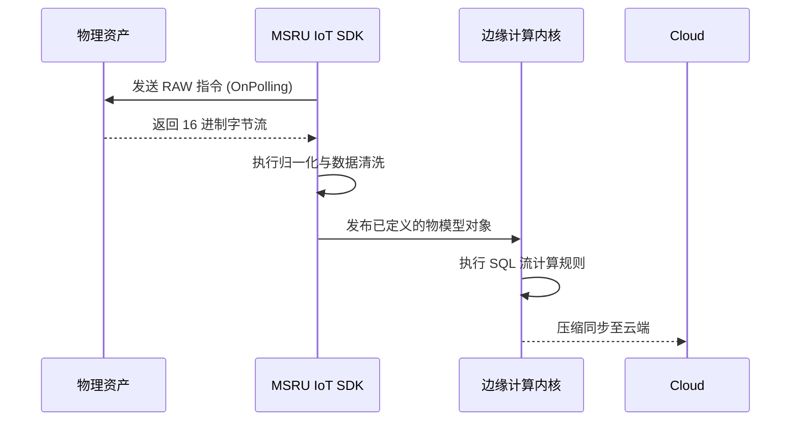

# SDK 使用指南

对于拥有私有通讯协议或需要嵌入式实时处理逻辑的高级用户，**MSRU | IoT** 提供了功能强大的全栈 **SDK (Software Development Kit)**。

通过 SDK，您可以超越标准驱动库的限制，在边缘网关中植入自定义的解析引擎、复杂的边缘逻辑控制流，或者是将 IoT 连接能力直接嵌入到您的嵌入式 Linux 应用中。

<Callout type="info" title="设计理念：解耦与性能">
  SDK 的设计初衷是提供“零拷贝（Zero-Copy）”的消息传递机制。这确保了即便处理万级并发点位流时，SDK 的代码开销也几乎可以忽略不计。
</Callout>

---

## 1. 多语言架构支持 (Polyglot Binding)

我们为不同的开发场景提供定制化的编译器支持：

<Cards>
  <Card 
    title="Golang SDK (核心驱动开发)" 
    description="适用于开发追求极致并发的高性能工业驱动。内置了对串口、并发内存池以及 gRPC-Gateway 的深度优化。" 
    icon="Cpu" 
  />
  <Card 
    title="Python SDK (数据科学与 AI)" 
    description="为分析师量身定制。支持将实时测点流无缝导入 TensorFlow/PyTorch。适用于开发边缘侧的预测维护插件。" 
    icon="BarChart3" 
  />
  <Card 
    title="C++ / Rust SDK (嵌入式优先)" 
    description="专为 ARM 单片机或极低算力环境设计。支持静态链接，不依赖宿主操作系统的复杂运行时环境。" 
    icon="Terminal" 
  />
</Cards>

---

## 2. 核心范式：自定义驱动钩子 (Driver Hooks)

通过实现 `MSRU_Driver` 接口，您可以将任何非标设备转化为物模型资产。

<Tabs items={['逻辑切点', '代码示例 (Golang)', '执行生命周期']}>
<Tab value="逻辑切点">
| 钩子名称 | 调用时机 | 典型用途 |
| :--- | :--- | :--- |
| `OnInitialize` | 驱动启动时 | 申请物理内存、建立 TCP 链接库。 |
| `OnPolling` | 周期性触发时 | 执行物理地址读取指令（ Read Command）。 |
| `OnShadowChange` | 云端影子指令到达时 | 向设备下发写控制指令（Write Command）。 |
</Tab>
<Tab value="代码示例 (Golang)">
```go
package main

import "github.com/msru/iot-sdk-go"

type CustomSensors struct {}

// 模拟读取逻辑
func (s *CustomSensors) OnPolling(ctx context.Context) (float64, error) {
    raw := lowLevelSerial.Read(0x20)
    return float64(raw) * 0.001, nil // 归一化处理
}

func main() {
    agent := iot.NewAgent("SITE-01-GW")
    agent.RegisterDriver("PRIVATE_PROTO", &CustomSensors{})
    agent.Start()
}
```
</Tab>
<Tab value="执行生命周期">

</Tab>
</Tabs>

---

## 3. 边缘流计算插件开发 (Custom Processing)

SDK 允许您编写自定义的 **“流处理器插件”**。

<MathEquation 
  inline={false} 
  formula={String.raw`E_{filtered} = \text{SDK\_Hook}(S_{raw}) \implies \sum w_i \cdot x_i + \text{Bias}`} 
/>

这种模式适用于无法用标准 SQL 描述的算法场景（如：非平衡信号检测、基频追踪算法）。您可以在 SDK 内部实现复杂的浮点运算逻辑，并仅将计算结果发布到消息总线中。

---

## 4. 资源管理与文件结构 (SDK Structure)

典型的 IoT 开发项目组织结构如下：

<Files>
  <Folder name="msru-iot-driver-project" defaultOpen>
    <Folder name="cmd">
       <File name="main.go (接入点)" />
    </Folder>
    <Folder name="internal">
       <File name="protocol.go (二进制解析逻辑)" />
    </Folder>
    <File name="go.mod" />
    <File name="msru-thing-model.json (配套物模型定义)" />
  </Folder>
</Files>

---

## 5. 常见集成挑战 (FAQ)

<Accordions>
  <Accordion title="我可以利用 SDK 在断网时完全本地控制吗？">
    **可以**。SDK 具备 **“本地回路发现”** 能力。在完全物理离线的情况下，您的 SDK 插件可以订阅本地的消息队列并直接联动其他驱动下发指令，实现真正的“边缘闭环”。
  </Accordion>
  <Accordion title="在高频采集（<1ms）下会有内存抖动吗？">
    **方案**：我们的 Golang 与 C++ SDK 均默认开启了 **RingBuffer (环形缓存)** 策略。数据采集不再涉及动态内存申请，极大地规避了由于垃圾回收（GC）导致的系统停顿风暴。
  </Accordion>
</Accordions>

---

## 6. 总结

SDK 是您将 MSRU | IoT 转化为“行业特供版系统”的钥匙。

无论面对多么古怪的工业场景，只要有协议描述，通过 **IoT SDK** 的分层编排，您都能构建出一个具备极致性能、极致稳定性且完美贴合业务的感知管道。

---

> [!TIP]
> 准备好开发您的私有驱动了吗？请前往 [开发者门户](https://msru.cn/developers/iot) 下载各语言的集成 Demo。
