# 行业对比：MSRU | IoT vs. 传统工控物联

在数字化车间的选型阶段，企业往往在“传统 SCADA 系统”、“硬件透传网关”与“云原生 IoT 平台”之间纠结。**MSRU | IoT** 的出现，旨在整合三者的长处，利用“云边协同”架构构建新一代工业感知中枢。

本篇文档将通过多维度的技术对比，揭示 MSRU 如何解决工业物联网落地的“最后一公里”难题。

<Callout type="warn" title="拒绝“裸奔”的物联网">
  许多低成本网关仅实现了数据透传，缺乏安全加密与边缘治理。MSRU 坚持“安全即原生”，在所有连接链路默认开启 TLS 加密与端到端身份认证。
</Callout>

---

## 1. 架构代际：重心与实时性的平衡

架构设计决定了系统在面对工业级海量采集时的鲁棒性。

<Tabs items={['通讯模型对比', '性能参数表']}>
<Tab value="通讯模型对比">
### 传统架构 (Centralized)
数据由终端设备直接推向中心服务器。
- **痛点**：网络抖动导致采样间隔不均匀（Jitter），无法支持高频 SPC 分析。

### MSRU 边缘自治架构 (Edge-Native)
数据首先进入本地网关的 [流计算引擎] 进行清洗与判等。
- **优势**：**逻辑闭环在 10ms 内完成**。即便外网中断，车间内的监控与联动报警依然有效。
</Tab>
<Tab value="性能参数表">
| 维度 | 传统硬件网关 | 云厂家 IoT (SaaS) | MSRU | IoT |
| :--- | :--- | :--- | :--- |
| **接入延迟** | 100ms - 500ms | 2s+ (受公共网波动) | **10ms - 50ms** |
| **协议深度** | 仅常用协议 (Modbus) | 标准协议 (MQTT) | **100+ 工业专有协议** |
| **物模型能力** | 几乎没有 | 静态 JSON 定义 | **动态数字孪生绑定** |
| **离线支撑** | 简单缓存 | 仅指令缓存 | **分布式账本续传** |
</Tab>
</Tabs>

---

## 2. 核心差异：数据透传 vs. 语义识别 (Modeling)

大多数传统产品仅解决“连接”问题，而 MSRU 解决“理解”问题。

<Cards>
  <Card 
    title="普通网关：原始字节流" 
    description="上传的是 `0x0F` 或 `40001: 520`。业务系统不知所云，需要极其繁琐的二次转换。" 
    icon="FileWarning" 
  />
  <Card 
    title="MSRU IoT：结构化资产" 
    description="自动通过‘物模型’将原始值映射为 `spindle_vibration: 2.5mm/s`。业务层可直接调用具备物理意义的变量。" 
    icon="PackageSearch" 
  />
</Cards>

---

## 3. 数学模型：网络波动下的采样完整度

在不稳定网络下，数据丢失会导致质量趋势失效。我们通过 **“窗口滑动补偿”** 算法对比。

<MathEquation 
  inline={false} 
  formula={String.raw`E_{completeness} = \frac{\int_{t_0}^{t_1} S(t) dt}{\sum \text{Expected Samples}} \implies \text{MSRU Target: } > 99.99\%`} 
/>

MSRU 利用边缘侧的 **Time-Series Buffer** 存储机制，配合自定义的 ACK 重传确认，确保在链路恢复后的瞬间完成历史补偿（Backfill），让您的 SPC 曲线始终连续、丝滑。

---

## 4. 开放性与二次开发体验 (SDK)

对于开发者，MSRU 提供了现代化的工具链：

<Files>
  <Folder name="集成模型对比" defaultOpen>
    <Folder name="传统 SCADA / OPC Server">
       <File name="Proprietary-API.dll" />
       <File name="Dcom-Configuration" />
    </Folder>
    <Folder name="MSRU | IoT" defaultOpen>
       <File name="thing-model.json" />
       <File name="edge-sidecar.go" />
       <File name="grafana-datasource.js" />
    </Folder>
  </Folder>
</Files>

---

## 5. CIO 选型雷达：多维度量

我们对比了 5 个核心决策因子：

```mermaid
gantt
    title IoT 平台选型核心维度对比 (0-100)
    dateFormat  X
    axisFormat  %s
    section MSRU - IoT
    协议接入广度 :active, 0, 98
    边缘处理能力 :active, 0, 95
    数据一致性保证 :active, 0, 92
    开发灵活性 :active, 0, 90
    性价比 (TCO) :active, 0, 85
```

---

## 6. 总结

如果您的需求仅是“把温湿度传上看版”，那么任何单片机网关都能胜任。但如果您打算构建一个 **“软件定义的工厂”**，或者需要接入成百上千台异构的、具备精密生产节奏的设备，**MSRU | IoT** 将是您唯一的工业级代际选择。

---

> [!TIP]
> 想要了解如何从旧的 OPC Server 迁移存量设备？请查看 [迁移逻辑](../configuration/deployment#迁移逻辑)。
