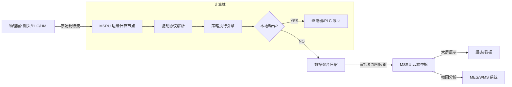

# 什么是 IoT 万物互联？

在工业 4.0 的宏大叙事中，**IoT (Internet of Things)** 常被误解为简单的“联网”。但在 MSRU 平台的架构定义中，IoT 是工厂的**“数字化呼吸系统”**。

它通过全栈的连接技术、边缘侧的计算逻辑以及云端的物模型映射，将物理世界的机械脉搏转化为数字世界的可编程资产。

<Callout type="info" title="MSRU IoT 的本质">
  IoT 本身不产生价值，数据在流动和转化为决策后才产生价值。我们的使命是确保数据在从物理探针流向业务系统的过程中，保持极致的**实时性、准确性与语义完整性**。
</Callout>

---

## 1. 工业物联网的技术代际分析

为何传统工业网关和 SCADA 系统正逐渐被 MSRU | IoT 取代？通过下表可见分晓：

<Tabs items={['1.0 SCADA 时代', '2.0 云集成时代', '3.0 边缘自治时代', '4.0 语义连接 (MSRU)']}>
<Tab value="1.0 SCADA 时代">
**特征**：本地化监视，协议封闭。
**局限**：数据无法上云，形成严重的信息孤岛。
</Tab>
<Tab value="2.0 云集成时代">
**特征**：透传网关出现，数据暴力上云。
**局限**：带宽开销高，延迟抖动剧烈，无法处理实时控制需求。
</Tab>
<Tab value="3.0 边缘自治时代">
**特征**：引入边缘计算，实现本地逻辑。
**局限**：缺乏标准化的“物模型”，不同设备间数据无法通用。
</Tab>
<Tab value="4.0 语义连接 (MSRU)">
**特征**：**边缘 AI + 统一物模型 + 分布式计算**。
**核心价值**：设备自带“自我描述”能力，插电即接入业务流。
</Tab>
</Tabs>

---

## 2. IoT 平台的三大核心能力锚点

MSRU | IoT 为企业建立起坚实的数字化感知防线：

<Cards>
  <Card 
    title="异构协议的“标准翻译官”" 
    description="支持超过 100 种工业协议（如 Profinet, EtherCAT, OPC-UA）。将不同厂牌设备的原始数据流统一转化为标准的 JSON 模型。" 
    icon="Languages" 
  />
  <Card 
    title="边缘侧的“流处理引擎”" 
    description="在本地网关上运行 SQL-like 语法流式计算。实时进行滑动平均、异常波峰过滤和逻辑联动判定。" 
    icon="Zap" 
  />
  <Card 
    title="全生命周期的“数字影子”" 
    description="建立资产的数字化镜像。不仅记录当前值，还记录设备拓扑、校正历史以及与其关联的工艺参数文档。" 
    icon="Ghost" 
  />
</Cards>

---

## 3. 技术深度：低时延通讯模型

在工业场景，每一毫秒的延迟都可能意味着一次事故或一批废品。

<MathEquation 
  inline={false} 
  formula={String.raw`T_{reaction} = \underbrace{T_{collect} + T_{edge\_inference} + T_{actuator}}_{\text{Determinism}} \leq 100ms`} 
/>

MSRU 采用 **“事件驱动架构 (EDA)”**。当边缘传感器（如压力探针）侦测到异常信号时，信令会直接在本地环路中触发报警逻辑，而无需经过漫长且不确定的广域网握手。这种 **“边缘闭环”** 是工业物联网落地的金标准。

---

## 4. 业务落地架构图 (Workflow)

展现数据如何从传感器转化为生产力。

---

## 5. 常见挑战与 FAQ

<Accordions>
  <Accordion title="既然我的 PLC 已经有 HMI 界面了，为什么还需要 IoT 模块？">
    **深度分析**：HMI 仅供现场操作员查看单机状态。IoT 模块的价值在于**“系统耦合”**。它将 A 机床的压力数据与 B 产线的质量记录进行自动关联，建立起全厂级的“因果关系链”，这是单机系统无法实现的。
  </Accordion>
  <Accordion title="旧厂房里的‘哑设备’（无任何通讯接口）如何接入？">
    **方案**：利用 MSRU 的 **IoE (Internet of Everything) 适配套件**。通过外挂非侵入式电流互感器、振动探头或工业级 AI 相机进行“视觉报工”，将所有的生产节奏数字化。
  </Accordion>
</Accordions>

---

## 6. 开启连接，释放资产潜能

IoT 平台不再是冷冰冰的数字连接，而是企业的**“资产管理操作系统”**。

---

> [!TIP]
> 准备好定义您的第一个数字化资产了吗？请前往 [快速上手指南](./quick-start)。
