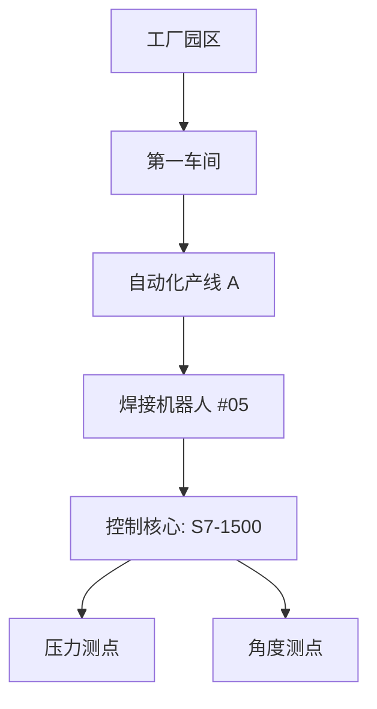

# 模块详解：工业物联底座

**MSRU | IoT** 平台通过高度模块化的组件设计，将复杂的硬件连接任务拆解为可直观操作的业务流。

本页面将协助系统管理员与现场集成工程师，理解各核心模块的功能边界与协同逻辑。

<Callout type="info" title="模块化解耦：按需启用">
  IoT 模块与 MSRU 平台的其他业务（如 MES 生产、WMS 仓储）是深度解耦的。您可以仅开启“数据采集中心”作为企业的统一工业网关，也可以开启“规则引擎”实现全自主的自动化联动。
</Callout>

---

## 1. 资产与驱动管理中心 (Asset Manager)

这是 IoT 平台的“台账”根基，负责管理物理资产的身份与连接。

<Cards>
  <Card 
    title="设备台账 (Device Registry)" 
    description="管理全厂设备的数字化名片。记录资产编号、生产厂家、物模型关联以及物理地理位置（GIS 映射）。" 
    icon="Info" 
  />
  <Card 
    title="驱动商店 (Driver Market)" 
    description="云端下发协议驱动。支持西门子、三菱、Modbus、OPC-UA 等通用协议，并支持上传企业自研的 SDK 插件驱动。" 
    icon="Download" 
  />
  <Card 
    title="连接监视器" 
    description="实时观测各网关节点的在线状态（Heartbeat）、信号强度及数据吞吐量。" 
    icon="Activity" 
  />
</Cards>

---

## 2. 实时监控与数字看板 (Visualizer)

让隐形的数据流动变得清晰可见。

<Tabs items={['实时组态屏', '设备影子 (Shadow)', '拓扑映射图']}>
<Tab value="实时组态屏">
基于低代码拖拽构建的工业看板。
- **动态曲线**：实时渲染高频测点走势。
- **状态控件**：支持 3D 风格的泵机、开关、指示灯组件，直观模拟产线现状。
- **数据回溯**：点击任意指标即可进入历史时间轴。
</Tab>
<Tab value="设备影子 (Shadow)">
### 云边状态对齐
设备影子保存了设备最近一次上报的快照（Reported）以及云端期望下发的指令（Desired）。
- **离线指令**：若设备当前离线，云端指令将暂存在影子中，待设备上线后自动下发对齐。
- **读写分离**：有效缓解了高频控制冲突。
</Tab>
<Tab value="拓扑映射图">

</Tab>
</Tabs>

---

## 3. 告警、规则与流计算 (Rule Engine)

这是 IoT 平台的“自动化大脑”。

<MathEquation 
  inline={false} 
  formula={String.raw`Policy_{trigger} = (\text{Metric} > \text{Threshold}) \cap (\text{Duration} > T_{debounce}) \implies \text{Notify(Channel)}`} 
/>

- **告警编排**：支持分级告警（致命、严重、提示）。
- **策略下发**：规则在云端编辑，毫秒级同步至边缘网关执行。
- **联动控制**：例如“当温度 > 100 且 压力 > 10 时，通过 SDK 向 PLC 执行紧急停机指令”。

---

## 4. 数据转发与集成模块 (Data Link)

IoT 模块通过多种协议将采集到的精简数据分发给业务系统。

<Files>
  <Folder name="iot-export-services" defaultOpen>
    <Folder name="webhooks" defaultOpen>
       <File name="mes_production_sync.json (MES报工集成)" />
    </Folder>
    <Folder name="databases">
       <File name="timescale_db_config.yaml (冷存储同步)" />
       <File name="influx_flux_query.js (高性能分析任务)" />
    </Folder>
  </Folder>
</Files>

---

## 5. 多维度运维中心 (Ops Center)

针对大规模节点的生命周期管理。

<Accordions>
  <Accordion title="节点健康大屏">
    集成 CPU、内存、网络带宽及本地存储卷（Local Volume）的监控。支持对异常掉线的节点进行远程一键重启或镜像回滚。
  </Accordion>
  <Accordion title="日志分析追踪">
    深度解析边缘驱动的底层 Debug 信息。支持按 Device ID 过滤通讯报文，快速排查总线冲突或地址重叠问题。
  </Accordion>
</Accordions>

---

## 6. 总结

MSRU | IoT 模块不仅是数据的管道，更是**工厂资产的数字化管理底座**。

通过对连接、监控、规则及运维的全面工具化，它将传统的、难以管理的设备黑盒，转化为了一系列透明的、可编程的、具备业务语境的数字化资源。

---

> [!TIP]
> 准备好审视您的设备性能了吗？请前往 [使用概览](./overview) 了解如何操作 IoT 实时看板。
