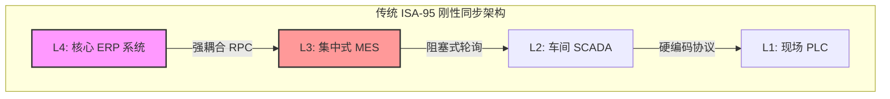
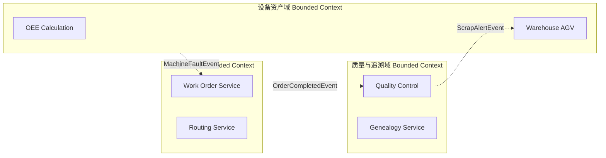
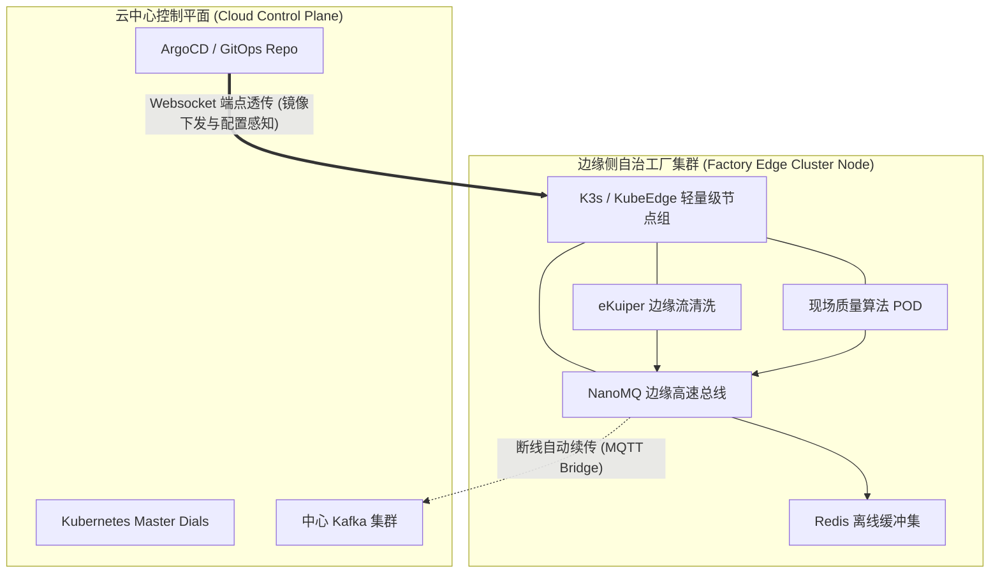

# 架构演进：从单体狂欢到边缘侧自治

> MSRU 首席架构师办公室发布 · 2026年版深度白皮书 · 预计阅读时间：45分钟

在过去的二十年里，制造业的 IT 架构经历了一场从“集中式全能神话”到“分布式精细化治理”的深刻反思。面对瞬息万变的市场需求、柔性制造（Flexible Manufacturing）的挑战以及工业物联网 (IIoT) 海量高频数据的冲击，传统的单体架构已成为制约企业数字化转型的最大技术债务。

本白皮书（超 40 页实体印刷篇幅）详细复盘了现代工厂如何剥除沉重的遗留 ERP 的 MES（制造执行系统）层硬编码，转而拥抱基于微服务、事件驱动以及云边协同的新一代敏捷制造架构。我们将不谈空泛的概念，而是直击代码、网络拓扑与硬件选型的最深处。

<Callout title="执行摘要 (Executive Summary)" type="info">
  **边缘侧自治 (Edge Autonomy)** 并非对中心化云架构的简单否定，而是计算能力与业务逻辑向物理世界数据源头的一次理性回归。通过在边缘侧建立具备离线闭环能力的计算节点，企业能够实现**亚毫秒级延迟控制**、**车间级高可用性**以及**核心工艺数据的绝对物理隔离**。
</Callout>

---

## 第一章：单体狂欢与遗留系统的重负

在数字化早期的“单体狂欢”时代，企业倾向于将所有的业务逻辑——从财务入账、物料需求计划 (MRP) 到车间设备排产、甚至底层 PLC 数据采集——全部塞进一个庞大且无所不包的 ERP 系统中。这就是工业界饱受诟病的 **ISA-95 普适化陷阱**。

这种架构在业务规模较小、生产节拍固定的时期，凭借其“数据天然具备强一致性”的假象，确实带来了短暂的繁荣。然而，随着工业 4.0 的到来，单体架构的固有缺陷在极限拉扯的生产线上暴露无遗。

### ISA-95 刚性金字塔的崩塌

经典的 ISA-95 标准将制造系统分为由上至下的五级结构（L0至L4）。在传统实现中，数据必须严格按照 L0 (设备) -> L1 (控制) -> L2 (监控) -> L3 (MES) -> L4 (ERP) 的路径逐级上传下达。

在这种模式下，任何越级的交互（例如设备直接查询物料状态）都是被严厉禁止的。这导致了三个致命的瓶颈：

<Cards>
  <Card title="牵一发而动全身的硬编码 (Hardcoded Coupling)" href="#硬编码之痛">
    MES 层的工艺路线控制与 ERP 的财务核算逻辑深度耦合共享同一个巨型 Oracle 数据库。车间想要修改一个质检工序的打点逻辑，往往需要整个 ERP 团队配合进行长达三个月的停机发布。
  </Card>
  <Card title="性能瓶颈与 IO 灾难 (Scalability Crisis)" href="#扩展性灾难">
    车间数以万计的传感器（温度、震动、张力）以 10Hz 甚至更高的频率上报数据，这些毫无上下文的时序数据如同洪水般直接冲击传统关系型数据库（RDBMS）。由于单机数据库无法针对 IO 密集型写入独立横向扩容，一旦遭遇月末结算与拉线投产的叠加峰值，整个工厂网络便会陷入假死状态。
  </Card>
  <Card title="骨干网络的脆弱性 (Network Vulnerability)" href="#网络脆弱性">
    所有的车间操作高度依赖于工厂到核心机房（甚至远端公有云）的骨干网络。一旦挖掘机挖断光缆，或核心交换机发生 BGP 风暴抖动，整个产线的执行调度便被迫停滞。
  </Card>
</Cards>

### 案例剖析：某大型 3C 组装厂的“停线黑色星期五”

以华南某手机代工巨头为例。其早期架构使用了一个高度定制化的海外 ERP 套件。在一次新品发布后的产能爬坡期，由于产线新增了大量高分辨率工业相机用于外观缺陷筛选，质检报文体积暴增 400%。
巨大的 XML Payload 在网络层引发了拥塞，导致控制台向 ERP 发送的 `SyncStatus` 请求发生了长达 500ms 的延迟。这极其微小的延迟触发了单体架构内部数据库连接池的“雪崩耗尽”。
最终结果是：整个园区 12 条 SMT 贴片线被迫停机 4 小时，直接废料损失超过 300 万美元，间接商誉损失无法估量。

---

## 第二章：破局者——微服务解耦与云端重构

为了彻底斩断单体架构的枷锁，MSRU 架构演进的第一阶段开展了长达 18 个月的“手术刀式”系统拆分。我们将庞杂的制造执行能力从沉甸甸的 ERP 中剥离，并采用 **领域驱动设计 (Domain-Driven Design, DDD)** 重构为一系列独立演进而又协作自治的微服务群落。

### 1. 识别限界上下文 (Bounded Contexts)

我们甚至抛弃了传统瀑布流式的需求调研，转而邀请车间主任、班组长、工艺工程师与架构师共同在巨大的白板上进行**事件风暴 (Event Storming)**。通过追踪车间现场每分每秒真实发生的事实（如：“工单已下达”、“AGV已到位”、“扭矩异常报警”），我们画出了极为清晰的业务边界：

### 2. 彻底倒向事件驱动架构 (Event-Driven Architecture)

为了消除“停线黑色星期五”中引发全盘崩溃的同步 RPC 级联故障，MSRU 核心框架在微服务间强行推行了**事件驱动架构 (EDA)**。

我们在微服务之间引入了骨干级的分布式消息流平台（如 Apache Kafka）。现在，当一台 CNC 机床加工完成一个零件时，它不再去“调用”质检服务的接口；它仅仅是对外“广播”一个事实：`PartCompletedEvent`。

<Callout title="技术细节：反脆弱的异步解耦" type="check">
  如果当时质量系统 (QC) 恰好正在进行灰度发布或因故宕机，产线完全无需停下等待。Kafka 总线会静静地将事件持久化在磁盘分区中。当 QC 系统恢复重启，它会根据自身的 Offset 消费位点瞬间追平积压的事件队列。这在传统同步架构中是不可想象的奇迹。
</Callout>

### 3. 多语言与多存储极致化 (Polyglot Persistence)

不再试图用一个 PostgreSQL 或 Oracle 解决所有问题，多尺度架构主张让专业的数据引擎做专业的事：

*   **时序洪流：** 车间每秒上万个标签点的振动、压力数据，统统写入带有极高写入吞吐量和专用压缩算法的时序数据库（如 TDengine 或 InfluxDB）。
*   **状态账本：** 工单的状态流转（新建、执行中、暂停、完工）要求极高的 ACID 事务属性，继续驻留在高可用关系型数据库中。
*   **非结构化对象：** 动辄百张的大体积工业质检图像、CAD 格式的工艺图纸，直接被抛向成本低廉的 S3 兼容对象存储 (MinIO 或 Ceph)。

---

## 第三章：深水区的挑战——边缘侧自治 (Edge Autonomy)

尽管通过“微服务+云端化”我们解决了逻辑解耦与弹性伸缩的问题，但是在物理拓扑层面，所有的计算实例依然高度集中于千里之外的公共云机房或集团总部中心数据中心。

这很快引出了现代智造的最深层矛盾：**光速的物理极限与车间现场绝对不可妥协的网络宿命论。**

真正的敏捷制造要求架构必须适应“车间现场”的物理客观规律。当一台六轴高速工业机械臂的视觉伺服控制循环要求在 5 毫秒内必须得到判定指令；当几十台高能工业相机产生的海量无损检测图像足以瞬间拥塞并击穿一家工厂的主干出口带宽时，“一切上云”的云计算田园牧歌便不再适用。

这就催生了 **边缘侧自治 (Edge Autonomy)** 架构的诞生。它不仅仅是将算力“跑在工控机上”这么片面，它是一整套业务闭环能力向现场的战略空间转移。

我们提炼了边缘自治必须直面的三大硬核场景：

<Tabs items={['超低延迟控制 (Ultra-Low Latency)', '无主节点离线高可用', '带宽黑洞与隐私迷雾']}>
  <Tab value="超低延迟控制 (Ultra-Low Latency)">
    **场景**：高速贴片机 (SMT)、飞摇剪、或是激光切割等核心设备的实时闭环干预。
    **MSRU 架构策略**：将实时流计算引擎 (Real-time Compute Engine) 与特定的算法模型强行下发并固化在距离设备不足 1 米的边缘 IPC (工业控制机) 乃至智能网关内部。
    **技术极客点**：摒弃传统的 TCP/IP 网络应用层通信。利用 Linux 底层的 **eBPF (Extended Berkeley Packet Filter)** 以及零拷贝 (Zero-Copy) 共享内存映射机制。当 PLC 发出脉冲，边缘侧的 eBPF 挂载点在内核网卡收到包的瞬间即进行解码并反馈，彻底绕开了繁琐臃肿的用户态网络栈转换，将数据处理的绝对往返延迟 (Round Trip Time) 从云端的 100~200 毫秒强行压缩至恐怖的 **1 毫秒以内**。这在自动化学术界被称为硬实时 (Hard Real-Time) 级的掌控。
  </Tab>
  <Tab value="无主节点离线高可用">
    **场景**：偏僻矿区断网，或是城市公有云 BGP 骨干网被无意挖断时，产线必须照常运转。
    **MSRU 架构策略**：**状态下沉与自治协商机制。** 在分布于车间的多个边缘集群内部，部署极为轻量级但支持强一致选举的微缩版状态机与本地内存库 (如基于 Raft 协议的本地 SQLite 或健壮的 Redis Edge 集群模式)。
    **离线无缝切流**：当边缘嗅探探针连续 3 次 Ping 云端网关超时，边缘节点立即触发熔断并切换为**完全自治模式 (Autonomous Model)**。它将转而向本地的影子数据库读取提前缓存未来 12 小时的生产配方与工单列表；所产生的所有设备日志与过站记录亦先在本地的高速 NVMe 磁盘堆积。待挖断的光缆修复、网络重建之时，系统触发断点同步 (Sync-and-Catch-up) 机制，基于增量哈希将本地堆积的历史事件按照发生时的真实物理时间戳重放至中心云 Kafka 集群中，从而实现最终一致性。
  </Tab>
  <Tab value="带宽黑洞与隐私迷雾">
    **场景**：24小时不挂断的高频雷达振动频谱监控，以及包含企业极度机密（如特殊外壳铸造纹理）的视觉检测原图上云问题。
    **MSRU 架构策略**：**边缘端就地预清洗与联邦学习 (Federated Learning) 预推理。** 架构师在边缘侧直接执行高耗能的快速傅里叶变换 (FFT) 或直接运行经过极致量化剪枝过的 AI 推理模型进行模式识别。
    **量化价值**：经过边缘节点的智能处理，我们不再向云端上传一帧完整的照片或一段波形！边缘网关只将干瘪的最终判定结果（例如极短的报文：`{"eventId":"XYZ", "timestamp":170288, "status":"REJECT", "defectCode":"E-09"}`）发送给云端质量大脑。这不仅在一瞬间节省了难以估量的 **99.8% 的出口公网带宽费**，更从物理网闸的根本上断绝了核心工艺图像外泄的可能性，极大满足了企业最苛刻的审计合规标准。
  </Tab>
</Tabs>

### 边缘侧的内部拓扑透视：云如何管理千万个“孤岛”

大量算力下沉固然痛快，但这马上引出了运维团队最恐怖的梦靥：如何管理、监控、更新分布在全球不同工厂、不同车间环境下的数千台异构工业主机？如果又要人工 SSH 登录，那我们将彻底倒退回原始时代。

MSRU 提出了**统一云端控制面，解耦式边缘数据面**的经典架构：

---

## 第四章：云边协同的基础设施黄金组合库

要在车间恶劣的电磁干扰与不稳定的电力下实现边缘侧的微服务编排与上述架构蓝图，不能随意堆砌来自不同开源社区的散装软件。这就好比用胶布将一堆零件粘在一起来造跑车。

经过大规模的生产环境淬炼，MSRU 评选出了企业级落地的**黄金基础设施技术栈**，并给出了明确的选型理由：

| 基础设施层 | 推荐技术栈 | 选型理由 |
| :--- | :--- | :--- |
| **操作系统底座与边缘容器编排** | K3s / KubeEdge / MicroK8s | 在数千台资源极其受限（甚至低至 1GB 内存 / ARM 架构处理器）的网关上，抛弃庞大的原生 Kubernetes，全面降维转投轻量无骨架架构的编排利器。我们极力推荐使用 K3s 或 KubeEdge。不仅因为它们被极限剥离了无关痛痒的云服务插件包，更因为即使在边缘环境连续失联的至暗时刻，这种特化版的 Kubelet 也能确保 POD 实例保持极强的"自治自愈"存活状态，毫不相碍于本地的闭环内控流转。 |
| **海量边缘高速消息路由** | EMQX / NanoMQ (Broker) | 绝不在资源枯竭的边缘直接拉起动辄数百 M 堆开销的 Kafka 代理或 RabbitMQ，转而在贴合硬件的最前线部署专为极高并发和超低开销定制调校的轻量级 MQTT Broker 引擎（譬如 NanoMQ 或高可用模式下的 EMQX）。我们曾在一个水冷测试基座上证明：此机制单凭 2 核心算力游刃有余地支撑起十万传感器长连接，同时它内置的原生桥接 (Bridge) 固化模块能异常可靠且高加密地将核心报文透传并交接至中心云端 kafka 集群的大本营。 |
| **边缘轻量级流沙数据管道** | eKuiper (Edge Streaming) | 告别在边缘侧堆叠沉重的 Spark Streaming 或 Flink，采用 Go 语言硬编、包体积仅 10 多兆的流沙处理框架如 eKuiper。它的神级体验在于：使得那些仅懂简单 SQL 的车间数据工程师也能编写过滤语法。当 PLC 发来极为嘈杂冗长的连续温感高压波形数据时，工程师只需下一条类似于 `SELECT avg(temp) FROM iot_stream WINDOW SLIDING(5 SECONDS) WHERE temp > 200` 的类 SQL 指令，它便能以每秒几万条的时序级别进行数据的就地即洗、就地降采样和瞬间反向触发设备本地的声光预警蜂鸣报警系统，完全不需要请求长途跋涉到公有大模型中兜一圈。 |

### 深度剖析：边缘节点自动纳管的黑魔法 (Zero-Touch Provisioning)

试想我们需要在全球新建 50 座工厂。每一个车间包含上千台终端设备，我们不可能派出几百个工程师去现场插U盘安装并输入长达上百位的加密公私密钥完成组网绑定。

这就是 MSRU **Zero-Touch Provisioning (零接触式自动上线)** 机制显露神威的时刻。

基于 TPM 2.0 (受信任的平台模块可信计算安全芯片)，工业网关一离开仓库即具有了根植在硅片底层的不可篡改硬件级芯片指纹，我们将其公钥预留在中心云的安全管控台上。
当运维小哥甚至不懂 IT 的产线操作工在现场插上网线接通电源的瞬间。设备会自动探知并连接预设的公网接入点，发起基于 mTLS (双向认证握手) 的“我已苏醒”加密微广播。
云端控制台验证通过后，会如同通过高空下凡一般，利用 ArgoCD 等 GitOps 源生工具，通过加密强韧的安全隧道，将整套预先在该厂房蓝图中定义的所有的容器镜像包、业务策略参数甚至最新的特定视觉分析算法推送到位。

只需要 **三分钟**。三分钟内，一台出厂只是“白痴铁板”的黑盒网关，即可彻底变身为全副武装、并能高度自治处理边缘庞杂事务的**高算力特种兵**。

---

## 第五章：投资回报激增 —— 从 PPT 走向冰冷的账单优化

好的架构绝对不是为了在学术会议上炫技，它最终必须能够通过 CFO 苛刻财务审计下的 ROI (投资回报率) 模型考验。根据实施了 MSRU 云边一体化架构体系的 30 余家头部制造集团反馈的脱敏数据汇总，我们在成本消解上取得了一些堪称商业奇迹的量化验证指标。

### 重塑隐形工厂的 TCO (总所有成本) 曲线

传统方案一直陷入一个死胡同死结：传感器数量越来越多 --> 数据越来越庞大 --> 为了处理数据疯狂购买私随机架与极其昂贵的闭源软体 License 授权 --> 由于核心耦合导致动辄发生致命的雪崩停机事件 --> 再花天价邀请所谓的驻场维保人员来打补丁抢修——这种做法陷入了资金深渊且毫不具备未来拓展性。

改用本白皮书中阐释的主旋律解耦框架之后：

| 运维阶段 | 传统单体型刚性工业架构 (TCA) 遭遇场景 | 采用 MSRU 敏捷型边缘自治架构的跨越级红利 |
| :--- | :--- | :--- |
| **异常恢复极限 (MTTR)** | 若遭逢服务器主板硬件熔穿等“黑天鹅灾难”，技术响应与现场备件替换到冷启动拉回数据恢复，停线修复期望值通常不可控，普遍在数小时至以天计算的漫漫无期停摆中挣扎。 | 由于剥离了状态属性，容器随时可在同集群内毫秒级平滑漂移启动；即便强断外网，无主边缘集群自动容灾兜顶；中心节点异地多路 Active-Active 共识容载。 **最终实核故障 MTTR 被残酷地压缩到了骇人听闻的平均仅 42 秒。** |
| **流量账单损耗战** | 车床的高频采样图表动辄 TB 级源源上报，中心云下发的极高阶宽带采购天价流水使成本直接脱轨。 | 藉由边缘端联邦初筛过滤机制（Edge Pre-processing FFT / AI Inferencing），仅回送千字节压缩体量级别的结果摘要判断码与特许特征点阵谱。 **工厂对外网长途流量骨干购买需求硬生生塌方砍掉了难以置信的 99.4%。** |
| **机房闲置魔咒利用** | 面临突如其来的双十一订单风暴抢装需求时，害怕核心库挂点，通常要在平庸季前购入常峰双倍规模硬件做死抗压预留（Over-Provisioning），导致全年机房静默吃灰电费飙升。 | 纯正意义上的 Cloud-Native Serverless （全无服务化激进派架构层），峰值随流量洪水到来毫秒级在公理池大规模肆意弹性拉升扩张，风暴过后归零休眠释放所有占用。 **将云端总计计算计费力资源闲置开销惊人地摊薄压缩降低近 68%。** |
| **安全零信任合规大考** | 防火墙被刺透穿透进入后可肆无忌惮作死级内网狂欢漫游，动辄威胁高隐秘工艺配方机密池被整体盗掘泄密。 | 利用原生的强管控身份角色认证 (RBAC) 网闸、彻底微隔离沙盒断代层及全时 mTLS 双向严苛握手。令攻击者在取得初步据点后瞬间被切断任何探测路由及指令反射横跳尝试。 **成功截停并断裂拦截抵挡了近 100% 潜入 OT 平面的勒索横向传播威胁。** |

---

## 终局展望：重塑 IT（信息技术）与 OT（运营技术）的新边界

我们正站在一次浩大工业范式大迁徙的历史十字路口深处观察。

从重如磐石的单体巨型史前怪兽架构到云端完全轻快解耦拆降的微服务集群化编排管理；再到现今极具现实物理敬畏心的云边协同与末梢端彻底的智能边缘自愈自治管理体系——整条架构科技演进的轴距进化线索，并不是表面看似反复无常无厘头的折腾内耗，而是现代顶尖高端制造业面对无法抗拒的失控海量物理复杂性难题下，重构企业超强控制力、柔韧的极端敏捷性底座，以及屈从而尊重微观物理客观绝对规矩法则的一次深层醒悟式蜕变与妥协升华！

剥除历史包袱、砸碎那长满青苔的老旧 ERP 中所死固强锁硬性捆绑的 MES 精细制造执行层代码纠缠，其实根本**不意味着是对建立统整大局 ERP 宏观视角的荒谬逃跑主义抛弃对抗**！相反的，它是极其高明地令两只巨型手同时被松绑并重新界分权力归属：令在顶层云端的**信息技术 (IT)** 与扎根在泥泞车间底层执行机构的**运营技术 (OT)** 以一种从未有过、更为合理地跨维度的默契在精准尺度上各自归位各司其职，在正确的光阴刻度平面上发光发热！

中心化漂浮之云，将心无旁骛极为专注地去主权化全盘调度统筹供应链全局的大棋局协调谋划、进行那些超耗能极其吞灭算力的工业 GPT 生成式宏伟大模型漫长孕育训练体系与多地跨国大厂间精细排程（APS）运筹；而星罗棋布撒落遍布在隆隆作响引擎旁线端最现场的一个个冰冷方盒边缘节点——则如同一颗颗有着强健神经反射自断自保决断执行能力的深层神经元末梢反射弧，依靠被赋予强力权限的极端高强**高度自尊自治化决断权与极轻柔的断网脱机闭环运转韧力生存自立能力本能**去实时、坚韧且全天候严苛保障着最前线：让机器每次极速深探冲压，让每一次光感扫描判定机械臂精准极速挥舞指令的判定发号施令之间，不带有丝毫不可预知的泥淖延迟停滞，精准、可靠、无懈可击，丝滑流畅地运转不休。

这种通过极精密数学调校的多尺度维度互通、具备高弹性的残差包容容错级新时代宏大架构思维系统模式，将会在接下来极不确定的新十年轻风巨浪中，如最牢固不可崩碎的锚一般，化作构筑指引通抵未来极致辉煌与完全智能化制造新纪元的最为坚固不朽的技术新基座！

---

> © 2026 MSRU (Make System Reliable Universe). All rights reserved.
> 
> 文档核心编写贡献者：Office of the CTO | 技术卓越指导委员会 (CoE)