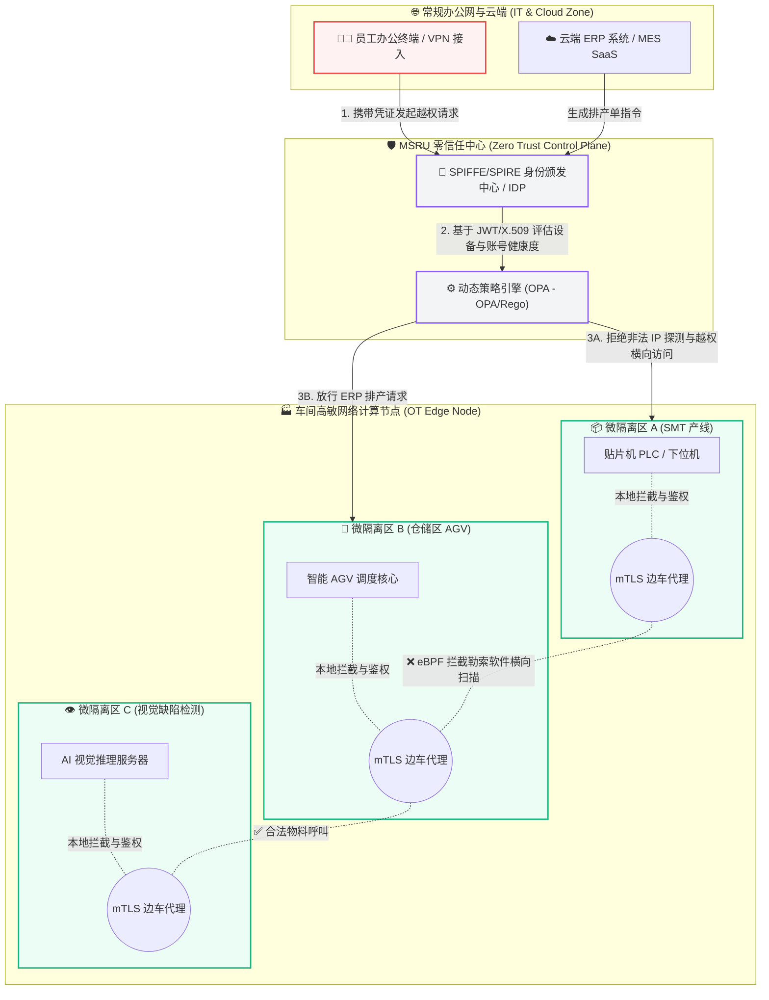
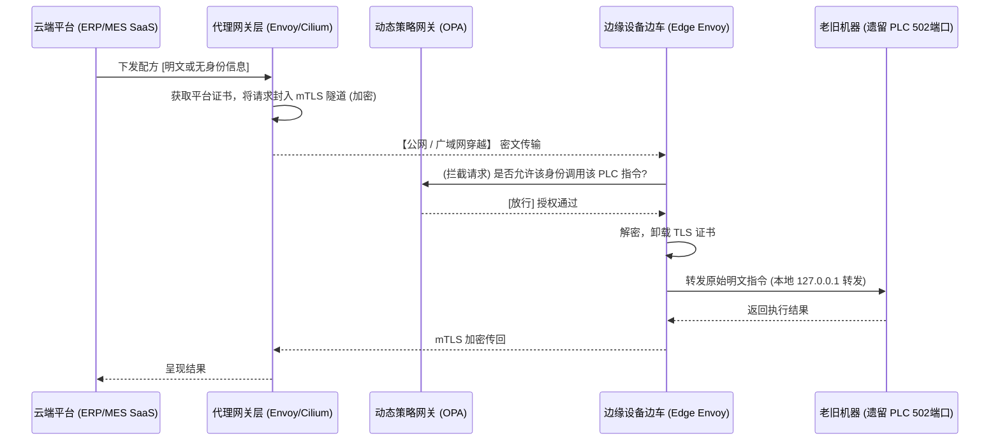

# 安全合规指南：零信任制造现场防御战

<Callout title="作者序" type="info">
传统的边界安全模型在现代 IT/OT 融合的浪潮下已千疮百孔。当一封来自办公网的钓鱼邮件就能轻易攻陷车间里的工控机甚至 PLC 时，我们必须重新审视制造业的安全基石。本文是 MSRU 首席科学家办公室（Office of the CTO）关于工业网络安全演进的深度思辨与技术实践汇编。
</Callout>

## 1. 传统 OT 网络的“脆骨症”与破窗效应

长久以来，制造业内部网络（特别是车间层）普遍采用**“外紧内松”**的扁平化网络架构。人们天真地依赖于 ISA-95 普渡模型（Purdue Model）物理或逻辑隔离形成的边界防火墙（DMZ）。一旦攻击者（如臭名昭著的 WannaCry 或 Stuxnet 变种）突破了这层外壳，内部的各类工控设备（SCADA、PLC、HMI、AGV）就像是毫无防备的羊群，任其横向移动（Lateral Movement）。

### 1.1 核心痛点深度剖析

*   **过度信任的内网 (Implicit Trust)**：设备间缺乏身份校验，只要 IP 在同一网段或内网，就能互相下发控制指令。大多数旧设备使用明文的 Modbus/TCP，没有任何加密或鉴权。
*   **漫长的补丁空窗期 (Patching Nightmare)**：老旧的 Windows XP/7/10 工控机根本无法停机打补丁。某些上位机软件与特定的老旧系统库绑定，一旦更新系统就会导致产线停摆，成为天然的漏洞温床。
*   **一刀切的隔离代价 (Air-gap Fallacy)**：为了安全直接物理断网（物理隔离），导致管理层无法获取实时的 OEE（设备综合效率）和生产数据，数字化转型变成一纸空谈。

<Callout type="warning">
**破窗理论在车间的体现**：一台未打补丁的检重秤如果被植入后门，它不仅是一个单点故障，它还是黑客扫描整个核心生产控制网的跳板。
</Callout>

---

## 2. 零信任 (Zero Trust) 架构的内生演进

**“从来不信任，始终在验证” (Never Trust, Always Verify).**

MSRU Platform 彻底抛弃了基于“网络物理位置”构建信任的落后观念，将零信任（Zero Trust）架构深度刻入工业底座。我们通过**微隔离 (Micro-segmentation)** 与**设备身份加密认证 (mTLS)**，将防御边界从厂房物理大门，缩小到每一个微服务、每一台设备，甚至每一个传感器的 API 入口。

### 2.1 零信任微隔离拓扑逻辑全景



---

## 3. MSRU 零信任防御核心技术：三把利斧

为了在不影响生产效率（毫秒级低延迟、高并发要求）的前提下实现零信任，MSRU 平台摒弃了沉重的传统边界网关，采用了轻量化、分布式下放的核心技术手段：

### 第一把斧：身份即边界 (Identity-Based Access & mTLS)

IP 地址在 MSRU 系统中不再具有任何特权。传统网络中，你可以伪造 IP，但在零信任体系下，你无法伪造密码学身份。

每一台入网的工业设备、传感器甚至微服务，在激活时（Provisioning）都会由 MSRU 内置的 PKI（公钥基础设施，基于 SPIFFE 规范）自动颁发唯一的短期 X.509 数字证书。
任何两个设备或微服务之间的通讯（无论是 IT 到 OT，还是 OT 内部横向交互），都必须建立双向 TLS (mTLS) 隧道进行极速的身份互认。

<Tabs items={['旧版边界验证', 'MSRU 身份证明 (SPIFFE/mTLS)']}>
  <Tab value="旧版边界验证">
    ```bash
    # 基于 IP 和端口的 ACL 漏洞百出
    iptables -A INPUT -p tcp -s 192.168.1.50 --dport 502 -j ACCEPT
    # 黑客只要黑入 192.168.1.50 就可以控制整个产线
    ```
  </Tab>
  <Tab value="MSRU 身份证明 (SPIFFE/mTLS)">
    ```go
    // 基于密码学与工作负载身份的 OPA 策略 (Rego)
    allow {
        input.method == "POST"
        input.path = ["api", "v1", "machine", "stop"]
        input.subject.spiffe_id == "spiffe://msru.local/ns/erp/sa/scheduler"
        input.subject.jwt_claims.role == "production_supervisor"
    }
    ```
  </Tab>
</Tabs>

### 第二把斧：eBPF 内核级角色防火墙与微隔离 (Micro-segmentation)

不同于传统防火墙基于 IP 端口的粗粒度管控，MSRU 的流量调度建立在容器层（K3s/K8s）的 CNI 网络策略和 **eBPF (Extended Berkeley Packet Filter)** 技术之上。

我们将车间网络切割为无数个逻辑上的“微隔离区”。得益于 eBPF 在 Linux 内核层构建的高性能沙箱引擎，我们可以拦截任何可疑的系统调用与套接字连接，而带来的性能损耗几乎为零（小于 2%）。

*   **勒索软件的最终克星**：假设某台质检工控机因为员工插入了带毒 U 盘而感染了勒索病毒。病毒苏醒后试图进行内网网段横向扫描（Ping Sweep, Port Scan）。
*   **防御生效**：底层的 eBPF 探针会瞬间发现该进程没有合法的 API 授权与证书，它发出的所有探测包会在到达物理网卡之前，**在操作系统内核态被直接默默丢弃**。感染被完美禁锢在这一台物理机内，连旁边同在一个网段的打印机都扫描不到。

### 第三把斧：动态上下文策略引擎 (Dynamic Policy Enforcement)

静态权限（如在 Active Directory 里给用户分配一个静态组）依然是不安全的。在 MSRU 架构中，权限是**动态评估**的。

安全代理会实时请求中心化的 OPA (Open Policy Agent) 抓取动态上下文：

*   **场景 A (合规)**：维修工程师在周三下午（规定工作时间），使用注册过的内网平板，尝试重启故障的流水线控制器。策略引擎校验时间、设备指纹、账号角色，**请求放行**。
*   **场景 B (异常)**：同一个维修工程师账号，在凌晨 2 点，通过一个远程 VPN 从未见过的公网跳板机，尝试下发“全厂数据清空”指令。策略引擎发现【时间异类】+【地理位置异类】+【高危风险接口】，立刻**阻断请求**，弹窗要求进行多因素认证 (MFA)，并拉响防蓝军入侵最高级别警报。

---

## 4. 架构纵深：MSRU Sidecar 代理模式解析

为了让老旧设备（Legacy Devices）在不修改一行代码的情况下接入零信任网络，我们引入了 Sidecar（边车）拦截模式。



**对老设备的透明兼容**：PLC 和老鼠皮软件根本不知道外面发生了什么。它们依然坚信自己是在本地无加密通讯。所有的证书轮换、加解密、身份校验、跨网段路由，全部由部署在树莓派或工业网关中的 **MSRU Edge Sidecar** 悄无声息地代为解决。

---

## 5. 企业级落地：从零到一的演进路径

要在几十年来杂乱无章、背负着沉重历史包袱的工厂里落地零信任，不可采取“一刀切”的激进做法，否则会引发生产事故。MSRU 战略交付部建议采用**“监控 -> 告警 -> 阻断”**的无痛渐近演进策略：

<Accordions>
<Accordion title="阶段一：流量监控与可视化拓扑 (Visibility & Discovery)">
首先部署 MSRU 零信任网关，但**不开启任何拦截规则**。此时系统完全处于“监听”模式，利用 eBPF 捕获全量四层到七层的网络元数据。网关会自动绘制出厂内错综复杂的通讯拓扑图，并利用机器学习算法，自动提取出一份“正常业务的流量白名单”草案。
</Accordion>

<Accordion title="阶段二：影子演习模式 (Shadow Mode / Alert-Only)">
根据阶段一自动生成的基线白名单，开启规则逻辑匹配。但是，当发现不在白名单内的违规流量时，防火墙**只产生安全告警审计日志（Alert），绝不切断连接**。这使得生产线可以保持运转，同时安全团队可以根据审计日志，查漏补缺，将偶尔遗漏的合法老旧设备加入白名单，持续打磨和收敛规则。
</Accordion>

<Accordion title="阶段三：全面封锁与强制执行 (Hard Enforcement)">
在“影子模式”运行 2-4 周，确认白名单策略已 100% 覆盖真实生产需要，且再无新的无辜合法报警后。启动**严格的零信任阻断模式（Default Deny）**。此时，除了清单内确定的合法身份和通道，所有未经 mTLS 发出的隐秘通信都会在内核层被物理碾碎。工厂的内网真正成为一个无懈可击的暗箱。
</Accordion>
</Accordions>

## 6. 结论

在工业 4.0 与全自动柔性制造的时代，数据是驱动机器运转的唯一血液。闭关锁国的物理断网早已被淘汰。MSRU 零信任架构，就像是为每一台工业设备配备了贴身保镖与基因锁，它让大中型企业不仅能大胆地打通云端 IT 与现场 OT 的数据链条，享受云端 AI 大算力的红利，更能在日益严酷的 APT 组织与勒索软件攻击面前，构筑起一道坚不可摧、免于恐慌的纵深防御阵地。
