# Ingress 流量调度

Ingress 是外部用户访问集群内微服务的统一入口。K3s 默认集成 Traefik 作为 Ingress Controller，但 MSRU 推荐根据场景进行调优或替换。

---

## K3s 默认 Traefik 评估

| 维度 | 评价 | 说明 |
|------|------|------|
| **安装便捷性** | ⭐⭐⭐ | K3s 内置，开箱即用 |
| **性能** | ⭐⭐ | Go 实现，单实例吞吐有限（约 2w RPS） |
| **功能丰富度** | ⭐⭐ | 基础路由 + TLS 终结 + 中间件 |
| **生态成熟度** | ⭐⭐ | Dashboard 弱、社区小于 Nginx |
| **MSRU 建议** | 开发留用 / 生产替换 | 生产推荐 Nginx Ingress 或 APISIX |

<Callout type="info" title="禁用默认 Traefik">
  MSRU 在初始化 K3s 时通过 `--disable traefik` 参数禁用默认 Traefik，改用更可控的 Ingress Controller。
</Callout>

---

## 方案对比

| 维度 | Traefik（默认） | Nginx Ingress | Apache APISIX |
|------|----------------|---------------|---------------|
| **性能** | ~20k RPS | ~50k RPS | ~80k+ RPS |
| **配置方式** | CRD (IngressRoute) | 标准 Ingress + Annotation | CRD (ApisixRoute) |
| **WAF 能力** | 插件 | ModSecurity 集成 | 内置 |
| **灰度发布** | 有限 | Canary Annotation | 原生支持 |
| **适用场景** | 小规模/开发 | 标准微服务集群 | 高性能/API 网关 |

---

## 方案一：Nginx Ingress Controller（标准推荐）

<Steps>
  <Step>
    ### 安装
    ```bash
    helm repo add ingress-nginx https://kubernetes.github.io/ingress-nginx
    helm install ingress-nginx ingress-nginx/ingress-nginx \
      --namespace ingress-system --create-namespace \
      --set controller.service.type=NodePort \
      --set controller.service.nodePorts.http=80 \
      --set controller.service.nodePorts.https=443 \
      --set controller.metrics.enabled=true
    ```
  </Step>
  <Step>
    ### 创建 Ingress 规则
    ```yaml
    apiVersion: networking.k8s.io/v1
    kind: Ingress
    metadata:
      name: msru-mes-ingress
      annotations:
        nginx.ingress.kubernetes.io/ssl-redirect: "true"
        nginx.ingress.kubernetes.io/proxy-body-size: "50m"
    spec:
      ingressClassName: nginx
      tls:
        - hosts: [mes.msru.io]
          secretName: mes-tls
      rules:
        - host: mes.msru.io
          http:
            paths:
              - path: /
                pathType: Prefix
                backend:
                  service:
                    name: mes-web
                    port:
                      number: 3000
              - path: /api
                pathType: Prefix
                backend:
                  service:
                    name: mes-api
                    port:
                      number: 8080
    ```
  </Step>
  <Step>
    ### TLS 证书自动化（cert-manager）
    ```bash
    helm repo add jetstack https://charts.jetstack.io
    helm install cert-manager jetstack/cert-manager \
      --namespace cert-manager --create-namespace \
      --set crds.enabled=true
    ```
    
    创建 Let's Encrypt 签发器：
    ```yaml
    apiVersion: cert-manager.io/v1
    kind: ClusterIssuer
    metadata:
      name: letsencrypt-prod
    spec:
      acme:
        server: https://acme-v02.api.letsencrypt.org/directory
        email: infra@msru.io
        privateKeySecretRef:
          name: letsencrypt-prod
        solvers:
          - http01:
              ingress:
                class: nginx
    ```
  </Step>
</Steps>

---

## MSRU 流量架构全景

```mermaid
graph TB
    U["用户 / 浏览器"] -->|"HTTPS"| DNS["DNS (mes.msru.io)"]
    DNS --> LB["Tailscale Funnel / 云 LB"]
    LB -->|":443"| ING["Nginx Ingress Controller"]

    ING -->|"/api/*"| API["mes-api (Go/Hertz)"]
    ING -->|"/*"| WEB["mes-web (Next.js)"]
    ING -->|"/grafana"| MON["Grafana Dashboard"]

    API --> DB["PostgreSQL"]
    API --> MQ["NATS / Kafka"]
    WEB --> API

    style U fill:#09090b,stroke:#2dd4bf,stroke-width:2px
    style ING fill:#c2410c,stroke:#7c2d12
    style API fill:#0f766e,stroke:#042f2e
    style WEB fill:#1d4ed8,stroke:#1e3a5f
```



---

## 常见调优参数

<Accordions>
  <Accordion title="如何处理大文件上传（> 10MB）？">
    默认 Nginx Ingress 的 `proxy-body-size` 限制为 1MB。通过 Annotation 调整：
    ```yaml
    annotations:
      nginx.ingress.kubernetes.io/proxy-body-size: "100m"
    ```
  </Accordion>
  <Accordion title="WebSocket 连接频繁断开？">
    增加超时时间：
    ```yaml
    annotations:
      nginx.ingress.kubernetes.io/proxy-read-timeout: "3600"
      nginx.ingress.kubernetes.io/proxy-send-timeout: "3600"
    ```
  </Accordion>
  <Accordion title="如何实现灰度发布（Canary）？">
    ```yaml
    metadata:
      annotations:
        nginx.ingress.kubernetes.io/canary: "true"
        nginx.ingress.kubernetes.io/canary-weight: "20"   # 20% 流量到新版本
    ```
  </Accordion>
</Accordions>
