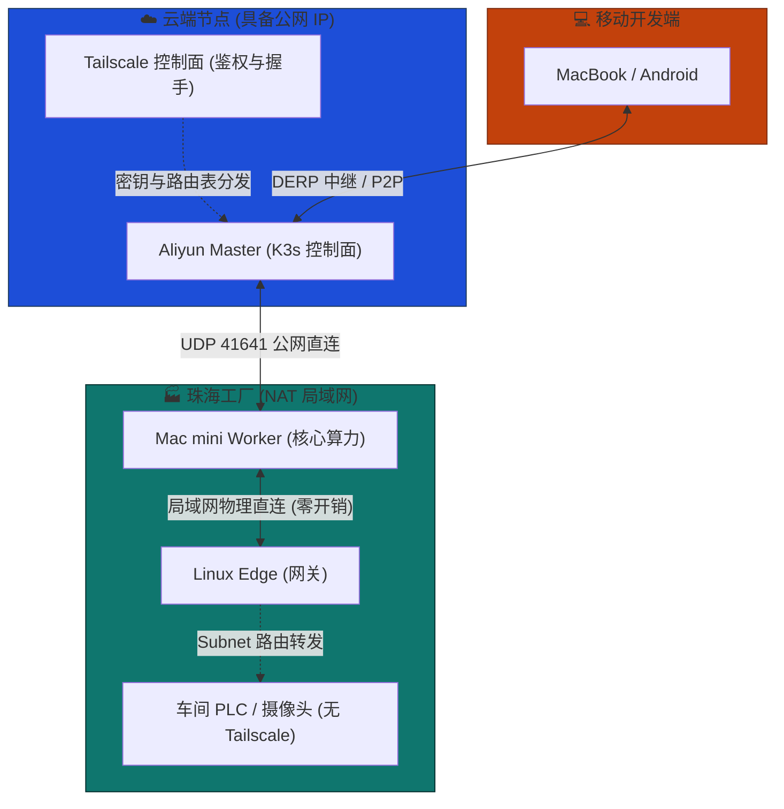

# 异地大内网 VPN 组网

MSRU 平台的典型部署场景涉及拥有公网 IP 的云端控制面、隐藏在 NAT 后的多个制造工厂站点、以及分散在各地的研发人员。传统的 IPSec VPN 或专线方案成本高、配置脆弱且运维复杂。

我们选择 **Tailscale** 作为核心组网底座，基于 WireGuard 协议构建零信任 Mesh 网络，将所有异构节点拉平至统一的 `100.x.x.x` 虚拟局域网内。

---

## 网络拓扑架构




---

## 核心原理

<Cards>
  <Card
    title="WireGuard 内核级加密"
    description="Tailscale 底层使用 WireGuard 协议，运行在内核态，单连接加密开销极小，延迟增加 < 1ms。"
    icon="Shield"
  />
  <Card
    title="智能穿透与路由"
    description="优先尝试 P2P 直连（STUN 打洞）；同局域网内自动物理直连；跨国或严苛 NAT 失败时，自动回退到 DERP 中继服务器。"
    icon="ArrowLeftRight"
  />
  <Card
    title="零信任 ACL"
    description="基于设备身份（Identity）和标签（Tags）定义策略，每次通信都经过极简且严格的身份验证，符合工业安全合规。"
    icon="Lock"
  />
</Cards>

---

## 多终端安装与接入 SOP

不同操作系统的节点接入虚拟局域网的方式略有不同。我们在下方按设备类型提供了标准的接入作业程序。推荐对于无头（Headless）服务器统一使用预授权密钥（Auth Key）进行批量静默注册。

<Tabs items={['Linux 服务器', 'macOS / Windows', '移动端设备']}>
  <Tab value="Linux 服务器">
    **适用场景**：K3s Master、Worker 以及车间网关机。

    ```bash showLineNumbers
    # 1. 一键安装脚本 (Debian/Ubuntu/CentOS)
    curl -fsSL [https://tailscale.com/install.sh](https://tailscale.com/install.sh) | sh

    # 2. 使用不可过期密钥静默启动，并打上 K3s 节点标签，开启内置 SSH
    sudo tailscale up --authkey=tskey-auth-xxxxx --advertise-tags=tag:k3s-node --ssh
    ```
  </Tab>
  <Tab value="macOS / Windows">
    **适用场景**：研发人员的开发机或现场交付调试终端。

    * **macOS**: 推荐使用 Homebrew 安装以保持开发环境命令行的一致性：
        ```bash
        brew install --cask tailscale
        ```
        *(也可通过 Mac App Store 搜索下载图形化客户端)*
    * **Windows**: 访问 [Tailscale 官网下载页面](https://tailscale.com/download/windows) 获取 MSI 安装包。安装完成后，从系统托盘右键登录企业账号。
  </Tab>
  <Tab value="移动端设备">
    **适用场景**：车间巡检人员的手持扫码终端、管理人员手机。

    * **安装途径**: 直接在系统应用商店（Google Play 或 Apple App Store）搜索 `Tailscale` 进行下载安装。
    * **鉴权方式**: 支持通过设备自带浏览器拉起 SSO，一键登录 MSRU 企业账号，无需手动输入复杂的 Auth Key。
  </Tab>
</Tabs>

---

## 混合网络互通与局域网融合

在实际物理环境中，并非所有设备都能安装 Tailscale（例如老旧的车间数控机床、网络摄像头），且不同节点所处的网络位置差异巨大。Tailscale 提供了智能的路由融合机制。

### 场景一：同局域网内设备的智能短路 (Local LAN)
当家里的 Mac mini (Worker) 和另一台测试机都连接在同一个路由器下时，Tailscale 的 **Local Peer Discovery（本地发现）** 机制会自动生效。它们之间的通信**不会**绕道公网，而是直接通过物理交换机/路由器直连，跑满局域网千兆带宽，完全没有 VPN 瓶颈。

### 场景二：公网 IP 节点作为网络“灯塔”
对于阿里云等具备独立公网 IP 的服务器，务必在云服务商的**安全组/防火墙中放行 41641 端口**。
这不仅能让该节点与其他 NAT 后的边缘节点保持 100% 的 P2P 直连打洞成功率，还能让它成为整个 Mesh 网络中极其稳定的流量汇聚点。

### 场景三：子网路由 (Subnet Router) 接入无客户端设备


对于车间里无法安装 Tailscale 的 PLC 设备（如 IP 为 `192.168.10.x`），我们需要在车间找一台已安装 Tailscale 的 Linux 边缘节点作为“路由器”。

1. **开启宿主机 IP 转发:**
   ```bash
   echo 'net.ipv4.ip_forward = 1' | sudo tee -a /etc/sysctl.d/99-tailscale.conf
   sudo sysctl -p /etc/sysctl.d/99-tailscale.conf
   ```
2. **声明暴露本地车间网段:**
   ```bash
   sudo tailscale up --advertise-routes=192.168.10.0/24
   ```
3. **管理台授权:** 在 Tailscale 控制台的对应机器设置中，手动批准（Enable）这条子网路由。此时，云端的 Master 节点就能直接 ping 通车间的纯内网 PLC 设备。

---

## Tailscale 控制台管理与进阶


Tailscale 的强大在于其分离的控制面。网络状态与安全策略全部在云端 Admin Console 完成配置。

* **设备审批 (Device Approval)**
  强烈建议在企业的 `Settings > Device management` 中开启此项。开启后，即使 Auth Key 泄露，新设备加入也必须经过管理员在网页端手动点击放行，防止 K3s 集群被恶意节点接入。
* **访问控制列表 (ACLs)**
  使用 JSON 定义严格的访问边界。例如：禁止移动端开发设备直接访问 K3s Master 节点的 `6443` 端口，只允许特定 `tag:sre` 的设备访问。
* **MagicDNS 与 HTTPS 证书**
  开启 MagicDNS 后，可以直接使用机器名（如 `ping mac-mini`）代替难记的 `100.x.x.x` IP。系统甚至支持为内部节点自动签发 Let's Encrypt 证书。

---

## K3s 集成要点

<Callout type="warn" title="关键网络绑定配置">
  在异地组网架构下，K3s 必须强制绑定到 Tailscale 分配的虚拟网卡（通常名为 `tailscale0`）及其 `100.x.x.x` IP 上。如果绑定到默认物理网卡，跨站点的 Pod 通信将发生路由黑洞。
</Callout>

```bash
# K3s Master 启动参数示例
curl -sfL [https://get.k3s.io](https://get.k3s.io) | INSTALL_K3S_EXEC="server \
  --node-ip=$(tailscale ip -4) \
  --advertise-address=$(tailscale ip -4) \
  --flannel-iface=tailscale0 \
  --tls-san=$(tailscale ip -4)" sh -
```

| 启动参数 | 架构说明 |
| :--- | :--- |
| `--node-ip` | 强制 Kubelet 注册 Tailscale 虚拟 IP 为节点内部 IP。 |
| `--advertise-address` | API Server 仅在 VPN 隧道内广播，拒绝公网直连访问。 |
| `--flannel-iface` | 指示 Flannel CNI 跨主机容器网络数据包必须走 `tailscale0` 加密网卡。 |
| `--tls-san` | 将 Tailscale IP 签入集群自签名证书，确保 `kubectl` 远程调用不报证书错误。 |