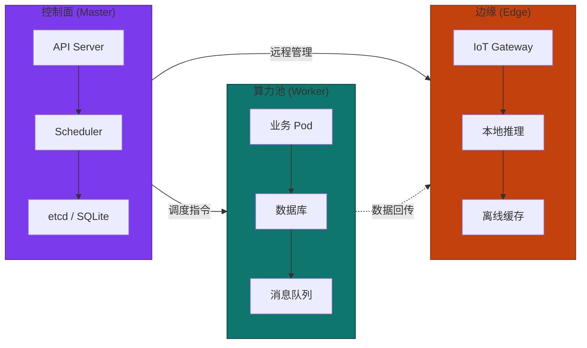

# 节点角色规划

MSRU 平台采用分层的节点角色设计，每种角色承担不同的职责并对硬件有差异化要求。理解角色边界是规划集群拓扑的前提。

---

## 角色对照



---

## Master 控制面节点

| 属性 | 说明 |
|------|------|
| **职责** | 运行 K3s API Server、Scheduler、Controller Manager 和存储后端 |
| **数量** | 开发: 1 台 / 生产 HA: 3 台（奇数保证 quorum） |
| **核心约束** | **禁止运行业务工作负载**，仅承载控制面组件 |
| **网络要求** | 低延迟（Master 间 RTT < 10ms），稳定连通 |
| **存储后端** | 单机: 内嵌 SQLite / HA: 外部 etcd 或嵌入式 etcd |

<Callout type="warn" title="Master 节点隔离">
  生产环境必须为 Master 节点设置 `node-role.kubernetes.io/master:NoSchedule` 污点，防止业务 Pod 抢占控制面资源。K3s 通过 `--node-taint` 参数在安装时即可完成。
</Callout>

---

## Worker 算力池节点

| 属性 | 说明 |
|------|------|
| **职责** | 运行全部业务微服务、数据库、消息队列等有状态/无状态工作负载 |
| **数量** | 按业务容量弹性伸缩，最少 1 台 |
| **标签建议** | `node-type=worker`、`zone=xx`、`gpu=true/false` |
| **资源超卖** | 无状态服务可设 CPU Limit > Request；有状态服务（DB）禁止超卖 |

**推荐标签体系：**

```yaml
# Worker 节点标签示例
labels:
  node-type: worker
  msru.io/zone: factory-a        # 物理区域
  msru.io/tier: compute          # 职能层
  msru.io/gpu: "false"           # GPU 可用性
  msru.io/disk-type: nvme        # 存储介质
```

---

## Edge 边缘节点

| 属性 | 说明 |
|------|------|
| **职责** | 就近处理 IoT 数据采集、协议转换、本地推理和离线缓存 |
| **部署位置** | 产线旁、车间内、远端工厂——网络条件不稳定 |
| **核心特征** | 支持自治运行（断网后仍可独立工作） |
| **资源限制** | 通常 4~8 核 / 8~16 GB 内存，ARM 架构居多 |

<Callout type="info" title="边缘自治模式">
  当边缘节点检测到与控制面的连接超时 > 30s，MSRU Edge Agent 自动切换为本地自治模式，启用 SQLite 本地账本记录，待网络恢复后增量同步。
</Callout>

**边缘节点关键配置：**

```yaml
# Edge 节点 Kubernetes 标签与污点
labels:
  node-type: edge
  msru.io/zone: remote-site-01
  msru.io/autonomous: "true"
taints:
  - key: msru.io/edge
    value: "true"
    effect: NoSchedule          # 防止非边缘工作负载被调度到此节点
```

---

## 角色决策流程图

<Steps>
  <Step>
    ### 确认部署规模
    根据[硬件选型对照表](/docs/platform/foundation/hardware-and-sizing/capacity-planning)确定目标档位（开发 / 标准 / HA）。
  </Step>
  <Step>
    ### 分配节点角色
    按上述矩阵为每台物理机或 VM 分配角色，贴上对应标签。
  </Step>
  <Step>
    ### 配置污点与容忍
    Master 和 Edge 节点必须设置污点；Worker 节点保持干净。详见[边缘污点隔离](/docs/platform/foundation/k3s-orchestration/edge-taints)。
  </Step>
</Steps>
