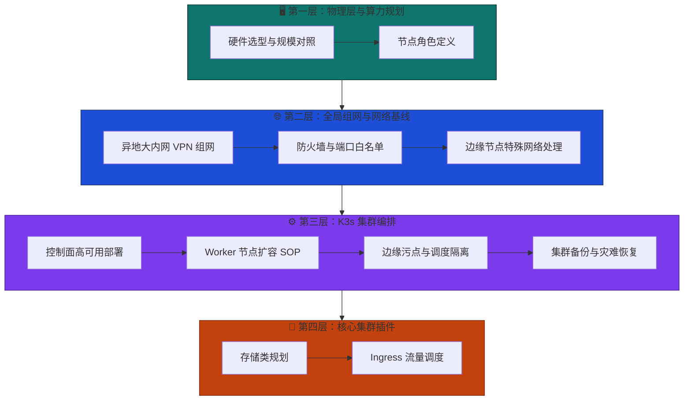

# MSRU 平台基础设施架构总览

MSRU（微服务与多尺度资源利用）平台的每一行业务代码都运行在精心规划的基础设施之上。本章从物理算力到集群插件，分四层自底向上地拆解整个基础设施的技术栈。

<Callout type="info" title="为什么基础设施文档如此重要？">
  工业环境的网络抖动、硬件异构、边缘节点离线等场景远比互联网 SaaS 复杂。每一层都经过 MSRU 团队的生产验证，跳过任何一层都可能在上线后埋下稳定性隐患。
</Callout>

---

## 四层架构全景图

---

## 各层导读

<Cards>
  <Card
    title="物理层与算力规划"
    description="硬件选型规模对照表、节点角色规划（Master / Worker / Edge），帮助运维在拿到机器前完成容量评估。"
    href="/docs/platform/foundation/hardware-and-sizing"
    icon="HardDrive"
  />
  <Card
    title="全局组网与网络基线"
    description="Tailscale 异地大内网组网、防火墙白名单精确到端口协议、IPv6 穿透与中继策略。装 K3s 前的网络必修课。"
    href="/docs/platform/foundation/global-networking"
    icon="Globe"
  />
  <Card
    title="K3s 集群编排"
    description="控制面 HA 部署、Worker 节点扩容 SOP、边缘污点隔离、集群快照与灾难恢复——核心引擎的启动指南。"
    href="/docs/platform/foundation/k3s-orchestration"
    icon="Container"
  />
  <Card
    title="核心集群插件"
    description="StorageClass 存储规划（本地 / NFS / Longhorn）、Ingress 外部流量调度——为微服务提供运行时基础设施。"
    href="/docs/platform/foundation/cluster-addons"
    icon="Puzzle"
  />
</Cards>

---

## 阅读建议

<Steps>
  <Step>
    ### 首次部署：自底向上通读
    如果您是首次搭建 MSRU 平台，请从第一层「物理层」开始，逐层完成配置。每一层都依赖前一层的就绪状态。
  </Step>
  <Step>
    ### 扩容运维：按需跳转
    已有运行中集群的运维人员，可直接跳到第三层「Worker 节点扩容 SOP」或第四层「存储扩容」章节。
  </Step>
  <Step>
    ### 架构评审：全景对照
    CTO / 架构师可通过上方 Mermaid 图快速定位关注层，再深入对应子文档获取技术细节。
  </Step>
</Steps>
