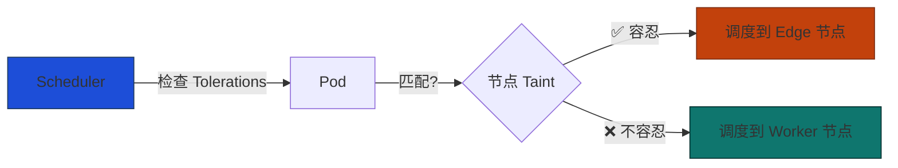

# 边缘污点与调度隔离

边缘节点在资源、网络稳定性方面与标准 Worker 差异极大。如果不做隔离，Kubernetes 调度器可能将数据库、Web 服务等非边缘工作负载调度到边缘节点，导致性能劣化甚至服务中断。

---

## 核心机制



| 概念 | 说明 |
|------|------|
| **Taint（污点）** | 打在节点上的「排斥标记」，声明「除非 Pod 主动容忍，否则别来」 |
| **Toleration（容忍）** | 写在 Pod 上的「我能接受该污点」声明 |
| **Effect** | `NoSchedule`（不调度）/ `PreferNoSchedule`（尽量不调度）/ `NoExecute`（驱逐已有 Pod） |

---

## 配置步骤

<Steps>
  <Step>
    ### 边缘节点安装时设置污点
    ```bash
    curl -sfL https://get.k3s.io | INSTALL_K3S_EXEC="agent \
      --server https://<master>:6443 \
      --token <token> \
      --node-ip=$(tailscale ip -4) \
      --flannel-iface=tailscale0 \
      --node-label node-type=edge \
      --node-label msru.io/zone=remote-site-01 \
      --node-label msru.io/autonomous=true \
      --node-taint msru.io/edge=true:NoSchedule" sh -
    ```
  </Step>
  <Step>
    ### 对已有节点追加污点
    ```bash
    kubectl taint nodes edge-node-01 msru.io/edge=true:NoSchedule
    ```
  </Step>
  <Step>
    ### 边缘工作负载声明容忍
    ```yaml
    apiVersion: apps/v1
    kind: Deployment
    metadata:
      name: iot-gateway
    spec:
      template:
        spec:
          tolerations:
            - key: "msru.io/edge"
              operator: "Equal"
              value: "true"
              effect: "NoSchedule"
          nodeSelector:
            node-type: edge
          containers:
            - name: gateway
              image: msru/iot-gateway:latest
    ```
  </Step>
</Steps>

---

## MSRU 推荐污点体系

| 污点 Key | Value | Effect | 适用节点 | 说明 |
|----------|-------|--------|----------|------|
| `msru.io/edge` | `true` | NoSchedule | Edge | 防止非边缘 Pod 调度 |
| `node-role.kubernetes.io/master` | ─ | NoSchedule | Master | 防止业务 Pod 抢占控制面 |
| `msru.io/gpu` | `true` | NoSchedule | GPU Worker | GPU 资源隔离 |
| `msru.io/maintenance` | `true` | NoExecute | 维护中节点 | 驱逐所有 Pod 后进行维护 |

<Callout type="info" title="驱逐 vs 不调度">
  `NoSchedule` 仅阻止新 Pod 调度，不影响已运行的 Pod。如需将节点上的 Pod 全部迁走（如计划维护），应使用 `NoExecute` 效果或 `kubectl drain`。
</Callout>
