# 边缘算力接入：Mac mini (OrbStack) 部署

在 MSRU 平台的研发与测试环境中，本地的 Mac mini 是极其优质的高性能算力资源。然而，K3s 的核心组件（Kubelet 和 Containerd）强依赖于 Linux 内核的 `cgroups` 和 `namespace` 特性，**无法直接运行在 macOS 的 Darwin 内核之上**。

本文档详述了如何利用 **OrbStack** 快速拉起一个极低开销的 Ubuntu 虚拟机，并在该虚拟机的独立隔离沙盒中完成 Tailscale 异地组网与 K3s Agent 的点火并网。


---

## 架构拓扑与网络边界

<Callout type="error" title="网络边界红线：不要复用宿主机的 Tailscale">
  虽然你的 Mac mini 宿主机（`100.68.155.119`）已经安装了 Tailscale，但 K3s 必须显式绑定一个名为 `tailscale0` 的物理或虚拟网卡才能建立 Flannel 跨主机容器网络。
  **因此，我们必须在 OrbStack 虚拟机内部，单独再安装一次 Tailscale。** 虚拟机将获得一个全新的、独立的 `100.x.x.x` IP，专门用于承载微服务流量。

```mermaid
graph TD
    subgraph MacHost ["💻 Mac mini 宿主机 (macOS)"]
        TS_Mac["Tailscale (100.68.155.119)"]
        
        subgraph OrbStack ["⚡ OrbStack 虚拟化层"]
            subgraph UbuntuVM ["🐧 Ubuntu VM (msru-worker-01)"]
                TS_VM["内部 Tailscale (100.x.x.x)"]
                K3s["K3s Agent (Kubelet / Flannel)"]
                Pods["业务微服务 Pods"]
            end
        end
    end

    Cloud["☁️ 阿里云 Master (100.97.2.38)"]

    TS_VM <-->|"UDP 41641 加密隧道"| Cloud
    K3s -->|"向 API Server 注册"| Cloud
    
    style MacHost fill:#0f172a,stroke:#334155
    style OrbStack fill:#1e1b4b,stroke:#3730a3
    style UbuntuVM fill:#064e3b,stroke:#065f46
    style Cloud fill:#1d4ed8,stroke:#1e3a5f
```

</Callout>



---

## 算力节点点火 SOP

请在你的 **Mac mini 自带的终端 (Terminal / iTerm2)** 中严格按序执行以下步骤。

<Steps>
  <Step>
    ### 创建并启动 Ubuntu 实例
    OrbStack 的 `orb` CLI 可以在秒级拉起一个原生 Linux 环境。我们将创建一个名为 `msru-worker-01` 的 Ubuntu 24.04 实例。

    ```bash showLineNumbers
    # 1. 拉起 Ubuntu 虚拟机 (首次执行会自动下载基础镜像)
    orb create ubuntu msru-worker-01

    # 2. 直接进入该虚拟机的 Linux Bash 终端
    orb default msru-worker-01
    ```
    *(执行完第二步后，你的命令行提示符应该会变成类似 `root@msru-worker-01:~#`，说明你已成功进入虚拟机内部。)*
  </Step>
  
  <Step>
    ### 植入 Tailscale 虚拟网卡
    在 **OrbStack 虚拟机内部**，执行一键安装脚本。

    ```bash showLineNumbers
    # 安装 Tailscale
    curl -fsSL [https://tailscale.com/install.sh](https://tailscale.com/install.sh) | sh

    # 拉起组网并拒绝接管 DNS (防止虚拟机断网)
    sudo tailscale up --accept-dns=false --advertise-tags=tag:k3s-node
    ```
    *此时，虚拟机会弹出一个授权链接。请在 Mac 的浏览器中打开该链接，将其加入 Tailscale 网络。*
  </Step>

  <Step>
    ### 执行 K3s Agent 算力并网
    确保虚拟机内的 Tailscale 已经上线后，执行以下命令将该节点接入阿里云的总控大脑。我们使用国内加速镜像源以避开网络阻断。

    ```bash showLineNumbers {5,6}
    # 提取虚拟机专属的 Tailscale IP
    TS_IP=$(tailscale ip -4)

    # 注入 Master IP 与 集群准入 Token，启动 Agent
    curl -sfL [https://rancher-mirror.rancher.cn/k3s/k3s-install.sh](https://rancher-mirror.rancher.cn/k3s/k3s-install.sh) | INSTALL_K3S_MIRROR=cn INSTALL_K3S_EXEC="agent \
      --server [https://100.97.2.38:6443](https://100.97.2.38:6443) \
      --token K10ac2283d77f2e75bf874e63ced9688440227c26d676d8465b61705883decf8344::server:bea9068de633f992e550b93098f88536 \
      --node-ip=${TS_IP} \
      --flannel-iface=tailscale0" sh -
    ```
  </Step>
</Steps>

---

## 验证与健康巡检

算力并网是一项涉及跨广域网（WAN）的复杂操作。请切换回**阿里云 Master 节点**的 SSH 终端，执行以下检阅指令：

<Tabs items={['验证节点会师', '验证网络路由', '排错指南']}>
  <Tab value="验证节点会师">
    检查 `msru-worker-01` 是否成功注册，且处于 `Ready` 状态。

    ```bash
    sudo k3s kubectl get nodes -o wide
    ```
    **预期输出**：
    你会看到两台机器，`msru-worker-01` 的角色为 `<none>`（代表 Worker），且 `INTERNAL-IP` 是它在 Tailscale 中获取的新虚拟 IP。
  </Tab>
  <Tab value="验证网络路由">
    K3s 跨地域集群最容易在 Pod 网络层面翻车。我们必须验证 Master 节点能否打通 Worker 节点的 Flannel 隧道。

    ```bash
    # 在阿里云上，尝试 ping Worker 节点的内部 IP
    ping <msru-worker-01-的-INTERNAL-IP> -c 3
    ```
  </Tab>
  <Tab value="排错指南">
    如果 `msru-worker-01` 在阿里云上显示为 `NotReady`，或者根本没有出现：
    1. **时间不同步：** K3s 强依赖 SSL 证书鉴权，如果虚拟机时间与阿里云时间相差超过几分钟，会导致握手失败。
    2. **Token 错误：** 确认拷贝的 Token 没有多出换行符或空格。
    3. **本地查看 Agent 日志：** 回到 Mac mini 虚拟机内部，执行 `sudo journalctl -u k3s-agent -f` 追踪报错根因。
  </Tab>
</Tabs>