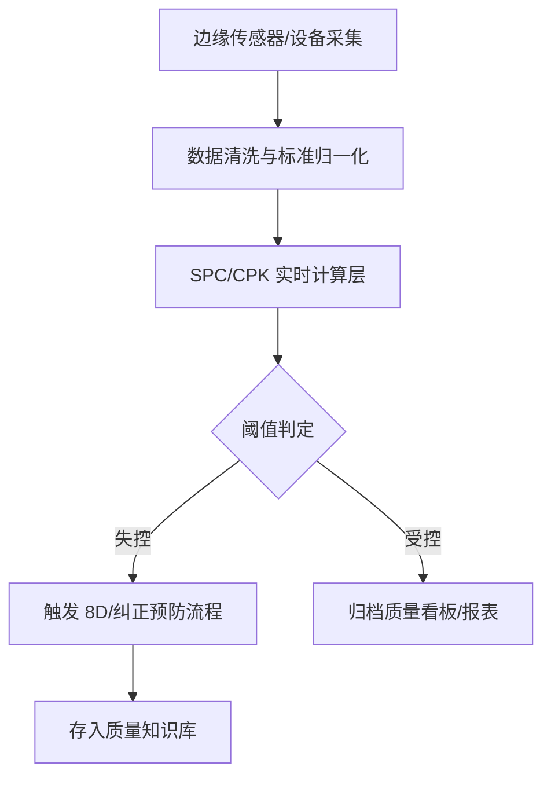

# QMS 质量管理概览

在工业 4.0 的技术版图中，**质量管理系统 (Quality Management System, QMS)** 已经超越了传统的“试检表数字化”阶段。

**MSRU | QMS** 被构建为工厂的“数字化守门员”。它利用分布式计算与边缘感知技术，将质量管控从单纯的“产后检查”演进为“实时预测、主动干预与全量溯源”的数智闭环。

<Callout type="info" title="设计哲学：预防胜于拦截">
  在 MSRU 体系中，质量不是检查出来的，而是设计和制造出来的。我们的 QMS 模块通过与 MES 和边缘传感器的深度融合，能够检测出工艺参数的微小漂移（Drift），在不合格品产生之前便触发纠正动作。
</Callout>

---

## 1. MSRU 质量管控的三大尺度 (Three Scales)

质量管理需要同时兼顾宏观的体系合规与微观的每一个工艺点位。

<Cards>
  <Card 
    title="微观监测 (Edge Sensing)" 
    description="通过边缘网关直连检测仪器（如卡尺、拉力计、三坐标）。数据毫秒级上传，杜绝人工录入造假。" 
    icon="Microscope" 
  />
  <Card 
    title="中观过程 (SPC Analysis)" 
    description="实时计算 CPK, PPK 指标。利用休哈特控制图自动识别受控与失控状态，让质量趋势波动可见。" 
    icon="Activity" 
  />
  <Card 
    title="宏观体系 (Compliance)" 
    description="支持 IATF 16949, ISO 9001 等行业标准。一键导出审核所需的完整追溯链与 8D 报告。" 
    icon="ShieldCheck" 
  />
</Cards>

---

## 2. 什么是“数智化”品控闭环？

QMS 的核心使命是将孤立的质量数据转化为驱动决策的知识。

<Tabs items={['业务流程', '算法模型', '合规架构']}>
<Tab value="业务流程">
### 端到端的质量治理
1. **IQC (进料检验)**：基于供应商风险等级调整抽样频率（AQL）。
2. **IPQC (过程检验)**：MES 触发首末检、巡检任务，不合格即刻锁死产线。
3. **FQC (成品检验)**：通过条码锁定库存，未检或检不合格无法扫描出库。
4. **OQC (出货检验)**：结合 WMS 状态，生成最终质量合格证书（CoA）。
</Tab>
<Tab value="算法模型">
### SPC 统计过程控制公式
系统利用收集的样本均值 $\bar{x}$ 与极差 $R$ 自动计算控制限：

<MathEquation 
  inline={false} 
  formula={String.raw`UCL_{\bar{x}} = \bar{\bar{x}} + A_{2}\bar{R} \quad \text{and} \quad LCL_{\bar{x}} = \bar{\bar{x}} - A_{2}\bar{R}`} 
/>

当数据点超出 $[\text{LCL}, \text{UCL}]$ 范围时，边缘节点将立即向订阅了 Webhook 的通知终端发送异常警报。
</Tab>
<Tab value="合规架构">

</Tab>
</Tabs>

---

## 3. 标准化质量操作流程 (SOP)

从定义标准到获得报告，MSRU | QMS 提供了简洁直观的引导。

<Steps>
  <Step>
    ### 定义质量方案 (Standard Formulation)
    根据零件图纸或内控标准，在系统中定义【检测项】（如：外径 Φ50±0.05）。配置抽样方案（GB/T 2828.1 或自定义标准）。
  </Step>
  <Step>
    ### 指令触发与执行 (Task Execution)
    MES 或 WMS 事件触发检测任务。质检员通过智能平板或 AR 眼镜，按照指引进行测量并实时录入。
  </Step>
  <Step>
    ### 异常处置与锁定 (Anomaly Handling)
    若录入值超出公差，系统自动触发“不合格品评审 (MRB)”。逻辑自动锁定关联托盘/批次，阻止非法进入下一工位。
  </Step>
  <Step>
    ### 纠正与关闭 (Closure)
    利用内置的 AI 辅助分析根因。提交纠正措施后，QC 组长确认关闭，系统释放解除锁定标记。
  </Step>
</Steps>

---

## 4. 质量底层数据结构 (Data Assets)

对于开发人员，理解 QMS 的数据实体关系是集成的关键。

<Files>
  <Folder name="qms-core-schema" defaultOpen>
    <Folder name="inspection-templates" defaultOpen>
       <File name="dimension-check.json (尺寸检测模板)" />
       <File name="visual-ai-model.config (视觉算法配置)" />
    </Folder>
    <Folder name="ledger">
       <File name="inspection-record.sql (质检台账)" />
       <File name="non-conformity.xml (不合格项声明)" />
    </Folder>
  </Folder>
</Files>

---

## 5. 常见问题排查 (FAQ)

<Accordions>
  <Accordion title="如何确保质检员没有‘盲填’数据？">
    **方案**：MSRU 提供两种机制：
    1. **硬件直连**：通过 Bluetooth 或 WiFi 直接从卡尺获取读数，UI 界面禁止手动输入。
    2. **时空存证**：利用边缘节点的本地时钟与 GPS/室内定位，记录每一笔数据的确切录入时间与位置。
  </Accordion>
  <Accordion title="系统支持二级/多级抽样吗？">
    **方案**：支持。在质量方案中可以灵活配置“分层抽样”逻辑。例如：第一层抽箱，第二层从箱中抽样。
  </Accordion>
</Accordions>

---

## 6. 总结

质量管理是工厂的“主权”象征。

通过 **MSRU | QMS**，您获得的不只是一个软件工具，而是一套**基于数据驱动的、具备自我演进能力的质量治理框架**。它将协助您从被动维护品质转变为主动创造价值。

---

> [!TIP]
> 准备好运行您的首个质检方案了吗？请前往 [快速上手指南](./introduction/quick-start)。
