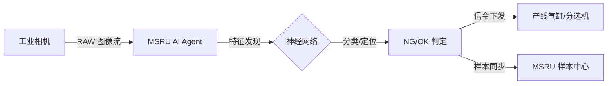

# AI 集成指南

在 MSRU 的产品哲学中，AI 不仅仅是一个实验室里的挂件，而是深度嵌入生产呼吸的**“数字质检员”**。

通过 **MSRU | QMS** 的 AI 集成模块，企业可以将质量管控从劳动密集型的人工抽检，升级为由神经网络驱动的全量自动监控。

<Callout type="info" title="AI 的使命：消除模糊性">
  人工质检受限于疲劳、视力差异与主观标准，漏检率难以突破瓶颈。QMS AI 引擎提供了一套绝对一致的、24/7 不间断的判定尺度。
</Callout>

---

## 1. 核心 AI 能力矩阵 (AI Capabilities)

我们在质量链条的三个核心环节注入了智能算法：

<Cards>
  <Card 
    title="视觉自动缺陷检测 (AOI)" 
    description="集成工业相机边缘站。自动识别表面划痕、污点、字符残缺（OCR）及组装干涉。判定延迟 < 50ms。" 
    icon="Eye" 
  />
  <Card 
    title="参数化质量预测" 
    description="分析 MES 工艺参数（温度、压力、转速）与质量结果的相关性，实时计算‘不合格先导指标’。" 
    icon="LineChart" 
  />
  <Card 
    title="知识图谱故障诊断" 
    description="利用 LLM 对历史不合格项记录进行语义分析，为 8D 报告中的‘根因分析’提供智能建议。" 
    icon="Brain" 
  />
</Cards>

---

## 2. AI 视觉判定流 (Vision Logic)

MSRU 支持通过 **Open-API** 接入第三方的深度学习推理引擎，也可直接调用内置的轻量化模型。

<Tabs items={['推理逻辑', '数据流图', '模型下发']}>
<Tab value="推理逻辑">
### 边侧推理 (Edge Inference)
1. **图像采集**：通过 GigE 接口触发相机。
2. **预处理**：边缘 Agent 进行灰度化与降噪。
3. **推理**：调用 TensorFlow Lite 或 ONNX 推理机进行目标检测。
4. **决策回传**：判定结果实时写入 QMS 质检单。
</Tab>
<Tab value="数据流图">

</Tab>
<Tab value="模型下发">
通过 MSRU 管理后台，您可以实现 **“一次训练，全球同步”**。将更新后的 `.pth` 模型文件通过分布式网关远程推送到全球各厂区的边缘节点。
</Tab>
</Tabs>

---

## 3. 数学模型：质量确定性预测

我们利用逻辑回归与梯度提升树（GBDT）来预测批次的不合格概率。

<MathEquation 
  inline={false} 
  formula={String.raw`P_{fail} = \sigma \left( \sum_{i=1}^n w_i \cdot \text{Feature}_i(t) + b \right) \quad \text{Alert if } P_{fail} > \ Tau_{risk}`} 
/>

其中，$\text{Feature}_i(t)$ 代表实时的工艺流数据。当预测概率超过风险阈值 $\Tau$ 时，QMS 会自动在 [看板] 中将当前批次标记为“风险关注”。

---

## 4. 样本库管理规范 (Sample Dataset)

高质量的 AI 来自于高质量的数据资产。

<Files>
  <Folder name="qms-ai-assets" defaultOpen>
    <Folder name="training-sets" defaultOpen>
       <File name="good-samples.tar.gz (正样本)" />
       <File name="defect-labels.json (缺陷标注)" />
    </Folder>
    <Folder name="inference-specs">
       <File name="yolov8-custom.onnx" />
       <File name="preprocessing.py" />
    </Folder>
  </Folder>
</Files>

---

## 5. 常见挑战与 FAQ

<Accordions>
  <Accordion title="AI 判定出现‘误报’（False Alarm）怎么办？">
    **方案**：QMS 支持 **“人工复核模式”**。系统会将 AI 判定为 NG 的样本推送至质检员工作站进行快速确认。确认后的数据会自动回传至样本库，参与下一轮模型的在线微调（Online Tuning）。
  </Accordion>
  <Accordion title="对硬件算力有什么要求？">
    **方案**：对于轻量化的 2D 尺寸测量，普通工业 PC 即可。若涉及复杂的 3D 点云匹配或高频视频流分析，建议部署带有 NVIDIA Jetson 或 Tesla 加速卡的边缘扩展节点。
  </Accordion>
</Accordions>

---

## 6. 总结

AI 不会取代质检员，但会取代那些不使用 AI 的质检流程。

通过 **MSRU | QMS** 的 AI 集成，您的工厂将拥有一种能够“学习”质量标准的、具备 100% 重现性的智能大脑。

---

> [!TIP]
> 准备好训练您的首个缺陷识别模型了吗？请查看 [SDK 使用指南](../integrations/sdk) 获取 Python 训练脚本示例。
