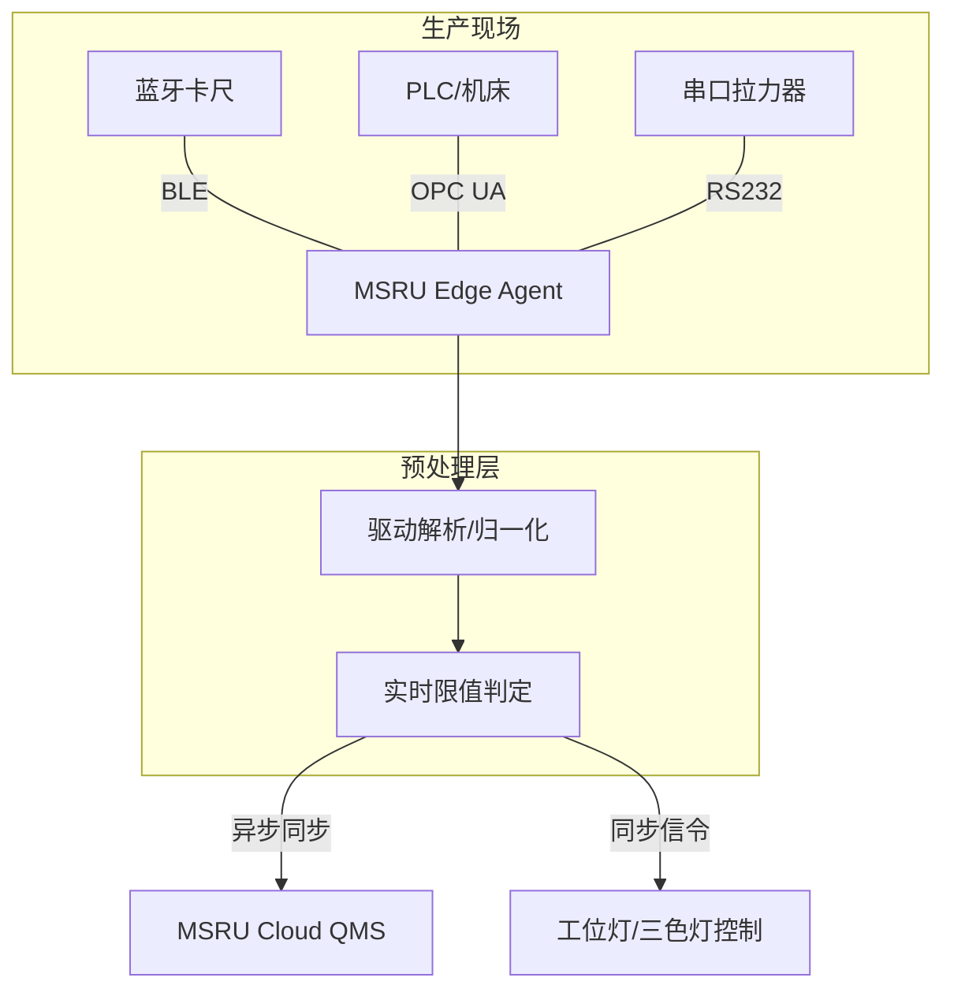

# 硬件集成与通讯指南

质量管理数字化的瓶颈往往不在于软件界面，而在于如何高效、准确地获取来自物理世界的测量数据。

**MSRU | QMS** 借助集成的 **Edge Agent** 通讯引擎，打破了现场硬件与云端业务系统之间的“协议墙”。我们实现了从手动量具到高速自动检测线的全方位数据直采。

<Callout type="info" title="设计理念：自动化防错">
  通过硬件直连，QMS 确保每一个数据点均来自受校准的测量设备，从源头上消除了人工录入可能产生的读数错误、笔误甚至数据造假。
</Callout>

---

## 1. 通讯协议矩阵 (Protocol Matrix)

MSRU 支持多种尺度的工业通讯协议，复盖从实验室到重工业车间的所有场景。

<Cards>
  <Card 
    title="低功耗无线 (BLE)" 
    description="专为手持设备设计。支持数显卡尺、千分尺、电子天平等通过蓝牙 5.0 协议自动配对并传输读数。" 
    icon="Bluetooth" 
  />
  <Card 
    title="串口与总线 (RS232/485)" 
    description="适用于传统的工业天平、测厚仪。内置 Modbus RTU 解码器，支持自定义波特率与奇偶校验调优。" 
    icon="Usb" 
  />
  <Card 
    title="以太网协议 (OPC UA/MQTT)" 
    description="针对自动化产线。通过 OPC UA 服务器实时抓取 PLC 中的质量参数或 AGV 传感器的物理状态。" 
    icon="Network" 
  />
</Cards>

---

## 2. 边缘直采架构图

理解数据如何从物理探针流向云端大屏。

<Tabs items={['数据流向对比', '拓扑展示', '实时性指标']}>
<Tab value="数据流向对比">
### 传统方式 (Manual)
`仪器读数` $\rightarrow$ `人工眼看` $\rightarrow$ `笔录或手动键入` $\rightarrow$ `QMS`
**缺点**：存在 5% 以上的录入错误率与数分钟的延迟。

### MSRU 直采方式 (Automated)
`仪器动作 (Data Out)` $\rightarrow$ `Edge Agent (Polling/Listen)` $\rightarrow$ `自动判定` $\rightarrow$ `QMS`
**优点**：零误差，延迟范围在 10ms - 100ms。
</Tab>
<Tab value="拓扑展示">

</Tab>
<Tab value="实时性指标">
- **BLE 连接稳态**：支持同时维持 8 个手持量具的心跳。
- **采集频率**：PLC 变量采集频率最高可设置为 10Hz（100ms/次）。
</Tab>
</Tabs>

---

## 3. 驱动配置与映射关系 (Driver Config)

在边缘侧，驱动程序负责将原始字节流转化为结构化的质量数据。

<Files>
  <Folder name="edge-drivers" defaultOpen>
    <File name="caliper-mitutoyo.yaml">
      ```yaml
      # 三丰蓝牙卡尺驱动配置
      connection:
        type: BLE
        uuid: "0000180a-0000-1000-8000-00805f9b34fb"
      data_mapping:
        byte_start: 2
        byte_len: 8
        scale: 0.01
        unit: "mm"
      ```
    </File>
    <File name="opc-server.json" />
  </Folder>
</Files>

---

## 4. 传输可靠性模型

工业环境中的无线干扰不可避免。MSRU 利用缓冲区重传模型确保数据“不丢失、不重录”。

<MathEquation 
  inline={false} 
  formula={String.raw`P_{reliability} = 1 - \prod_{retry=1}^{n} (1 - P_{success\_capture}) \quad \text{where } n = \text{Retry Threshold}`} 
/>

这种 **“重试增强型”** 采集技术能够自动处理由于现场电磁环境恶劣导致的断连瞬间，通过 Agent 内部的队列缓冲，待信号恢复后自动补齐数据戳。

---

## 5. 常见集成挑战 (FAQ)

<Accordions>
  <Accordion title="如何实现‘一键触发采集’而不依赖软件点击？">
    **方案**：QMS 支持 **“脚踏开关”** 或量具自带的 **“Data 键”** 映射。当工人按下测量设备上的实体按键时，Edge Agent 会通过事件冒泡机制自动触发 QMS 界面的数据录入动作。
  </Accordion>
  <Accordion title="支持多级代理级联吗（由于厂房过大）？">
    **方案**：支持。您可以在不同车间部署多个轻量级的 **Satellite Agent**，它们会将收集到的信号汇总至主边缘节点，共用一套质量判定逻辑。
  </Accordion>
</Accordions>

---

## 6. 总结

硬件集成是 QMS 真正的“肌肉”。通过打破物理层障碍，MSRU 协助企业建立起了一套**绝对客观的、基于机器信用的质量根基**，让“数据说话”不再是一句口号。

---

> [!TIP]
> 已经完成设备连接了吗？现在可以开始利用 [QMS SDK](../integrations/sdk) 开发您的个性化质检看板了。
