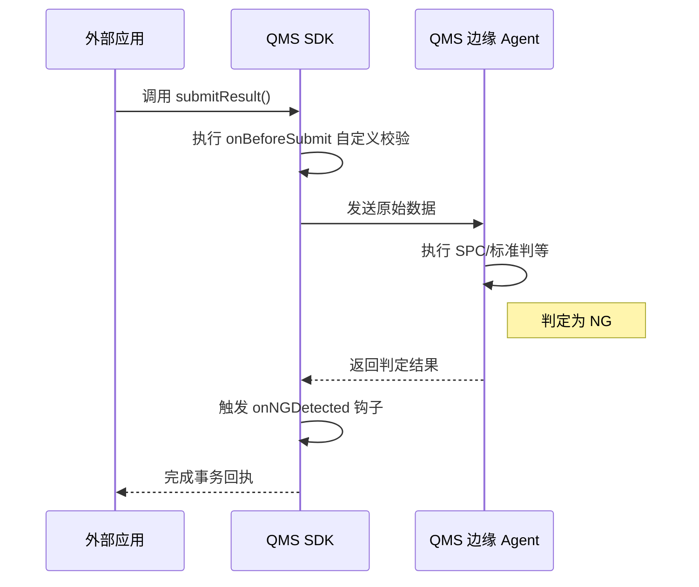

# SDK 使用指南

对于需要高度定制化质量逻辑的企业，**MSRU | QMS** 提供了功能强大的全栈 **SDK (Software Development Kit)**。

通过 SDK，开发者可以打破标准界面的限制，在边缘侧植入私有的算法模型、构建复杂的自动化检测工作流，或者是将质检功能无缝嵌入到自有的移动应用中。

<Callout type="info" title="设计理念：嵌入式智能">
  SDK 的存在是为了让质量管理“隐形化”。通过在工位控制软件中集成 QMS SDK，工人可以在完全不感知系统存在的情况下，完成所有的合规录入与判定逻辑。
</Callout>

---

## 1. 多语言架构支持 (Polyglot Support)

针对工业现场不同的硬件环境，我们提供三套核心 SDK 绑定：

<Cards>
  <Card 
    title="Rust / C++ SDK" 
    description="适用于高频数据采集与实时判定。拥有极低的内存占用与毫秒级的指令延迟，支持嵌入到 ARM/X86 工业网关中。" 
    icon="Cpu" 
  />
  <Card 
    title="TypeScript SDK" 
    description="专为 Web 端插件与 React/Next.js 应用设计。内置了状态管理与 WebSocket 实时更新能力。" 
    icon="Terminal" 
  />
  <Card 
    title="Python SDK" 
    description="质量分析师的最佳伴侣。支持将数据直接加载为 Pandas DataFlow，进行深度的质量趋势建模与机器学习训练。" 
    icon="Layout" 
  />
</Cards>

---

## 2. 核心架构：工作流钩子 (Workflow Hooks)

SDK 的灵活性源于其 **“钩子 (Hook)”** 机制。您可以拦截质量生命周期中的关键事件，并执行私有代码。

<Tabs items={['逻辑切点', '代码示例 (TypeScript)', '执行生命周期']}>
<Tab value="逻辑切点">
| 钩子名称 | 触发时机 | 典型用途 |
| :--- | :--- | :--- |
| `onBeforeSubmit` | 结果录入前 | 执行私有的公差二次校验。 |
| `onNGDetected` | 判定为不合格时 | 自动锁定下游 AGV 的调度任务。 |
| `onSyncFailed` | 云端同步异常时 | 切换到本地存储模式（Local Secondary）。 |
</Tab>
<Tab value="代码示例 (TypeScript)">
```typescript
import { QmsEdgeClient } from '@msru/qms-sdk';

const client = new QmsEdgeClient({ nodeId: 'STATION_001' });

// 注册不合格判定钩子
client.hooks.onNGDetected(async (event) => {
  console.warn(`发现质量异常: ${event.characteristic}`);
  
  // 联动发送企业微信通知
  await notifyFeishu(`报警: 批次 ${event.batchId} 尺寸超出临界值`);
  
  // 阻断产线 PLC
  await edgeGateway.write('STOP_SIGNAL', true);
});

await client.submitResult({ value: 50.12 });
```
</Tab>
<Tab value="执行生命周期">

</Tab>
</Tabs>

---

## 3. 边缘侧数据预处理 (Pre-processing)

为了节省云端带宽，建议利用 SDK 在边缘侧完成初步的统计计算。

<MathEquation 
  inline={false} 
  formula={String.raw`X_{clean} = \text{Filter}(X_{raw}, \text{Method}="Kalman") \implies \text{Publish}(\text{AVG}(X_{clean}))`} 
/>

通过在 SDK 层面集成卡尔曼滤波或中值滤波，可以显著去除由于传感器抖动造成的假阳性警报。

---

## 4. 文件结构与模块化 (SDK Anatomy)

典型的 SDK 项目组织方式：

<Files>
  <Folder name="msru-qms-plugin" defaultOpen>
    <Folder name="src">
       <File name="main.ts (入口文件)" />
       <File name="validators.ts (业务逻辑插件)" />
    </Folder>
    <File name="package.json" />
    <File name="msru-qms.config.json (授权配置)" />
  </Folder>
</Files>

---

## 5. 常见集成问题 (FAQ)

<Accordions>
  <Accordion title="SDK 支持‘无头模式 (Headless)’运行吗？">
    **支持**。您可以编写纯后台的服务（如一个 Linux Daemon），利用 SDK 监听特定的消息队列（MQTT/Kafka），自动将其中的传感器报文转化为 QMS 质检单。
  </Accordion>
  <Accordion title="版本兼容性如何管理？">
    **方案**：SDK 强制要求 SemVer 语义化版本。当云端 API 发生非兼容性升级时，SDK 会在初始化阶段抛出 `VersionMismatchException`，建议您始终开启依赖项的自动漏洞扫描。
  </Accordion>
</Accordions>

---

## 6. 总结

SDK 是 MSRU | QMS 从“封闭软件”走向“开放平台”的钥匙。

无论您的业务流程多么复杂、硬件环境多么苛刻，通过 **QMS SDK** 的灵活编排，您都能构建出一套真正符合工厂基因的、具备极致响应速度的品质管控网络。

---

> [!TIP]
> 准备好编写您的首个插件了吗？请访问 [SDK 开发中心](https://msru.cn/developers/sdk) 下载针对您所用语言的入门模板。
