# 行业对比：MSRU | QMS vs. 传统质量系统

在企业选择质量管理系统时，往往面临在“功能厚重的老牌套装软件”与“轻量化但割裂的点工具”之间的抉择。**MSRU | QMS** 的出现，旨在利用云原生与多尺度计算技术，调和“全局一致性”与“现场实时性”之间的矛盾。

本篇文档将通过全方位的技术维度对比，揭示 MSRU 如何重新定义新一代质量中枢。

<Callout type="warn" title="告别“孤岛式”质检">
  传统 QMS 的致命伤在于它是流程的“录入终端”而非执行的“控制核心”。MSRU 致力于将质量数据从单向汇报转变为双向闭环。
</Callout>

---

## 1. 架构代际：重心之战

架构决定了系统在应对海量实时数据时的天花板。

<Tabs items={['部署与响应模型', '数据流向对比']}>
<Tab value="部署与响应模型">
| 维度 | 传统 QMS (Legacy) | MSRU | QMS |
| :--- | :--- | :--- |
| **部署架构** | 集中式单体 (On-Premise) | 云原生 + 边缘计算 (Hybrid) |
| **实时响应** | 1s - 5s (受网络限制) | **10ms - 50ms (本地判定)** |
| **更新模式** | 繁琐的补丁导入 | 基于容器的蓝绿发布 |
| **系统健壮性** | 中心宕机即停摆 | **边缘自治，支持离线 48h+** |
</Tab>
<Tab value="数据流向对比">
### 传统架构 (Centralized)
数据由终端直接推向中心库。在高频 IPQC（过程巡检）场景下，网络抖动常导致 UI 假死，导致生产现场数据丢失或记录时间轴错位。

### MSRU | QMS 架构 (Distributed)
采用 **“双写”** 机制。测量数据首先在 [边缘 Agent] 进行标准判等与 SPC 计算，随后异步同步至云端。这确保了生产线的实时节拍完全不受网络状况影响。
</Tab>
</Tabs>

---

## 2. 核心差异：静态记录 vs. 动态预警 (SPC)

大多数传统 QMS 仅仅是一个“存储不合格品的电子仓库”，而实时统计分析（SPC）往往需要第三方专业工具（如 Minitab）二次导入。

<Cards>
  <Card 
    title="传统 QMS：事后汇报" 
    description="在产品已经入库甚至发货后才生成质量报表。此时发现问题，召回成本高昂。" 
    icon="History" 
  />
  <Card 
    title="MSRU：事前预测" 
    description="内置毫秒级渲染的 SPC 引擎。当 Cpk 指标开始恶化时，系统会在废品产生前触发预警并自动锁机。" 
    icon="Zap" 
  />
</Cards>

---

## 3. 数学模型：检验效率的量化对比

通过博弈论模型分析，传统系统的“录入错误”与“漏检”产生的隐性成本远超软件本身。

<MathEquation 
  inline={false} 
  formula={String.raw`Cost_{quality} = \underbrace{P_{fail} \cdot C_{recall}}_{\text{External}} + \underbrace{\int (T_{manual} \cdot R_{error}) dt}_{\text{Internal}}`} 
/>

MSRU 通过硬件直连（IoT）将 $R_{error}$ 降至接近于 0，将 $T_{manual}$ 缩减了 60% 以上。这种 **“确定性质量”** 是实现医疗、航空等高合规行业持续交付的基础。

---

## 4. 集成深度与二次开发对比 (SDK)

对 IT 而言，传统 QMS 是封闭的黑盒，集成往往涉及昂贵的数据库级别对接。

<Files>
  <Folder name="集成模型对比" defaultOpen>
    <Folder name="传统老牌 QMS">
       <File name="Proprietary-API.dll" />
       <File name="Legacy-SQL-View" />
    </Folder>
    <Folder name="MSRU | QMS" defaultOpen>
       <File name="graphql-api-spec.ts" />
       <File name="edge-trigger-hook.go" />
       <File name="custom-dashboard.jsx" />
    </Folder>
  </Folder>
</Files>

MSRU 拥抱标准化的 Web 技术栈。您的团队可以使用 TypeScript 轻松定制质检 UI，或通过 GraphQL 订阅实时的质量异常事件。

---

## 5. CIO 选型雷达：多维度量

我们对比了 5 个核心决策因子：

```mermaid
gantt
    title QMS 选型核心价值分布 (0-100)
    dateFormat  X
    axisFormat  %s
    section MSRU - QMS
    部署灵活性 :active, 0, 95
    实时SPC能力 :active, 0, 98
    合规追溯深度 :active, 0, 92
    TCO (低持有成本) :active, 0, 88
    硬件生态兼容性 :active, 0, 90
```

*(MSRU 在 **实时性** 与 **扩展性** 上具备断层领先优势)*

---

## 6. 总结

如果您的目标仅仅是“通过质量体系认证”，那么任何传统 QMS 都能满足文档记录的功能。但如果您旨在构建一个 **“零缺陷”** 的数智工厂，或者需要极致的合规透明度，**MSRU | QMS** 是您唯一正确的代际选择。

---

> [!TIP]
> 想要了解如何从传统系统零成本迁移数据？请查看 [迁移指南](../configuration/deployment#迁移逻辑)。
