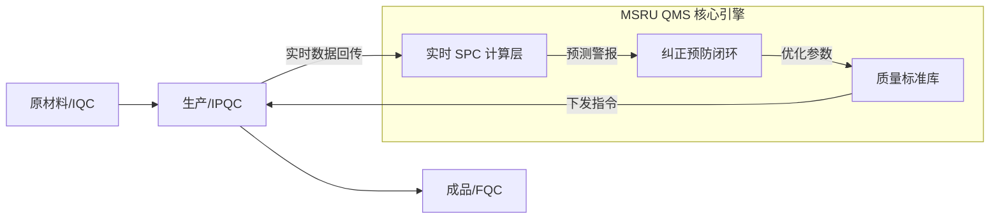

# 什么是 QMS 质量管理？

在 MSRU（微服务与多尺度资源利用）平台的语境下，**QMS (Quality Management System)** 并非一套死板的审批软件，而是工厂生产体系中不可或缺的**“数智自律神经系统”**。

它不仅仅记录“产品是否合格”，更深入到制造的每一个毛细血管，监测工艺稳定性，预测潜在失效，并驱动全价值链的质量治理。

<Callout type="info" title="MSRU QMS 的定义">
  QMS 是一套基于分布式账本与 AI 感知的动态管控框架。其核心使命是通过对生产全过程的“透明化采样”与“智能化分析”，建立起一套不可篡改的品质信用体系。
</Callout>

---

## 1. 工业 4.0 背景下的质量管理代际演进

理解 MSRU | QMS 的唯一途径是审视它与传统系统的差异。

<Tabs items={['1.0 纸质时代', '2.0 电子化时代', '3.0 互联时代', '4.0 MSRU 自治时代']}>
<Tab value="1.0 纸质时代">
**特征**：手工抄表、事后审核。
**痛点**：数据滞后、容易造假、无法追溯。
</Tab>
<Tab value="2.0 电子化时代">
**特征**：利用 Excel 或简单单体系统记录质检结果。
**痛点**：信息孤岛、各车间标准不一、缺乏实时预警。
</Tab>
<Tab value="3.0 互联时代">
**特征**：系统与 MES 集成，实现简单的线上流转。
**痛点**：中心化架构导致的网络延迟，严重依赖人工判定。
</Tab>
<Tab value="4.0 MSRU 自治时代">
**特征**：**边缘计算 + AI 视觉 + 零信任追溯**。
**核心价值**：10ms 级异常响应、全量数据自动化采集、质量预测模型（Quality Prediction）。
</Tab>
</Tabs>

---

## 2. 质量管理的四大核心价值锚点

MSRU | QMS 为企业构建起坚实的品质防线：

<Cards>
  <Card 
    title="数据确权与防篡改" 
    description="利用边缘节点生成的数据指纹，确保每一条质检记录与生产位置、时间、操作员强绑定，不可回溯修改。" 
    icon="Lock" 
  />
  <Card 
    title="实时统计决策 (SPC)" 
    description="不仅仅是数据采集，而是实时计算过程能力指数（Cpk）。当系统探测到工艺漂移时，自动干预执行逻辑。" 
    icon="BarChart4" 
  />
  <Card 
    title="预防性失效分析 (PFMEA)" 
    description="集成数字化失效模式分析。将历史失效库转化为 AI 预测模型，在风险发生前进行主动拦截。" 
    icon="ShieldAlert" 
  />
  <Card 
    title="全生命周期追溯" 
    description="从供应商原材料批次到客户手中的最终成件，通过‘数字孪生’建立起毫秒级的双向追溯拓扑。" 
    icon="GitFork" 
  />
</Cards>

---

## 3. 技术深度：多尺度质量反馈模型

在 MSRU 架构中，质量反馈被数学化描述为一个多闭环控制系统。

<MathEquation 
  inline={false} 
  formula={String.raw`Q_{index} = \oint_{C} \frac{\partial \text{Process}}{\partial t} dt + \sum_{i=1}^{n} \text{Sensor}(i) \cdot \omega_{i} \quad \text{Condition: } Cpk > 1.33`} 
/>

这意味着，当我们在边缘侧接收到传感器的微波信号波动或尺寸偏移时，QMS 会根据上述数学权重 $\omega$ 实时计算当前的“质量健康指数”。若低于阈值，系统会跳过传统的审批，直接通过分布式网关向产线的 [PLC 节点] 下达停机或报警指令。

---

## 4. 业务落地架构图

QMS 如何在实际工厂中运作？

---

## 5. 常见误区与 FAQ

<Accordions>
  <Accordion title="QMS 是否只需要在产线末端放一个检查员？">
    **误区**。MSRU 提倡“全员质量”与“全过程控制”。在我们的系统中，每一台机床的参数（如切削温度、压力）都是质检数据的一部分。将质量管控前移至加工过程，能降低 70% 以上的报废成本。
  </Accordion>
  <Accordion title="如果现有的旧设备没有数字化接口，如何接入 QMS？">
    **方案**：利用我们的 **Edge Box（边缘套件）**。通过加装非侵入式的传感器（如振动仪、温湿度贴）或利用‘扫码报工’结合 Pad 录入，将非智能设备纳入 MSRU 的数字化监测范围。
  </Accordion>
</Accordions>

---

## 6. 开启品质升级之路

QMS 不是负担，而是竞争力的源泉。在高端制造（如航天、医疗、电动车）领域，每一路质量数据都是资产。

---

> [!TIP]
> 准备好定义您的第一个数字化检验标准了吗？请前往 [快速上手指南](./quick-start)。
