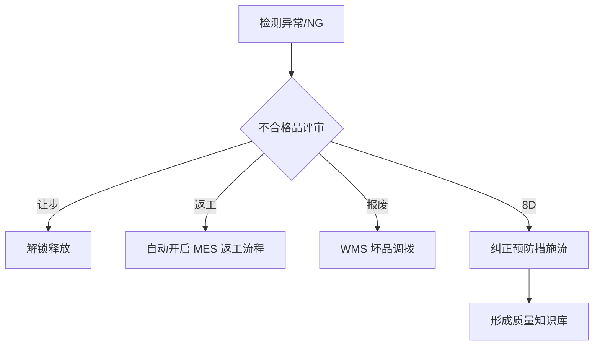

# 模块详解：全场景质量管控内核

**MSRU | QMS** 的强大之处在于其对制造全价值链的模块化支撑。每一个模块不仅具备深度的行业逻辑（如 IATF 16949 的 8D 要求），更结合了分布式架构带来的高实时性。

本页面将协助质量负责人（QM）与流程分析师，理解各核心模块的协同逻辑。

<Callout type="info" title="模块化集成：随需驱动">
  QMS 与 MSRU 平台的其他模块（如 MES, WMS）是松耦合集成的。您可以仅开启“供应商质量（IQC）”作为独立 LIMS 系统使用，也可以开启“全量过程质检”作为 MES 的品质大脑。
</Callout>

---

## 1. 全生命周期检验引擎 (Inspection Engine)

这是 QMS 的数据泵，支撑着从物料入库到成品交付的所有质检活动。

<Cards>
  <Card 
    title="IQC 进料检验模块" 
    description="自动拉取 WMS 收货单。支持供应商免检配置、破坏性实验记录及 AQL 动态抽样等级自动降级。" 
    icon="Inbox" 
  />
  <Card 
    title="IPQC/FQC 过程与成品检" 
    description="深度嵌入 MES 工单。支持首末检强拦截、巡检频率提醒及工位级的自动条码锁定。" 
    icon="Workflow" 
  />
  <Card 
    title="OQC 出货质量管理" 
    description="在 WMS 波次出库阶段进行最后一道防御。支持一键生成多语言版的 CoA（质量分析证明）。" 
    icon="Truck" 
  />
</Cards>

---

## 2. 异常处置与 CAPA 闭环 (Anomaly Management)

发现不合格品只是开始，QMS 的价值在于确保“同样的错误不犯第二次”。

<Tabs items={['MRB 不合格评审', '8D 处理引擎', '逻辑路由图']}>
<Tab value="MRB 不合格评审">
当判定为 NG 时，系统自动挂起该批次。
- **让步接收**：由高级主管签名后，自动释放并进入后续工位。
- **降级使用**：同步修改物料属性为“次品”或“B 级品”。
- **返工/挑选**：自动在 MES 中激活“返工工单（Rework Order）”。
</Tab>
<Tab value="8D 处理引擎">
系统内置了结构化的 8D 问题解决工具。
- **协同编辑**：支持工程、质量、采购部门多方会签。
- **AI 根因分析**：基于知识图谱推荐解决建议。
</Tab>
<Tab value="逻辑路由图">

</Tab>
</Tabs>

---

## 3. 数学模型：动态质量风险估算

对于多工序复杂装配，QMS 会计算“链式风险概率”。

<MathEquation 
  inline={false} 
  formula={String.raw`R_{total} = 1 - \prod_{step=1}^{n} (1 - P_{defect}(step)) \quad \text{Constraint: } R_{total} \leq \text{Threshold}_{safety}`} 
/>

当 `$R_{total}$` 超过安全阈值时，QMS 模块会自动拦截 FQC 流程，要求强制进行全量 100% 拆解检验，从而避免潜在的群发性品质事故。

---

## 4. 体系文件与仪器校准 (Compliance)

为了满足监管审计，QMS 还提供了基础的合规管理工具。

<Files>
  <Folder name="qms-compliance-vault" defaultOpen>
    <Folder name="gauge-management" defaultOpen>
       <File name="calibration-schedule.json (校准计划)" />
       <File name="msa-analysis.xlsx (测量系统分析)" />
    </Folder>
    <Folder name="sampling-tables">
       <File name="aql-normal.yaml" />
       <File name="aql-tightened.yaml" />
    </Folder>
  </Folder>
</Files>

---

## 5. 多维度质量大屏 (Analytics)

QMS 模块内置了三类看板，满足不同层级的管理需求。

<Accordions>
  <Accordion title="现场质检看板 (Operational)">
    实时显示各工位的首检情况、待检任务统计以及最近 10 笔测量值的 SPC 趋势。
  </Accordion>
  <Accordion title="质量管理看板 (Tactical)">
    聚焦业务绩效：**合格率 (Yield)**趋势、DPPM（百万分之缺陷率）分析、Top 5 缺陷根因柏拉图。
  </Accordion>
  <Accordion title="高管战略看板 (Strategic)">
    跨厂区质量对标、供应商年度考核评分矩阵以及质量损失成本（COPQ）估算。
  </Accordion>
</Accordions>

---

## 6. 总结

MSRU | QMS 模块通过精密设计的业务流与算法流，将零散的检测点汇聚成了工厂的“品质防御体系”。

无论您是面对极高频的消费电子首末检，还是面对长期程的医药合规监测，这套模块化系统都能为您提供**确定性的质量承诺**。

---

> [!TIP]
> 准备好查看您的实时质量趋势了吗？请前往 [使用概览](./overview) 了解如何操作质量看板。
