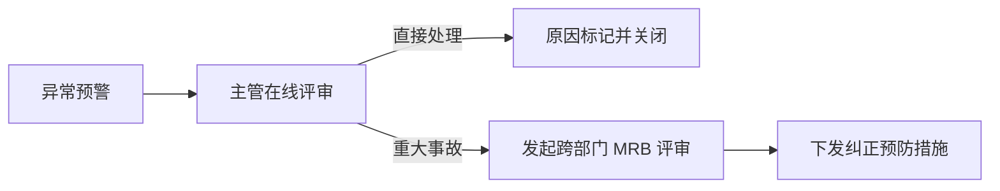

# 使用概览

**MSRU | QMS** 的设计核心是“让质量触手可及”。无论是置于产线末端的重型检验工作站，还是质检员随身携带的智能 Pad，其 UI 逻辑均保持了高度的一致性与响应速度。

本手册将引导您从用户的视角，走通一个标准的“检验-判定-异常-分析”的日常作业。

<Callout type="info" title="角色化视图">
  系统会根据您的 [登录角色](../configuration/settings#权限与角色矩阵-rbac) 自动切换视图。质检员将看到精简的“任务执行”界面，而质量主管将直面“全局看板”与“分析中心”。
</Callout>

---

## 1. 质检员：高效的数据反馈流 (Daily Tasks)

质检员的日常核心是完成系统派发的检验指令。

<Steps>
  <Step>
    ### 任务领取与识别
    登录移动质检 APP。通过“扫码（工单/零件）”或“工位绑定”自动拉取待检任务。系统会根据 [抽样方案](../configuration/settings#抽样方案与自动化逻辑-sampling-sop) 提示您本次需要抽检的样本量。
  </Step>
  <Step>
    ### 测量与防错录入
    按照屏幕指引进行操作。
    - **自动录入**：开启蓝牙量具，数据将在按下“测定”键后毫秒级反填。
    - **视觉辅助**：若物料存在外观缺陷，点击相机图标拍照并进行红圈标注。
  </Step>
  <Step>
    ### 结果判定与标记
    系统实时返回 OK/NG。
    - **OK**：任务自动关闭，数据存证。
    - **NG**：APP 立即弹出“不合格品标识指导”，指引质检员打印红色标签并将其移入“隔离区”。
  </Step>
</Steps>

---

## 2. 质量主管：掌控全局稳定性 (Management Dashboard)

主管不需要盯着报表，而应当盯着“趋势”与“例外”。

<Tabs items={['实时质量看板', 'SPC 趋势追踪', '异常响应流程']}>
<Tab value="实时质量看板">
### 全厂质量雷达
- **一次合格率 (FPY)**：各产线间的实时对标图。
- **任务积压率**：监控当前待检任务是否影响了收货或发货节奏。
- **设备稼动率**：检测仪器（如三坐标）的负荷分布。
</Tab>
<Tab value="SPC 趋势追踪">
### 让数据预测失效
主管可以订阅特定的【特性点位】。当对应的 Cpk 指标连续 3 小时下降时，系统会主动推送钉钉/飞书通知。
<MathEquation 
  inline={false} 
  formula={String.raw`Cpk = \min \left( \frac{USL - \mu}{3\sigma}, \frac{\mu - LSL}{3\sigma} \right) \quad \text{Goal: } > 1.67`} 
/>
</Tab>
<Tab value="异常响应流程">

</Tab>
</Tabs>

---

## 3. 统计报表与合规导出 (Reporting)

MSRU QMS 支持自定义报表引擎，让审计准备工作从“天级别”缩短至“分钟级别”。

<Files>
  <Folder name="daily-reports" defaultOpen>
    <File name="Yield_Report_2026-03-15.pdf (良率月报)" />
    <File name="Supplier_Audit_Top10.xlsx (供应商评分)" />
    <File name="8D_Case_Study.pdf (典型案例库)" />
  </Folder>
</Files>

---

## 4. 界面交互模型：极速响应设计

为了确保严酷车间环境下的易用性，我们的 UI 遵循了 **“手指级触控”** 规范。

<MathEquation 
  inline={false} 
  formula={String.raw`UI_{Accessibility} = \frac{\text{Font Size} > 14pt}{\text{Layer Depth} < 3} \quad \text{Click Target} > 44px`} 
/>

---

## 5. 用户常见困惑 (FAQ)

<Accordions>
  <Accordion title="我可以撤销已经提交的质检结果吗？">
    **原则：由于合规要求，不允许删除记录**。
    如果您发现录入有误，可以执行“更正操作”。系统会保留原始错误数值，并要求录入修正后的数值及【修正原因】，在审计日志中形成完整的变更链。
  </Accordion>
  <Accordion title="离线模式下，我如何知道数据已经由于断网而暂存在本地？">
    **视觉指示**：在页面顶部导航栏，同步图标会从“绿色云朵”变为“黄色警告”。此时您可以继续录入，数据将通过边缘节点的分布式本地库进行持久化。
  </Accordion>
</Accordions>

---

## 6. 开启您的卓越品质管理

使用 MSRU | QMS 不是在完成一项任务，而是在参与一场**“品质主权”**的竞赛。

---

> [!TIP]
> 熟悉界面了吗？如果您需要将 QMS 与您的生产硬件相连，请查看 [设备集成指南](../integrations/communications)。
