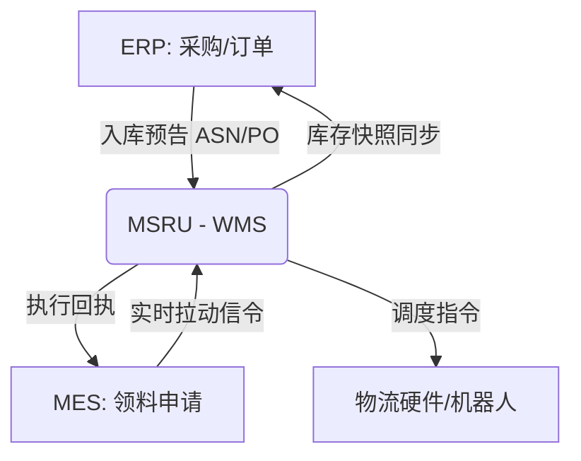

# 什么是 WMS 智能仓储？

在工业 4.0 与全渠道供应链的浪潮下，**仓储管理系统 (Warehouse Management System, WMS)** 的角色正在发生根本性的代际跃迁。

传统的 WMS 往往被视为 ERP 的延伸，仅作为一个“静态库位账本”存在。然而，**MSRU | WMS** 彻底打破了这一局限。我们将其定义为：**一个具备空间感知、边缘执行与 AI 进化能力的“产线动态血流控制器”**。

<Callout type="info" title="MSRU 的核心见解">
  仓储不是静止的，而是物料在特定空间尺度上的临时暂存。真正的“智能”在于：如何在网络闪断、需求波动的极端环境下，依然能够精准引导每一台 AGV 和每一位工人的作业路径。
</Callout>

---

## 1. 智慧仓储的三大支柱 (Three Pillars)

MSRU | WMS 的架构设计遵循“多尺度资源利用”哲学，由以下三个核心能力支撑：

<Cards>
  <Card 
    title="边缘自治 (Edge Autonomy)" 
    description="不同于依赖云端的传统系统。MSRU 边缘代理下沉至仓库现场，即使断网，本地校验与指令下发也永不停摆（10ms 级响应）。" 
    icon="Zap" 
  />
  <Card 
    title="多尺度空间建模" 
    description="从全球分拨中心到微型线边库，甚至是 AGV 上的移动格位，系统提供统一的四维时空描述符，实现‘万物皆库位’。" 
    icon="Box" 
  />
  <Card 
    title="AI 自进化分配" 
    description="内置 Reinforcement Learning 引擎。根据历史拣选热度，AI 自动建议‘动态储位优化（Slotting）’，让爆款物料始终处于最优路径。" 
    icon="BrainCircuit" 
  />
</Cards>

---

## 2. 数字化黄金三角：ERP, MES 与 WMS

理解 WMS 的最好方式是看它如何与其他平台“握手”。

<Tabs items={['业务分工', '数据流图', '集成深度']}>
<Tab value="业务分工">

| 系统 | 关注点 | 核心使命 |
| :--- | :--- | :--- |
| **ERP** | 计划与财务 | 解决“该买什么、该卖多少”的宏观账面平衡。 |
| **MES** | 工艺与产出 | 解决“怎么做、质量如何”的转化逻辑。 |
| **WMS** | 空间与移动 | 解决“物在哪里、如何去那里”的物理流转。 |

</Tab>
<Tab value="数据流图">

</Tab>
<Tab value="集成深度">

MSRU 提倡 **“协议级联邦”**。通过 Edge Agent，WMS 的库存状态可以以 100ms 以内的频率推送到 MES 画布上，真正实现“线边库与产线的一体化”。

</Tab>
</Tabs>

---

## 3. 技术底座：多尺度资源调度模型

我们的核心算法不仅仅是在找库位，而是在计算“能量损耗”与“时间确定性”。

<MathEquation 
  inline={false} 
  formula={String.raw`Efficiency = \frac{\sum Task_{completed}}{\text{Energy} \cdot \Delta t} \quad \text{Constraint: } Latency_{edge} < \text{Threshold}_{safety}`} 
/>

在复杂的自动化立体库（AS/RS）场景中，MSRU 利用该模型在边缘侧进行毫秒级的多机协同决策，规避了由于云端网络抖动造成的 AGV 撞车或堆垛机停转风险。

---

## 4. 实施 SOP：如何开启数字化第一步？

一个成功的 WMS 项目并非一蹴而就，而需要严谨的物理到数字的映射。

<Steps>
  <Step>
    ### 物理节点定义
    在 [空间建模] 模块绘制您的仓库拓扑，定义库区、巷道与格位。
  </Step>
  <Step>
    ### 规则引擎配置
    设定您的收货策略（如：QMS 强校验）与发货规则（如：FEFO 先失效先出）。
  </Step>
  <Step>
    ### 边缘代理部署
    在仓库现场安装 Edge Agent，完成与 PDA、RFID 读写器及 PLC 的心跳握手。
  </Step>
  <Step>
    ### 数据激活
    接入 ERP/MES 数据源，开启首个“数字化波次”。
  </Step>
</Steps>

---

## 5. 企业级代码与文件规范 (Files)

WMS 的核心逻辑文件在 MSRU 框架中的组织方式：

<Files>
  <Folder name="apps/wms-engine" defaultOpen>
    <Folder name="strategies" defaultOpen>
       <File name="putaway.ts (上架策略)" />
       <File name="picking.rs (高性能拣选算法)" />
    </Folder>
    <Folder name="protocols">
       <File name="vda5050.json (AGV 标准)" />
       <File name="llrp.go (RFID 驱动)" />
    </Folder>
  </Folder>
</Files>

---

## 6. 深度问答 (FAQ)

<Accordions>
  <Accordion title="MSRU | WMS 与普通国产 WMS 的最大区别是什么？">
    **最大区别在于“自治权”**。普通 WMS 一旦服务器断网，全仓停摆；MSRU 的每一个子库区都具备独立的逻辑判断能力，即使与主干网失联 48 小时，依然可以依靠本地缓存完成所有作业。
  </Accordion>
  <Accordion title="它能否支持‘混仓存储’（一个库位存多种物料）？">
    **支持**。通过多尺度建模，我们可以将一个物理格位拆解为多个“逻辑槽位”，并针对每个槽位开启动态批次隔离，极大提升了空间的垂直利用率。
  </Accordion>
  <Accordion title="是否可以与我现有的西门子 PLC 系统集成？">
    **当然**。Edge Agent 内置了 Modbus, OPC UA 及 S7 协议栈。您可以像调用 API 一样直接读取产线传送带的传感器信号。
  </Accordion>
</Accordions>

---

## 7. 总结

WMS 不仅仅是关于“盒子”的存放。在 MSRU 的愿景中，WMS 是**连接数字化计划（Cloud）与物理执行（Edge）的关键枢纽**。

通过我们的系统，您不仅能看到库存。您将拥有一个能够感知现场、预见未来、且永远不会断联的智慧物流大脑。

---

> [!TIP]
> 准备好见证真实的作业流程了吗？请前往 [快速上手指南](./quick-start)。
